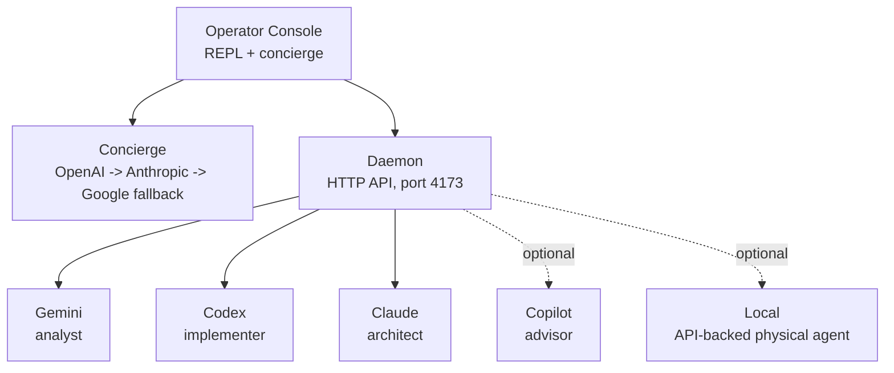

# CLAUDE.md

> **Note:** This file is internal developer tooling configuration for [Claude Code](https://claude.ai/code). It is not user-facing documentation — see [README.md](README.md) for project overview and usage.

This file provides guidance to Claude Code (claude.ai/code) when working with code in this repository.

## Project Overview

Hydra is a **multi-agent AI orchestrator** that routes prompts to the right AI coding agent (Claude
Code, Gemini CLI, Codex CLI) or orchestrates all three together through a shared HTTP daemon with
task queue, intelligent routing, and multi-round deliberation.

**Key modules:**

| File                             | Role                                                |
| -------------------------------- | --------------------------------------------------- |
| `lib/hydra-operator.ts`          | Interactive REPL + dispatch pipeline (main entry)   |
| `lib/hydra-agents.ts`            | Agent definitions, invoke commands, model config    |
| `lib/hydra-dispatch.ts`          | Headless task dispatch                              |
| `lib/hydra-council.ts`           | Multi-round deliberation pipeline                   |
| `lib/hydra-context.ts`           | Hierarchical HYDRA.md context injection             |
| `lib/hydra-concierge.ts`         | Streaming conversational AI (multi-provider)        |
| `lib/hydra-config.ts`            | Config loading, caching, role lookups               |
| `lib/orchestrator-daemon.ts`     | HTTP daemon, event-sourced state (port 4173)        |
| `lib/hydra-evolve-executor.ts`   | Phase execution engine (executeAgent / retry logic) |
| `lib/hydra-evolve-state.ts`      | Session state, checkpoint helpers, status types     |
| `lib/hydra-evolve-guardrails.ts` | Safety guardrails for evolve                        |
| `lib/hydra-evolve-knowledge.ts`  | Knowledge base persistence                          |

**Stack:** Node.js ESM TypeScript, `picocolors` for colors, no framework deps.  
**Tests:** `test/hydra-*.test.ts` — Node.js native `node:test` + `assert/strict`.  
**Config:** `hydra.config.json`

## Branch Workflow

Always work on a feature branch. Never commit directly to `main`. All changes go through pull requests.

Branch naming conventions: `feat/...`, `fix/...`, `docs/...`, `chore/...`, or `copilot/...`.

### Commit Rules

1. **Update documentation before every commit.** Before staging and committing, review what changed and update the relevant docs:
   - `CLAUDE.md` — if workflow, commands, conventions, or the architecture overview changed.
   - `README.md` — if user-facing features, setup steps, or usage changed. The **Operator Commands** table must be updated whenever a command is added/removed/renamed.
   - `docs/ARCHITECTURE.md` — if modules, exports, dispatch logic, or architectural patterns changed.
   - Inline code comments — only where logic isn't self-evident.
   - Skip doc updates only if the change is purely cosmetic or has zero doc impact.

2. **Open a PR targeting `main`.** Never push changes directly to `main`. Use `gh pr create` or `:pr create` in the operator console to open a pull request.

## Commands

```bash
npm test                    # Run all tests (Node.js native test runner)
npm run test:coverage       # Run all tests with c8 coverage reporting
npm run test:coverage:check # Run tests with 80% threshold — exits non-zero if below (CI surfaces this as warn-only via continue-on-error)
npm run test:mutation       # Run Stryker mutation tests against lib/hydra-shared/**/*.ts (warn <60%, break <40%)
node --test test/hydra-ui.test.ts   # Run a single test file
npm start                   # Start the daemon (port 4173)
npm run go                  # Launch operator console (interactive REPL)
npm run council -- prompt="..." # Run council deliberation
npm run evolve              # Run autonomous self-improvement
npm run evolve:suggestions  # Manage evolve suggestions backlog
npm run init                # Generate HYDRA.md in current project (or pass a path)
npm run nightly             # Run nightly task automation
npm run setup               # Register Hydra MCP server in all detected AI CLIs
npm run tasks               # Scan & execute TODO/FIXME/issues autonomously
npm run tasks:review        # Interactive merge of tasks/* branches
npm run tasks:status        # Show latest tasks run report
npm run tasks:clean         # Delete all tasks/* branches
npm run eval                # Run routing evaluation against golden corpus
npm run lint                # ESLint on entire codebase
npm run lint:fix            # ESLint with auto-fix
npm run lint:mermaid        # Validate Mermaid diagrams in Markdown
npm run lint:cycles         # Report circular imports in lib/
npm run format              # Prettier format all files
npm run format:check        # Prettier check (no write)
npm run typecheck           # tsc --noEmit type check (tsconfig.json)
npm run quality             # lint + format:check + typecheck + lint:cycles combined
npm run setup:hooks         # Install/verify git pre-commit and pre-push hooks
```

## Quality Gates

| Tool               | Config              | What it enforces                                                                             |
| ------------------ | ------------------- | -------------------------------------------------------------------------------------------- |
| **ESLint v10**     | `eslint.config.mjs` | `no-var`, `prefer-const`, `eqeqeq`, `no-eval`, `node:` protocol, unicorn best-practice rules |
| **Prettier**       | `.prettierrc.json`  | `singleQuote`, `trailingComma: all`, `printWidth: 100`, LF line endings                      |
| **TypeScript tsc** | `tsconfig.json`     | `--noEmit` type checking across `lib/`, `bin/`, `scripts/`, and `test/`                      |

**Git hooks (Husky v9 + lint-staged)** — install automatically when you run `npm install` or `npm ci` (via the `prepare` script). Use `npm run setup:hooks` only to manually reinstall or verify.

- `pre-commit` — runs lint-staged: ESLint `--fix` + Prettier **auto-write** on staged `.ts/.mjs` files; Mermaid validation + Prettier on staged `.md`; Prettier auto-write on staged `.json/.yml/.yaml`.
- `pre-push` — runs the full `npm test` suite. Push is blocked if tests fail.

**Always run `npm run quality` before opening a PR.** This runs lint + format:check + typecheck + lint:cycles in full (no auto-fix) so you catch issues before CI does.

Mermaid diagrams are validated separately with `npm run lint:mermaid`. The `quality.yml` workflow now runs Mermaid validation explicitly alongside ESLint and Prettier checks, and staged Markdown files run the same validation through `lint-staged`.

## Architecture

Hydra orchestrates three AI coding agents (Claude Code CLI, Gemini CLI, Codex CLI) through a shared HTTP daemon with task queue, intelligent routing, and multiple dispatch modes.

### Core Flow



> For full module reference, dispatch modes, route strategies, and architectural patterns, see [`docs/ARCHITECTURE.md`](docs/ARCHITECTURE.md).

## Code Conventions

- **ESM + TypeScript** (`"type": "module"` in package.json). Runtime code is primarily `.ts` with `import`/`export`; avoid CommonJS and prefer `.ts` for new code.
- **No build step for normal development** — Node.js 24+ runs the TypeScript sources directly. `tsc` is used for verification, not for emitted runtime artifacts.
- **Mixed `.ts` and legacy `.mjs` repo** — prefer existing patterns in the file you are editing, but default to `.ts` for new runtime modules and tests.
- **Import extensions must match source files** — `.ts` files import other `.ts` files with explicit `.ts` extensions.
- **Four dependencies**: `picocolors` (terminal colors), `cross-spawn` (cross-platform spawning), `@modelcontextprotocol/sdk` (MCP server), `zod` (schema validation for MCP tools). Optional peer: `@opentelemetry/api` (tracing, no-op when absent).
- **Agent names** are always lowercase strings: `claude`, `gemini`, `codex`, `local`, `copilot`, plus any user-defined names from `agents.customAgents[]`. `local` is the 4th built-in physical agent (API-backed via `hydra-local.ts`, no CLI). `copilot` is the 5th built-in physical agent (GitHub Copilot CLI, requires active subscription and browser-based device-flow auth). Custom agents are registered via `:agents add` (wizard) or directly in `hydra.config.json`; type `cli` spawns a local CLI tool, type `api` calls an OpenAI-compatible endpoint. CLI agents missing from PATH fall back to cloud transparently via `executeAgentWithRecovery`. Config: `agents.customAgents[]` (see `hydra-agents-wizard.ts`), `local.enabled`, `.baseUrl`, `.model`, `.budgetGate`. `routing.mode` (`economy`|`balanced`|`performance`) shifts affinity toward `local` in economy mode.
- **HTTP helpers**: Use `request()` from `hydra-utils.ts` for daemon calls. Status bar uses `fetch()` directly (lightweight polling).
- **Config access**: `loadHydraConfig()` returns cached config. `getRoleConfig(roleName)` for role-specific model/agent lookups.
- **Model references**: Config-driven via `roles` and `models` sections in `hydra-config.ts`. Don't hardcode model IDs — use `getActiveModel(agent)` or `getRoleConfig(role)`. Codex always requires an explicit `--model` flag (its own `~/.codex/config.toml` may differ from Hydra's config).
- **Interactive prompts**: Use `promptChoice()` from `hydra-prompt-choice.ts` with cooperative readline lock. Boxes dynamically size to terminal width (60-120 columns, 90% of terminal width) and word-wrap long context values.
- **PowerShell launchers** in `bin/` — `hydra.ps1` starts the full system (daemon + agent heads + operator).
- **Intent gate**: `lib/hydra-intent-gate.ts` — `gateIntent(text)` pre-screens prompts before dispatch. Config: `routing.intentGate.enabled`, `.confidenceThreshold`.
- **Hierarchical context**: `lib/hydra-context.ts` — `buildAgentContext(agent, { promptText })` walks ancestor dirs for scoped HYDRA.md files. Config: `context.hierarchical.enabled`.
- **Provider presets**: `getProviderPresets()` from `hydra-config.ts` returns built-in GLM-5 / Kimi K2.5 templates. Used by `:agents add` wizard preset picker.
- **Custom agent wizard**: `lib/hydra-agents-wizard.ts` — `runAgentsWizard(rl)` guides CLI or API agent setup, writes to `agents.customAgents[]`, calls `registerCustomAgentMcp()`. Exports `buildCustomAgentEntry()`, `parseArgsTemplate()`, `validateAgentName()`. Accessed via `:agents add`. `lib/hydra-setup.ts` exports `registerCustomAgentMcp({ configPath, format, force? })` and `KNOWN_CLI_MCP_PATHS` for MCP injection into custom agent config files.
- **Task worktree isolation**: `routing.worktreeIsolation.enabled` (default: false) — daemon creates/merges/cleans per-task worktrees at claim/result time. `:cleanup` sweeps stale worktrees via `scanStaleTaskWorktrees()`.
- **Process exit**: Always use `exit()` from `lib/hydra-process.ts` instead of `process.exit()` directly. This allows tests to intercept exit calls via `setExitHandler(fn)` without terminating the process. Reset with `resetExitHandler()` in test teardown.

## Test Patterns

Tests use Node.js native `node:test` module with `node:assert`. No external test framework.

```javascript
import { describe, it } from 'node:test';
import assert from 'node:assert/strict';
```

Integration tests (`*.integration.test.ts`, plus any remaining legacy `.mjs` tests) spin up the daemon on an ephemeral port and test HTTP endpoints.

## MCP Tool Escalation

Two MCP servers are available when working in this project. Use them to get second opinions, delegate work, or cross-verify your reasoning.

### `hydra_ask` — Ask Gemini or Codex directly

Invokes the agent CLI headlessly. No daemon needed.

- **`agent: "gemini"`** — Gemini 3 Pro. Best for: code review, architecture critique, analysis, research, identifying edge cases, security review.
- **`agent: "codex"`** — Codex (GPT-5.4). Best for: implementation, refactoring, code generation, writing tests, quick prototyping.

**When to use:**

- Reviewing your own generated code for bugs or missed edge cases
- Getting an alternative implementation approach
- Security or concurrency analysis on tricky code
- When the user explicitly asks for a second opinion

**When NOT to use:**

- Trivial/obvious changes (a typo fix doesn't need review)
- Asking questions you already know the answer to
- Every single code change (be cost-conscious)

### `ask_gpt53` / `ask_gpt_fast` — OpenAI API calls

Direct OpenAI Responses API calls (separate from Hydra's agent CLIs).

- **`ask_gpt_fast`** (gpt-4.1-mini) — Cheap/fast. Quick summaries, small refactors, simple reviews.
- **`ask_gpt53`** (GPT-5.3) — Deep reasoning. Architecture decisions, complex bugs, security analysis.
- **`ask_gpt52`** — Alias for `ask_gpt53` (backward compat).
