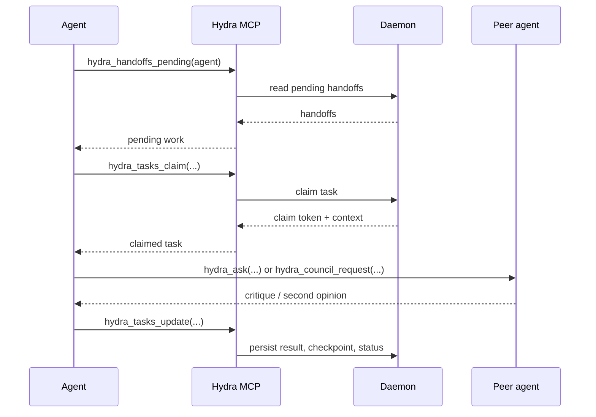

# HYDRA.md

> Multi-agent instructions for **Hydra**. This file is a shared reference for all agents.
> Per-agent instruction files (CLAUDE.md, GEMINI.md, AGENTS.md) are hand-maintained and take precedence for agent-specific details.

## Project Overview

Hydra is a multi-agent AI orchestration system that coordinates Claude Code CLI (architect), Gemini CLI (analyst), Codex CLI (implementer), GitHub Copilot CLI (advisor), and an optional API-backed local agent through a shared HTTP daemon with a task queue, intelligent routing, and multiple dispatch modes.

The daemon runs on `localhost:4173` and exposes an HTTP API for task management, agent coordination, and event sourcing. An interactive operator console (REPL) provides the primary user interface.

## Code Conventions

- **ESM + TypeScript** — `"type": "module"` in `package.json`. Runtime entrypoints and source files are now primarily `.ts`, using `import`/`export` only. Do not add CommonJS.
- **No compile step for normal runtime** — Hydra runs directly with Node.js 24+ and native TypeScript support. `tsc` is used for type-checking, not for emitting build artifacts during normal development.
- **Mixed repo during migration** — both `.ts` and some legacy `.mjs` files still exist. Prefer `.ts` for new or updated runtime code unless a file is intentionally still legacy.
- **Import paths** — use explicit file extensions that match the real source file, including `.ts` imports where applicable. `tsconfig.json` enables `allowImportingTsExtensions`.
- **Type-checking config** — use `tsconfig.json`, not `jsconfig.json`. It checks `lib/`, `bin/`, `scripts/`, and `test/`.
- **Agent names** are always lowercase: `claude`, `gemini`, `codex`, `local`, `copilot`. Never capitalized internally.
- **Terminal colors** — use `picocolors` (`pc`). Never chalk or ANSI escape strings directly.
- **Dependencies** — the core runtime dependencies are `picocolors`, `cross-spawn`, `@modelcontextprotocol/sdk`, and `zod`. `@opentelemetry/api` is optional.
- **Config-driven models** — never hardcode model IDs. Use `getActiveModel(agent)` or `getRoleConfig(role)`.
- **HTTP helpers** — use `request()` from `hydra-utils.ts` for daemon calls unless a module intentionally uses direct `fetch()` for streaming or lightweight polling.

## Coordination Protocol

All agents use the Hydra MCP tools for coordination:

1. **Check for handoffs** — `hydra_handoffs_pending` with your agent name at session start
2. **Claim tasks** — `hydra_tasks_claim` before starting work
3. **Report results** — `hydra_tasks_update` when done or blocked
4. **Get second opinions** — `hydra_ask` to consult another agent
5. **Council deliberation** — `hydra_council_request` for complex architectural decisions



For narrative walkthroughs and practical examples, see [docs/EFFECTIVE_BUILDING.md](docs/EFFECTIVE_BUILDING.md) and [docs/WORKFLOW_SCENARIOS.md](docs/WORKFLOW_SCENARIOS.md).

## @claude

Claude is the **architect** — responsible for design, planning, code review, and architectural decisions.

- Primary reference: `CLAUDE.md` in this repo (full architecture, commands, conventions)
- Always work on a feature branch. Open a PR targeting `main`. Never commit directly to `main`.
- Update docs (CLAUDE.md, README.md, docs/ARCHITECTURE.md) before every commit.
- Use `hydra_ask` with `agent: "gemini"` for critique and `agent: "codex"` for implementation delegation.

## @gemini

Gemini is the **analyst** — responsible for code review, research, security analysis, and critique.

- Primary reference: `GEMINI.md` in this repo
- Focus: identifying edge cases, architecture trade-offs, security issues, and alternative approaches
- When reviewing code, be specific about issues and suggest concrete fixes
- After analysis, update the task with findings via `hydra_tasks_update`

## @codex

Codex is the **implementer** — responsible for code generation, refactoring, and writing tests.

- Primary reference: `AGENTS.md` in this repo
- Focus: following specifications precisely, writing `node:test` + `node:assert/strict` tests, quick prototyping
- Always claim the task first, then report what changed and any tests added via `hydra_tasks_update`
- Codex always requires an explicit `--model` flag when invoked headlessly

## Quality Gates

Run `npm run quality` before opening a PR — it runs ESLint, Prettier check, and TypeScript type-check in one shot.

Git hooks are installed automatically via `npm install` or `npm ci` (the `prepare` script):

- **`pre-commit`** — auto-fixes ESLint + Prettier on staged files (no manual step needed)
- **`pre-push`** — runs the full test suite; blocks the push if tests fail

PR titles must follow [Conventional Commits](https://www.conventionalcommits.org/): `feat:`, `fix:`, `docs:`, `chore:`, etc. This is enforced by CI.

## Testing

All tests use the Node.js native test runner — no external framework.

```ts
import { describe, it } from 'node:test';
import assert from 'node:assert/strict';
```

Run all tests: `npm test`
Run a single file: `node --test test/hydra-ui.test.ts`

Integration tests (`*.integration.test.ts` and any remaining legacy `.mjs` integration tests) spin up the daemon on an ephemeral port.
