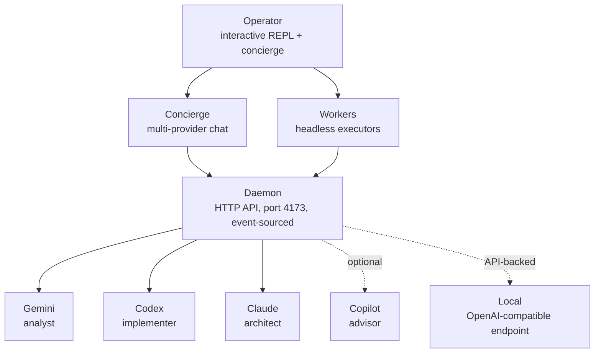
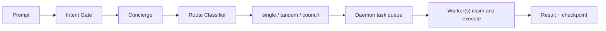

# Hydra

[](https://github.com/PrimeLocus/Hydra/actions/workflows/ci.yml)
[](https://opensource.org/licenses/MIT)

**Multi-Agent AI Orchestrator** — route your prompts to the right agent, or orchestrate all three together.

> **Status:** Active development. APIs may change between releases.

---

## Table of Contents

- [What Is Hydra?](#what-is-hydra)
- [Why Hydra?](#why-hydra)
- [Quick Start](#quick-start)
- [How It Works](#how-it-works)
- [When to Use It](#when-to-use-it)
- [Features](#features)
- [Essential Commands](#essential-commands)
- [Configuration](#configuration)
- [Architecture](#architecture)
- [Packaging and Distribution](#packaging-and-distribution)
- [Documentation](#documentation)
- [Security](#daemon-security)
- [License](#license)

---

## What Is Hydra?

```
   \ | //
    \\|//
   _\\|//_
  |  \|/  |
  |  /|\  |
  \_/ | \_/
    |   |
    |___|

  H Y D R A
```

Each AI coding agent has a distinct strength: Claude architects, Gemini analyzes, Codex implements, Copilot advises with GitHub context. Running them separately means picking one perspective per task.

Hydra routes your prompt to the right agent — or orchestrates all — through a shared daemon with intelligent dispatch, headless workers, and autonomous pipelines. One interface, every perspective.

Coordinates [Gemini CLI](https://github.com/google-gemini/gemini-cli), [Codex CLI](https://github.com/openai/codex), [Claude Code](https://docs.anthropic.com/en/docs/claude-code), and [GitHub Copilot CLI](https://github.com/github/copilot-cli) through an event-sourced HTTP daemon with task queue, intelligent routing, and multi-round deliberation.

## Why Hydra?

A common question: _"Why not just tell Claude Code to call `gemini -p` and `codex` from CLAUDE.md?"_

That works for one-shot delegation. Hydra gives you an orchestration runtime:

|                          | CLAUDE.md chaining    | Hydra                                                                  |
| ------------------------ | --------------------- | ---------------------------------------------------------------------- |
| Multi-round deliberation | Manual, ad-hoc        | Structured council with convergence criteria and named decision owner  |
| State persistence        | None between sessions | Event-sourced daemon, survives restarts, full replay                   |
| Parallel execution       | Sequential only       | Headless workers claim tasks concurrently from a shared queue          |
| Budget management        | None                  | Three-tier token tracking with automatic model downgrade at thresholds |
| Task isolation           | Shared workspace      | Per-task git worktrees, no branch conflicts                            |
| Cross-session recovery   | Manual                | `:resume` scans all resumable state in one command                     |

Use CLAUDE.md chaining when you need one agent to occasionally consult another. Use Hydra when you want a coordinated runtime that persists, tracks, isolates, and recovers across the full lifecycle of a task.

## Quick Start

**Requirements:** Node.js 24.0.0+, at least one AI CLI installed ([`gemini`](https://github.com/google-gemini/gemini-cli), [`codex`](https://github.com/openai/codex), [`claude`](https://docs.anthropic.com/en/docs/claude-code), or [`copilot`](https://github.com/github/copilot-cli))

```bash
# 1. Install
git clone https://github.com/PrimeLocus/Hydra.git && cd Hydra && npm install

# 2. Launch
npm run go             # operator console (no daemon required)
npm start              # daemon only
pwsh ./bin/hydra.ps1   # Windows: daemon + agent heads + operator

# 3. Register with your AI CLIs (one-time)
node lib/hydra-setup.ts   # or: hydra setup (after PATH install)
```

Type a prompt in the operator console. Hydra routes it. Use `:help` to see all commands.

**Platform notes:** `npm run go` works on Linux, macOS, and Windows. The `pwsh ./bin/hydra.ps1` launcher is Windows-only and starts daemon + agent heads + operator together. Linux/macOS users run `npm run go` and `npm start` directly.

**API keys:** Hydra orchestrates your installed AI CLIs using their own auth — no Hydra-specific API keys required. The optional concierge chat layer can use `OPENAI_API_KEY`, `ANTHROPIC_API_KEY`, or `GEMINI_API_KEY` for direct streaming responses, but falls back gracefully if none are set.

**Optional dependencies:**

- [`gh` CLI](https://cli.github.com) — GitHub integration (PRs, issue scanning)
- [`@opentelemetry/api`](https://www.npmjs.com/package/@opentelemetry/api) — distributed tracing

## How It Works

Hydra has five dispatch modes. Pick one or let it choose:

| Mode         | What it does                                                                                                                  |
| ------------ | ----------------------------------------------------------------------------------------------------------------------------- |
| **Auto**     | Classifies your prompt locally — zero extra API calls — then routes to a single agent, a tandem pair, or full council         |
| **Smart**    | Like Auto, but also auto-selects model tier (economy / balanced / performance) per prompt complexity                          |
| **Council**  | Multi-round deliberation: Claude proposes → Gemini critiques → Claude refines → Codex implements → Copilot advises (optional) |
| **Dispatch** | Headless pipeline — queues tasks for background workers, no interactive waiting                                               |
| **Chat**     | Conversational concierge — answers questions directly, escalates to agents only when real work is needed                      |

Switch modes with `:mode <name>` at any time. The daemon persists state across mode switches.

**Routing tiers within Auto / Smart:**

- **Single** — one agent handles the full task (fast path)
- **Tandem** — lead-follow pair: one agent analyzes, another implements
- **Council** — all three agents deliberate with structured synthesis

All routing decisions happen via a local heuristic. No API calls are made until an agent is dispatched.

## When to Use It

**Architecture decisions** — unsure which direction to take? Council mode gets Claude to propose, Gemini to challenge assumptions, Claude to refine, and Codex to produce the first implementation. Each perspective surfaces failure modes the others miss.

**Deep code audits** — `:nightly` scans your codebase for TODOs, issues, and improvement opportunities overnight, then executes them autonomously with budget tracking and per-task branch isolation.

**Staying under token limits** — Smart mode routes simple tasks to economy agents and reserves Claude for complex work. Affinity routing learns from outcomes. Budget thresholds auto-downgrade models before you hit a wall.

**Parallel autonomous work** — headless workers claim tasks from the daemon queue and execute concurrently in isolated git worktrees. Kick off a batch and check results later with `:tasks review`.

**Uncertain or high-stakes changes** — tandem mode lets Claude analyze the problem and Codex implement the fix independently, then cross-model verification reviews the result before it lands.

### Workflow chooser

| Goal                                                     | Recommended workflow                                 | Why                                                                     |
| -------------------------------------------------------- | ---------------------------------------------------- | ----------------------------------------------------------------------- |
| Understand the repo, discuss options, then make a change | `npm run go` in **Auto** or **Smart** mode           | Starts conversationally, then dispatches real work only when needed     |
| Make an architectural or high-risk product decision      | `:mode council` or `npm run council -- prompt="..."` | Forces proposal, critique, refinement, and implementation into one loop |
| Build a feature end to end                               | Operator console + optional workers                  | Good balance of planning, implementation, verification, and iteration   |
| Run through a backlog of TODOs or issues                 | `npm run tasks`                                      | Curated autonomous execution with review flow afterward                 |
| Let Hydra hunt for improvements overnight                | `npm run nightly`                                    | Scans, prioritizes, executes, and reports autonomously                  |
| Improve Hydra or your project continuously               | `npm run evolve`                                     | Long-form self-improvement pipeline with suggestions backlog            |

For scenario walkthroughs, Mermaid diagrams, and example interactions, start with [docs/EFFECTIVE_BUILDING.md](docs/EFFECTIVE_BUILDING.md) and [docs/WORKFLOW_SCENARIOS.md](docs/WORKFLOW_SCENARIOS.md).

## Features

### Intelligent Routing

- **Auto mode** — local heuristic classifies prompts into single / tandem / council routes without burning API tokens on routing
- **Smart mode** — extends Auto with per-prompt model tier selection (economy → balanced → performance based on complexity)
- **Intent gate** — pre-screens prompts before dispatch; catches off-topic or ambiguous inputs before they reach an agent
- **Tandem dispatch** — lead-follow agent pairs (e.g. Claude analyzes the problem, Codex implements the fix)
- **Affinity routing** — 10 task types mapped to optimal agents, with adaptive learning from past outcomes
- **Virtual sub-agents** — role-specialized agents (security-reviewer, test-writer, doc-generator, researcher) that resolve to physical agents at dispatch time

### Concierge Chat

- **Multi-provider front-end** — conversational AI with automatic failover: OpenAI → Anthropic → Google
- **Situational awareness** — "What's going on?" queries real-time daemon activity and agent status
- **Codebase knowledge** — questions about your architecture inject context from docs and the knowledge base
- **Fuzzy command matching** — catches `:stat` when you meant `:stats`, before falling back to AI suggestions
- **Persona system** — configurable identity, tone, verbosity, humor, and presets; interactive editor via `:persona`

### Automation Pipelines

- **Nightly runner** — scans TODO comments, `docs/TODO.md`, and GitHub issues → prioritizes → executes autonomously with budget tracking and commit attribution
- **Evolve** — 7-phase autonomous self-improvement loop with investigator self-healing, knowledge base accumulation, and a suggestions backlog for deferred improvements
- **Tasks runner** — per-task branch isolation, council-lite review for complex tasks, JSON + Markdown reports
- **Headless workers** — background agents claim tasks from the daemon queue, execute autonomously, and report results; permission modes configurable per agent

### Agent & Model Management

- **Per-agent model switching** — override any agent's model at runtime; interactive picker with type-to-filter and reasoning effort configuration
- **Custom agents** — add CLI-based or API-backed agents via wizard or config; built-in provider presets for GLM-5 and Kimi K2.5
- **Local agent** — API-backed fourth agent (`local`), no CLI install required; routes through OpenAI-compatible endpoints
- **Agent Forge** — multi-model agent creation pipeline: Gemini analyzes requirements, Claude designs, Gemini critiques, Claude refines, optional live test
- **Role system** — named roles (architect, analyst, implementer, etc.) map to agents and models; edit via `:roster`

### Monitoring & Safety

- **Circuit breaker** — per-model failure tracking; automatically opens after threshold failures and resets after cooldown
- **Rate limit resilience** — provider-level token bucket with exponential backoff and jitter on 429s across all providers
- **Three-tier budget tracking** — weekly, daily, and sliding-window token budgets with automatic model downgrade at thresholds
- **Per-provider usage tracking** — local session counters plus optional billing API queries (OpenAI and Anthropic admin keys)
- **Failure doctor** — diagnoses pipeline failures, detects recurring patterns, auto-creates follow-up tasks; `:doctor fix` runs an auto-remediation pipeline
- **5-line status bar** — persistent terminal footer with agent activity, token gauge, last dispatch route, session cost, and rolling event ticker

### Platform & Extensibility

- **MCP server** — 11 tools, 5 resources, 3 prompts via official SDK (protocol 2025-03-26); register with `hydra setup`
- **Hierarchical context** — scoped `HYDRA.md` files in any directory are auto-discovered and injected into agent calls for that path
- **Event-sourced daemon** — HTTP state management with replay from any sequence number, snapshots, and dead-letter queue
- **Git worktree isolation** — optional per-task isolated filesystems for parallel agent work without branch conflicts
- **Streaming middleware** — composable pipeline: rate limiting → circuit breaking → retry → telemetry → header capture → usage tracking
- **OTel tracing** — optional distributed tracing with GenAI semantic conventions; no-op when `@opentelemetry/api` is absent

## Essential Commands

### npm scripts

| Command                       | Description                                                                                                                  |
| ----------------------------- | ---------------------------------------------------------------------------------------------------------------------------- |
| `npm run go`                  | Launch operator console                                                                                                      |
| `npm start`                   | Start the daemon                                                                                                             |
| `npm test`                    | Run all tests                                                                                                                |
| `npm run test:coverage`       | Run all tests with c8 coverage reporting                                                                                     |
| `npm run test:coverage:check` | Run tests with 80% threshold; exits non-zero if below (CI runs this as a non-blocking warn-only job via `continue-on-error`) |

> **Note:** The `Coverage Gate (warn-only)` CI check is expected to show a red ✗ while coverage is actively being built up toward the 80% goal. The check uses `continue-on-error: true` so it **never blocks merges** — the red icon is informational only.
> | `npm run council -- prompt="..."` | Full council deliberation |
> | `npm run evolve` | Autonomous self-improvement |
> | `npm run nightly` | Nightly task automation |
> | `npm run tasks` | Scan & execute TODO/FIXME/issues |
> | `npm run lint:mermaid` | Validate Mermaid diagrams in Markdown |
> | `npm run lint:cycles` | Report circular imports in `lib/` |
> | `npm run eval` | Routing evaluation against golden corpus |

### Operator console (inside `npm run go`)

| Command                                      | Description                                 |
| -------------------------------------------- | ------------------------------------------- |
| `:help`                                      | Show all commands                           |
| `:status`                                    | Dashboard with agents & tasks               |
| `:mode auto\|smart\|council\|dispatch\|chat` | Switch dispatch mode                        |
| `:model claude=sonnet`                       | Override agent model                        |
| `:model:select`                              | Interactive model + reasoning effort picker |
| `:workers start`                             | Start headless background workers           |
| `:evolve`                                    | Launch self-improvement session             |
| `:nightly`                                   | Interactive nightly run setup               |
| `:doctor fix`                                | Auto-detect and fix pipeline issues         |
| `:persona`                                   | Edit concierge personality                  |
| `:resume`                                    | Scan all resumable state                    |
| `:agents add`                                | Register a new custom CLI or API agent      |
| `:agents remove <name>`                      | Remove a custom agent                       |
| `:agents test <name>`                        | Send a test prompt to verify agent works    |
| `!<prompt>`                                  | Force dispatch, bypass concierge            |

For the full command reference (80+ commands organized by category), see [docs/USAGE.md](docs/USAGE.md#operator-commands-reference).

## Configuration

Hydra is configured via `hydra.config.json` in the project root. Key sections:

| Section         | Controls                                                                       |
| --------------- | ------------------------------------------------------------------------------ |
| `roles`         | Role → agent → model mapping (architect, analyst, implementer, etc.)           |
| `models`        | Active model per agent, shorthand aliases, mode tier presets                   |
| `routing`       | Route strategy, council gate, tandem dispatch, intent gate, worktree isolation |
| `workers`       | Headless worker settings, permission modes, poll interval, auto-chain          |
| `concierge`     | Provider fallback chain, model, history length, persona                        |
| `persona`       | Identity, voice, tone, verbosity, formality, humor, presets                    |
| `nightly`       | Pipeline sources (TODO/GitHub), budget, AI discovery                           |
| `evolve`        | Self-improvement rounds, suggestions backlog settings                          |
| `doctor`        | Failure diagnosis, recurring pattern detection                                 |
| `providers`     | API keys, tier levels, rate limits, admin keys for usage queries               |
| `github`        | PR defaults, labels, reviewers                                                 |
| `modelRecovery` | Circuit breaker thresholds, fallback behavior, rate limit retry                |

See [docs/USAGE.md](docs/USAGE.md#config-file) for the full config reference with all fields and defaults.

## Architecture



**Notes:**

- Concierge fallback chain: OpenAI → Anthropic → Google
- Virtual sub-agents include `security-reviewer`, `test-writer`, `doc-generator`, and `researcher`
- `local` is API-backed and routes through an OpenAI-compatible endpoint rather than a CLI

**Routing flow:**



## Packaging and Distribution

Hydra is distributed in three forms. Each form supports a different subset of capabilities:

| Distribution form   | CLI / REPL orchestration | Web interface   | How to obtain                          |
| ------------------- | ------------------------ | --------------- | -------------------------------------- |
| **Source checkout** | ✅ Supported             | ✅ Supported    | `git clone` + `npm install`            |
| **npm package**     | ✅ Supported             | ✅ Included     | `npm pack` → tarball, or `npm install` |
| **Standalone exe**  | ✅ Supported             | ❌ Not included | `npm run build:exe` → single binary    |

**Source checkout** is the full-featured distribution. It includes the complete monorepo with all
workspace packages (`apps/web`, `apps/web-gateway`, `packages/web-contracts`). The web interface
requires building the browser bundle and starting the same-origin gateway alongside the daemon — see
[apps/web-gateway/README.md](apps/web-gateway/README.md) for startup commands.

**npm package** ships `lib/`, `bin/`, and `dist/web-runtime/` (compiled to JavaScript by
`scripts/build-pack.ts` during `prepack`). The `dist/web-runtime/` directory contains `server.js`
(a bundled gateway entry point), `web/` (pre-built browser assets), and a `.packaged` sentinel
marker. Root production dependencies include `@hono/node-server`, `hono`, and `ws` so the packaged
gateway is runnable without workspace-level installs. CLI orchestration, daemon, concierge, council,
tasks, evolve, and all operator console commands work as expected. To launch the web interface from
an installed package:

```bash
# Terminal 1: start the daemon
npm start

# Terminal 2: start the packaged web gateway
HYDRA_WEB_OPERATOR_ID=admin \
HYDRA_WEB_OPERATOR_SECRET=password123 \
node dist/web-runtime/server.js
```

Then open `http://127.0.0.1:4174/login` in your browser. For remote host access, add
`HYDRA_WEB_GATEWAY_HOST=0.0.0.0` and set `HYDRA_WEB_GATEWAY_ORIGIN` to the exact public URL
browsers will use. See [apps/web-gateway/README.md](apps/web-gateway/README.md) for full
remote host guidance.

> If `dist/web-runtime/` is missing from the installed package, the artifact is incomplete.
> Rebuild from a source checkout with `npm pack` (which runs `prepack` and produces a complete
> tarball). There is no recovery command inside the installed package itself.

**Standalone executable** bundles `bin/hydra-cli.ts` into a single binary via esbuild and
`@yao-pkg/pkg` (default target: `node20-win-x64`). The binary provides CLI orchestration only. Web
runtime assets are not included, and `hydra --full` is not supported for standalone exe builds.

If the gateway starts but the built browser bundle is not present (e.g. because the distribution
does not include the expected assets directory), the runtime returns an explicit **503** response:
_"Missing built frontend assets."_

## Documentation

| Doc                                                      | Contents                                                        |
| -------------------------------------------------------- | --------------------------------------------------------------- |
| [docs/USAGE.md](docs/USAGE.md)                           | Full command reference, config fields, daemon API, MCP tools    |
| [docs/ARCHITECTURE.md](docs/ARCHITECTURE.md)             | Module reference, dispatch modes, route strategies              |
| [docs/INSTALL.md](docs/INSTALL.md)                       | Detailed installation and setup                                 |
| [docs/EFFECTIVE_BUILDING.md](docs/EFFECTIVE_BUILDING.md) | How to use Hydra to build software effectively, end to end      |
| [docs/WORKFLOW_SCENARIOS.md](docs/WORKFLOW_SCENARIOS.md) | Scenario walkthroughs for operator, council, tasks, and nightly |
| [docs/MODEL_PROFILES.md](docs/MODEL_PROFILES.md)         | Agent model options, reasoning effort, aliases                  |
| [CONTRIBUTING.md](CONTRIBUTING.md)                       | Development workflow, test patterns, conventions                |

## Daemon Security

The HTTP daemon binds to `127.0.0.1` (localhost only) by default. It is designed for local, single-user use and does not include authentication. Do not expose port 4173 externally.

**Terms of service:** Hydra invokes the official CLI tools (`claude`, `gemini`, `codex`) as subprocesses using their own authentication. It does not bypass, proxy, or reimplement any provider's auth flow. Each CLI vendor's ToS applies to their own tool; Hydra adds orchestration on top.

See [SECURITY.md](SECURITY.md) for vulnerability reporting.

## License

[MIT](LICENSE)
