# Hydra — Dependency, Data-Flow & Component Diagrams

> Generated: 2026-03-13 | Branch: `copilot/audit-source-code-compliance`
> All diagrams use [Mermaid](https://mermaid.js.org/) syntax. Validate with `npm run lint:mermaid`.

---

## Table of Contents

1. [High-Level System Context](#1-high-level-system-context)
2. [Component Architecture](#2-component-architecture)
3. [Module Dependency Graph — Core Layer](#3-module-dependency-graph--core-layer)
4. [Module Dependency Graph — Full lib/](#4-module-dependency-graph--full-lib)
5. [Data-Flow: Prompt Dispatch](#5-data-flow-prompt-dispatch)
6. [Data-Flow: Council Deliberation](#6-data-flow-council-deliberation)
7. [Data-Flow: Autonomous Evolution](#7-data-flow-autonomous-evolution)
8. [Data-Flow: Nightly Batch Run](#8-data-flow-nightly-batch-run)
9. [Sequence: Task Claim → Execute → Result](#9-sequence-task-claim--execute--result)
10. [Sequence: Operator Console Interaction](#10-sequence-operator-console-interaction)
11. [State Machine: Daemon Task Lifecycle](#11-state-machine-daemon-task-lifecycle)
12. [Domain Cluster Map](#12-domain-cluster-map)
13. [Dependency Fan-In / Fan-Out Heat Map](#13-dependency-fan-in--fan-out-heat-map)
14. [Cyclic Dependency Graph](#14-cyclic-dependency-graph)

---

## 1. High-Level System Context

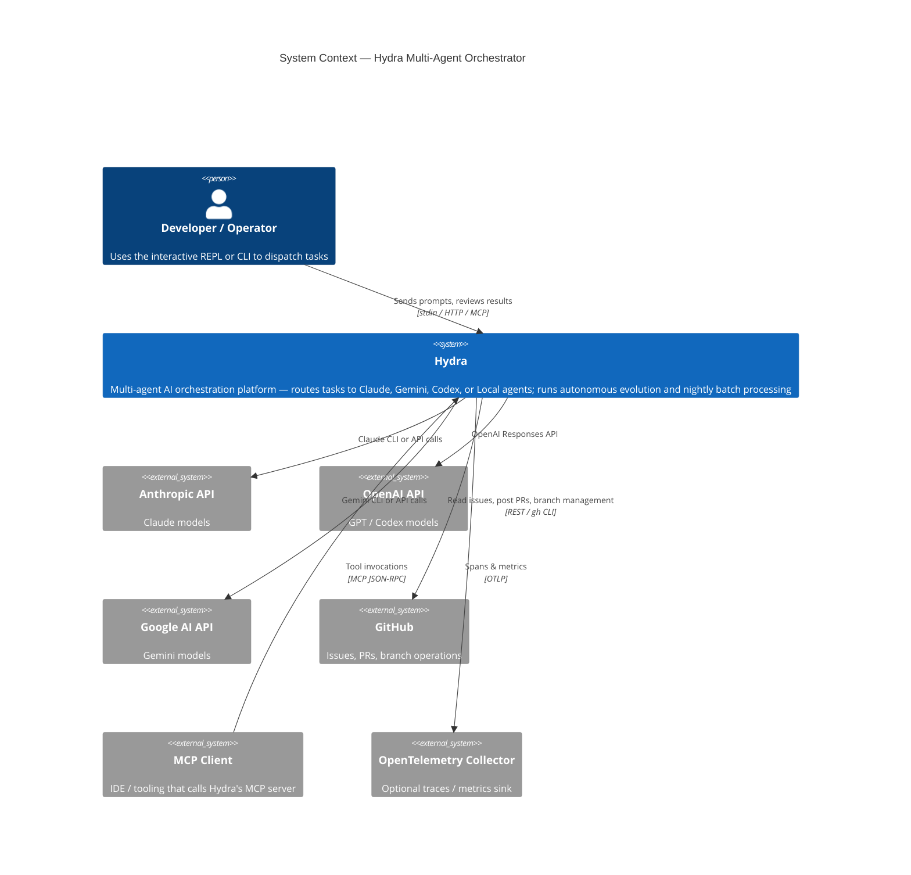

---

## 2. Component Architecture

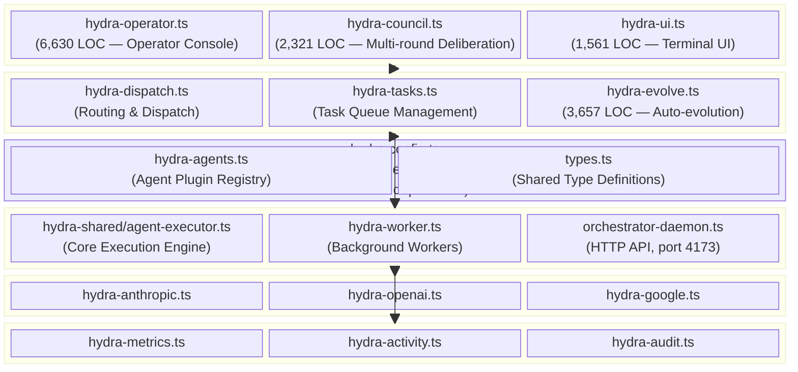

---

## 3. Module Dependency Graph — Core Layer

> Shows the most critical module relationships (high-coupling core only). Dashed arrows indicate indirect/optional dependencies.

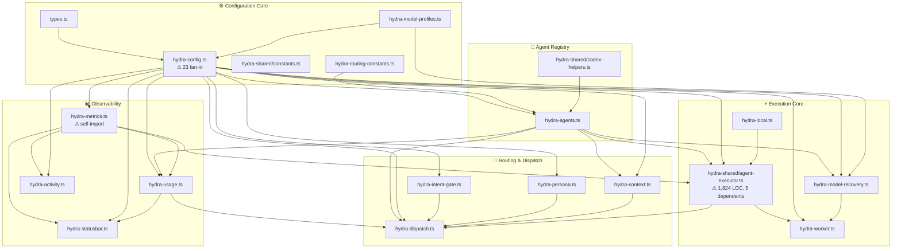

---

## 4. Module Dependency Graph — Full lib/

> Full picture of all `lib/` module relationships. Clusters represent logical domains.

```mermaid
graph LR
  subgraph Foundation["🧱 Foundation"]
    T[types.ts]
    CFG[hydra-config.ts]
    P[hydra-model-profiles.ts]
    C[hydra-shared/constants.ts]
    RC[hydra-routing-constants.ts]
    ENV[hydra-env.ts]
    VER[hydra-version.ts]
  end

  subgraph Agents["🤖 Agents"]
    AG[hydra-agents.ts]
    AW[hydra-agents-wizard.ts]
    AF[hydra-agent-forge.ts]
    SA[hydra-sub-agents.ts]
    CH[hydra-shared/codex-helpers.ts]
  end

  subgraph Execution["⚡ Execution"]
    EX[agent-executor.ts]
    WK[hydra-worker.ts]
    LO[hydra-local.ts]
    MR[hydra-model-recovery.ts]
    GD[hydra-guardrails-shared]
  end

  subgraph Routing["🔀 Routing"]
    DP[hydra-dispatch.ts]
    IG[hydra-intent-gate.ts]
    PE[hydra-persona.ts]
    CT[hydra-context.ts]
    CLI[hydra-cli-detect.ts]
  end

  subgraph Providers["🌐 AI Providers"]
    AN[hydra-anthropic.ts]
    OA[hydra-openai.ts]
    GG[hydra-google.ts]
    CI[hydra-concierge.ts]
    CP[hydra-concierge-providers.ts]
    RL[hydra-rate-limits.ts]
    SM[hydra-streaming-middleware.ts]
    PU[hydra-provider-usage.ts]
  end

  subgraph Daemon["🔧 Daemon & HTTP"]
    OD[orchestrator-daemon.ts]
    RR[daemon/read-routes.ts]
    WR[daemon/write-routes.ts]
    HUB[hydra-hub.ts]
    WT[hydra-worktree.ts]
  end

  subgraph Presentation["🖥 Presentation"]
    OP[hydra-operator.ts]
    CO[hydra-council.ts]
    UI[hydra-ui.ts]
    PC[hydra-prompt-choice.ts]
    SB[hydra-statusbar.ts]
    AP[hydra-action-pipeline.ts]
  end

  subgraph Observability["📊 Observability"]
    ME[hydra-metrics.ts]
    AC[hydra-activity.ts]
    AU[hydra-audit.ts]
    TE[hydra-telemetry.ts]
    US[hydra-usage.ts]
  end

  subgraph Evolution["🔄 Evolution Engine"]
    EV[hydra-evolve.ts]
    EG[hydra-evolve-guardrails.ts]
    EI[hydra-evolve-investigator.ts]
    EK[hydra-evolve-knowledge.ts]
    ES[hydra-evolve-suggestions.ts]
    ER[hydra-evolve-review.ts]
  end

  subgraph Tasks["📋 Task Management"]
    TK[hydra-tasks.ts]
    TS[hydra-tasks-scanner.ts]
    TR[hydra-tasks-review.ts]
  end

  subgraph Nightly["🌙 Nightly Batch"]
    NY[hydra-nightly.ts]
    ND[hydra-nightly-discovery.ts]
    NR[hydra-nightly-review.ts]
  end

  subgraph Integration["🔗 Integration"]
    GH[hydra-github.ts]
    MCP[hydra-mcp-server.ts]
    SE[hydra-self.ts]
    SI[hydra-self-index.ts]
  end

  subgraph Utilities["🛠 Utilities"]
    UT[hydra-utils.ts]
    PR[hydra-proc.ts]
    CA[hydra-cache.ts]
    SY[hydra-sync-md.ts]
    UP[hydra-updater.ts]
    BT[hydra-shared/budget-tracker.ts]
    GO[hydra-shared/git-ops.ts]
    SH[hydra-setup.ts]
    KN[hydra-knowledge.ts]
    RE[hydra-resume-scanner.ts]
    CC[hydra-codebase-context.ts]
  end

  %% Foundation relationships
  T --> CFG
  P --> CFG
  CFG --> AG

  %% Agent relationships
  AG --> EX
  CH --> AG
  RC --> AG
  AG --> AW
  AG --> SA
  AG --> AF

  %% Execution relationships
  EX --> WK
  CFG --> WK
  MR --> WK
  LO -.-> EX
  CFG --> MR
  AG --> MR
  P --> MR

  %% Routing relationships
  AG --> DP
  CFG --> DP
  EX --> DP
  IG --> DP
  PE --> DP
  CT --> DP
  CLI --> DP
  CFG --> IG
  CFG --> PE
  AG --> CT
  CFG --> CT

  %% Providers
  SM --> AN
  SM --> OA
  SM --> GG
  CP --> CI
  CFG --> CI
  PE --> CI
  RL --> CP
  CFG --> CP
  AG --> CP
  CFG --> RL
  P --> RL
  SM --> RL
  CFG --> SM
  MR --> SM
  PU --> SM
  RL --> SM
  CFG --> PU
  P --> PU
  RL --> PU
  CFG --> TE
  TE --> SM

  %% Daemon
  RR --> OD
  WR --> OD
  AG --> OD
  CFG --> OD
  ME --> OD
  US --> OD
  HUB --> WR
  WT --> WR
  SE --> RR

  %% Presentation
  AG --> OP
  CFG --> OP
  ME --> OP
  EX --> OP
  CI --> OP
  CP --> OP
  SB --> OP
  UI --> OP
  AC --> OP
  GH --> OP
  SE --> OP
  AF --> OP
  SA --> OP
  AG --> CO
  CFG --> CO
  EX --> CO
  UI --> CO
  ME --> SB
  CFG --> SB
  US --> SB
  UI --> SB
  P --> UI
  VER --> UI
  UI --> PC
  UI --> AP

  %% Observability
  CFG --> ME
  ME --> AC
  CFG --> AC
  AG --> AC
  PE --> AC
  ME --> US
  CFG --> US
  AG --> US
  AG --> AU
  CFG --> AU
  EX --> AU
  CFG --> TE

  %% Evolution
  AG --> EV
  CFG --> EV
  EX --> EV
  EG --> EV
  EI --> EV
  EK --> EV
  ES --> EV
  MR --> EV
  CFG --> EG
  ME --> EG
  US --> EG
  CFG --> EI
  CFG --> ER
  GH --> ER
  ES --> ER

  %% Tasks
  AG --> TK
  CFG --> TK
  EX --> TK
  TS --> TK
  US --> TK
  AG --> TS
  CFG --> TS
  GH --> TS
  CFG --> TR
  GH --> TR

  %% Nightly
  AG --> NY
  CFG --> NY
  EX --> NY
  ND --> NY
  NR --> NY
  AG --> ND
  CFG --> ND
  EX --> ND
  TS --> ND
  CFG --> NR
  GH --> NR

  %% Integration
  CFG --> GH
  GO --> GH
  AG --> MCP
  CFG --> MCP
  EX --> MCP
  ME --> MCP
  AF --> MCP
  AG --> SE
  CFG --> SE
  ME --> SE

  %% Utilities
  AG --> UT
  PR --> UT
  EX --> UT
  UT --> PR
  CFG --> SH
  CLI --> SH
  KN --> EK
  GH --> GO
  GO --> SH
```

---

## 5. Data-Flow: Prompt Dispatch

> Traces a user prompt from the operator console through routing, execution, and back.

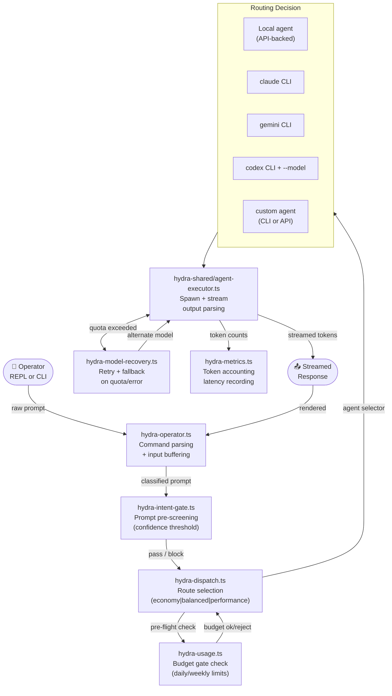

---

## 6. Data-Flow: Council Deliberation

> Multi-round consensus pipeline across Claude → Gemini → Claude → Codex.

```mermaid
sequenceDiagram
  participant OP as hydra-operator.ts
  participant CO as hydra-council.ts
  participant CTX as hydra-context.ts
  participant PE as hydra-persona.ts
  participant EX as agent-executor.ts
  participant DR as hydra-doctor.ts
  participant MR as hydra-model-recovery.ts

  OP->>CO: runCouncil(prompt, opts)
  CO->>CTX: buildAgentContext(agent, {promptText})
  CO->>PE: getPersonaPrompt(agent)

  loop Round 1 — Claude (Architect)
    CO->>EX: executeAgent("claude", enrichedPrompt)
    EX-->>CO: round1Output
  end

  loop Round 2 — Gemini (Analyst) with Round 1 context
    CO->>EX: executeAgent("gemini", prompt+round1)
    alt quota error
      EX->>MR: handleQuotaError()
      MR-->>EX: fallbackModel
    end
    EX-->>CO: round2Output
  end

  loop Round 3 — Claude Synthesis
    CO->>EX: executeAgent("claude", allRounds)
    EX-->>CO: synthesisOutput
  end

  opt Codex Validation (if enabled)
    CO->>EX: executeAgent("codex", synthesisOutput)
    EX-->>CO: validatedOutput
  end

  CO->>DR: diagnoseIfError(outputs)
  DR-->>CO: diagnosedResult
  CO-->>OP: CouncilResult{outputs, consensus}
```

---

## 7. Data-Flow: Autonomous Evolution

> The `hydra-evolve.ts` self-improvement pipeline — 7-phase cycle.

```mermaid
flowchart LR
  subgraph Phase1["Phase 1: Discover"]
    P1A["hydra-evolve-investigator.ts\nOpenAI issue analysis"]
    P1B["hydra-evolve-knowledge.ts\nKnowledge graph read"]
    P1C["hydra-evolve-suggestions.ts\nSuggestion backlog"]
  end

  subgraph Phase2["Phase 2: Gate"]
    P2["hydra-evolve-guardrails.ts\nBudget & safety check\n(daily token limits)"]
  end

  subgraph Phase3["Phase 3: Plan"]
    P3["hydra-evolve.ts\nCouncil deliberation\n(Claude architect round)"]
  end

  subgraph Phase4["Phase 4: Implement"]
    P4["agent-executor.ts\nCodex implementation\nrun in git worktree"]
  end

  subgraph Phase5["Phase 5: Test"]
    P5A["hydra-shared/git-ops.ts\ngit diff + test run"]
    P5B["hydra-verification.ts\nVerification commands"]
  end

  subgraph Phase6["Phase 6: Review"]
    P6["hydra-evolve-review.ts\nGemini review\n+ guardrails re-check"]
  end

  subgraph Phase7["Phase 7: Decide"]
    P7["hydra-evolve.ts\nMerge / discard\ngit commit or reset"]
  end

  START(["⚡ npm run evolve"]) --> Phase1
  Phase1 --> Phase2
  Phase2 -->|"budget ok"| Phase3
  Phase2 -->|"budget exceeded"| STOP(["🛑 Aborted"])
  Phase3 --> Phase4
  Phase4 --> Phase5
  Phase5 -->|"tests pass"| Phase6
  Phase5 -->|"tests fail"| DISCARD(["🗑 Discard change"])
  Phase6 -->|"approved"| Phase7
  Phase6 -->|"rejected"| DISCARD
  Phase7 --> DONE(["✅ Committed or reset"])
```

---

## 8. Data-Flow: Nightly Batch Run

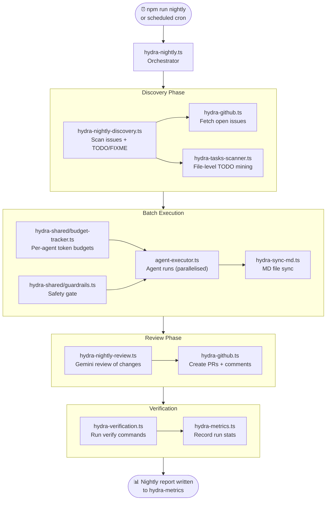

---

## 9. Sequence: Task Claim → Execute → Result

> HTTP daemon task lifecycle viewed from a worker's perspective.

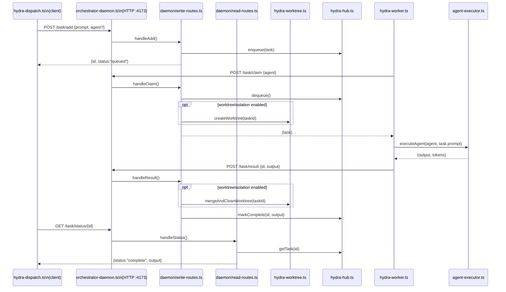

---

## 10. Sequence: Operator Console Interaction

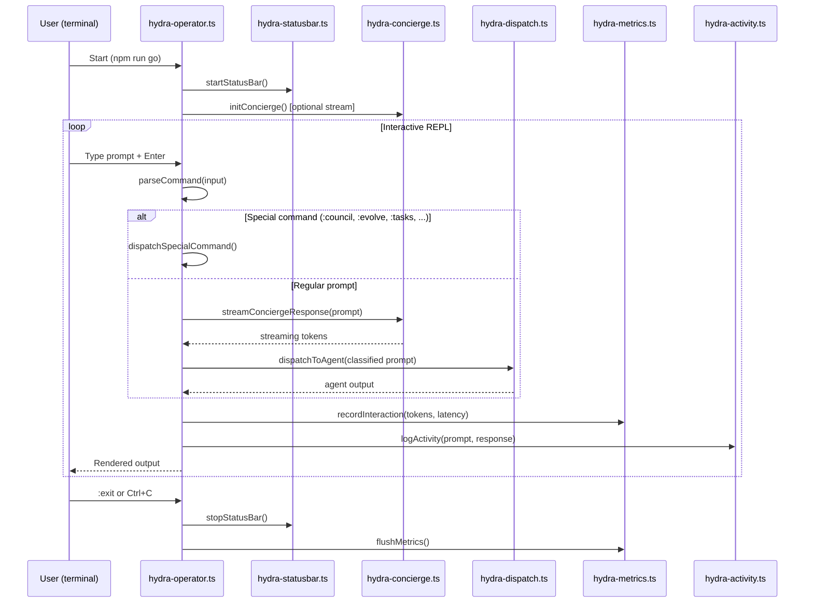

---

## 11. State Machine: Daemon Task Lifecycle

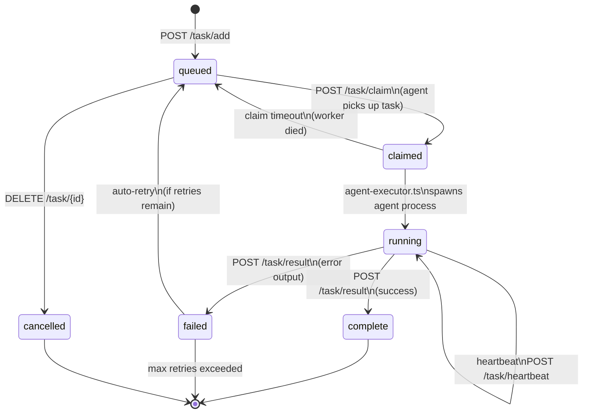

---

## 12. Domain Cluster Map

> Shows which modules belong to each logical domain and their inter-domain coupling.

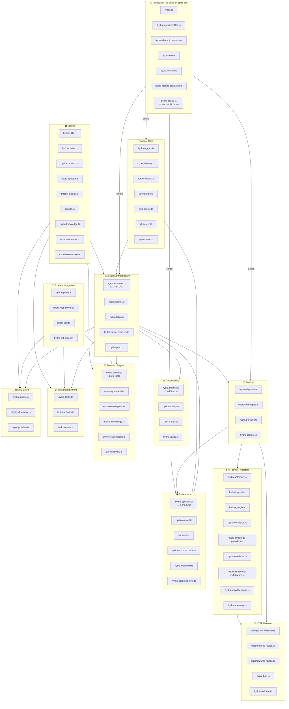

---

## 13. Dependency Fan-In / Fan-Out Heat Map

> Fan-in = number of files that import this module. Fan-out = number of lib/ files this module imports.
> Modules with high fan-in are fragile (many dependents). High fan-out modules are hard to test in isolation.

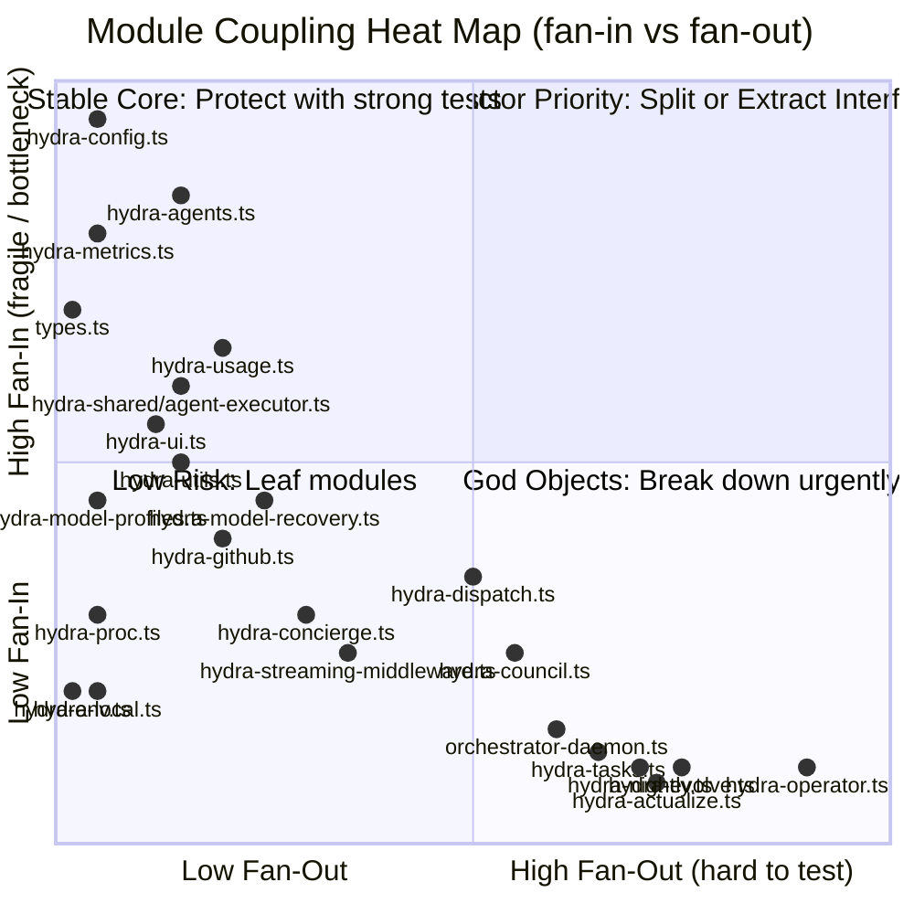

---

## 14. Cyclic Dependency Graph

> Three detected cyclic import chains — each breaks tree-shaking, complicates testing, and can cause runtime `undefined` module errors.

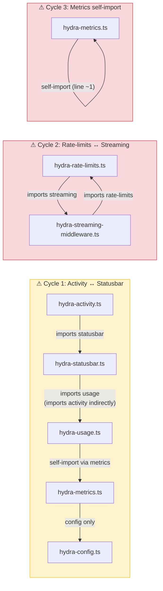

---

## Appendix: Module Inventory

| Module                         | Lines | Fan-In | Fan-Out | Has Tests | Domain        |
| ------------------------------ | ----: | -----: | ------: | :-------: | ------------- |
| hydra-operator.ts              | 6,630 |      0 |      29 |    ❌     | Presentation  |
| hydra-evolve.ts                | 3,657 |      1 |      11 |    ❌     | Evolution     |
| hydra-council.ts               | 2,321 |      2 |      11 |    ✅     | Presentation  |
| hydra-shared/agent-executor.ts | 1,824 |      5 |       4 |    ❌     | Execution     |
| orchestrator-daemon.ts         | 1,670 |      0 |      12 |    ❌     | Daemon        |
| hydra-ui.ts                    | 1,561 |      8 |       2 |    ✅     | Presentation  |
| hydra-agents.ts                | 1,496 |    15+ |       5 |    ✅     | Agent Core    |
| hydra-agent-forge.ts           | 1,247 |      2 |       6 |    ✅     | Agent Core    |
| hydra-nightly.ts               | 1,233 |      0 |      15 |    ❌     | Nightly Batch |
| hydra-model-profiles.ts        | 1,143 |      6 |       1 |    ✅     | Foundation    |
| hydra-audit.ts                 | 1,126 |      0 |       4 |    ❌     | Observability |
| hydra-config.ts                | 1,067 |     23 |       2 |    ❌     | Foundation    |
| hydra-mcp-server.ts            | 1,059 |      0 |       9 |    ❌     | Integration   |
| hydra-tasks.ts                 | 1,055 |      1 |      14 |    ❌     | Task Mgmt     |
| hydra-usage.ts                 | 1,051 |      6 |       5 |    ❌     | Observability |
| hydra-doctor.ts                | 1,037 |      1 |       2 |    ✅     | Presentation  |
| types.ts                       |   941 |    12+ |       0 |    ✅     | Foundation    |
| hydra-statusbar.ts             |   915 |      2 |       4 |    ❌     | Presentation  |
| hydra-activity.ts              |   897 |      3 |       6 |    ✅     | Observability |
| hydra-model-recovery.ts        |   865 |      5 |       3 |    ✅     | Execution     |
| hydra-actualize.ts             |  ~800 |      0 |      16 |    ❌     | Task Mgmt     |
| hydra-shared/git-ops.ts        |  ~750 |      8 |       0 |    ✅     | Utilities     |
| hydra-dispatch.ts              |  ~700 |      1 |      10 |    ✅     | Routing       |
| hydra-concierge.ts             |  ~650 |      2 |       7 |    ❌     | Providers     |
| hydra-streaming-middleware.ts  |  ~620 |      4 |       5 |    ✅     | Providers     |
| hydra-rate-limits.ts           |  ~580 |      4 |       3 |    ✅     | Providers     |
| hydra-metrics.ts               |  ~560 |    10+ |       1 |    ✅     | Observability |
| hydra-knowledge.ts             |  ~520 |      2 |       1 |    ❌     | Utilities     |
| hydra-setup.ts                 |  ~500 |      3 |       2 |    ✅     | Utilities     |
| hydra-intent-gate.ts           |  ~480 |      1 |       2 |    ✅     | Routing       |
| hydra-worker.ts                |  ~460 |      1 |       5 |    ❌     | Execution     |
| hydra-context.ts               |  ~440 |      3 |       3 |    ✅     | Routing       |
| hydra-hub.ts                   |  ~420 |      2 |       0 |    ✅     | Daemon        |
| hydra-provider-usage.ts        |  ~400 |      3 |       3 |    ❌     | Providers     |
| hydra-github.ts                |  ~390 |      6 |       3 |    ✅     | Integration   |
| hydra-self.ts                  |  ~380 |      3 |       4 |    ✅     | Integration   |
| hydra-codebase-context.ts      |  ~360 |      1 |       1 |    ✅     | Utilities     |
| hydra-sync-md.ts               |  ~350 |      5 |       0 |    ✅     | Utilities     |
| hydra-sub-agents.ts            |  ~340 |      2 |       3 |    ❌     | Agent Core    |
| hydra-nightly-discovery.ts     |  ~320 |      1 |       7 |    ❌     | Nightly Batch |
| hydra-tasks-scanner.ts         |  ~310 |      3 |       4 |    ❌     | Task Mgmt     |
| hydra-verification.ts          |  ~300 |      4 |       2 |    ✅     | Utilities     |
| hydra-persona.ts               |  ~280 |      4 |       1 |    ❌     | Routing       |
| hydra-cli-detect.ts            |  ~260 |      2 |       0 |    ✅     | Utilities     |
| hydra-agents-wizard.ts         |  ~250 |      1 |       2 |    ✅     | Agent Core    |
| hydra-telemetry.ts             |  ~240 |      1 |       1 |    ✅     | Providers     |
| hydra-proc.ts                  |  ~230 |      3 |       0 |    ✅     | Utilities     |
| hydra-openai.ts                |  ~220 |      2 |       1 |    ❌     | Providers     |
| hydra-anthropic.ts             |  ~210 |      1 |       1 |    ❌     | Providers     |
| hydra-google.ts                |  ~200 |      1 |       1 |    ❌     | Providers     |
| hydra-env.ts                   |  ~190 |      3 |       0 |    ❌     | Foundation    |
| hydra-evolve-review.ts         |  ~180 |      1 |       8 |    ❌     | Evolution     |
| hydra-evolve-guardrails.ts     |  ~170 |      2 |       5 |    ❌     | Evolution     |
| hydra-concierge-providers.ts   |  ~160 |      3 |       3 |    ✅     | Providers     |
| hydra-worktree.ts              |  ~155 |      1 |       0 |    ✅     | Daemon        |
| hydra-local.ts                 |  ~150 |      1 |       0 |    ✅     | Execution     |
| hydra-nightly-review.ts        |  ~145 |      1 |       7 |    ❌     | Nightly Batch |
| hydra-tasks-review.ts          |  ~140 |      0 |       7 |    ❌     | Task Mgmt     |
| hydra-models.ts                |  ~140 |      0 |       2 |    ❌     | Providers     |
| hydra-evolve-investigator.ts   |  ~130 |      1 |       2 |    ❌     | Evolution     |
| hydra-prompt-choice.ts         |  ~125 |      2 |       1 |    ✅     | Presentation  |
| hydra-models-select.ts         |  ~120 |      0 |       0 |    ❌     | Providers     |
| hydra-action-pipeline.ts       |  ~115 |      0 |       2 |    ✅     | Presentation  |
| hydra-evolve-suggestions.ts    |  ~110 |      2 |       1 |    ✅     | Evolution     |
| hydra-evolve-knowledge.ts      |  ~105 |      1 |       1 |    ❌     | Evolution     |
| hydra-routing-constants.ts     |  ~100 |      2 |       0 |    ❌     | Foundation    |
| hydra-shared/budget-tracker.ts |   ~95 |      3 |       0 |    ✅     | Utilities     |
| hydra-shared/guardrails.ts     |   ~90 |      4 |       0 |    ✅     | Utilities     |
| hydra-shared/review-common.ts  |   ~85 |      3 |       0 |    ❌     | Utilities     |
| hydra-shared/index.ts          |   ~80 |      2 |       0 |    ❌     | Utilities     |
| hydra-version.ts               |   ~75 |      1 |       0 |    ✅     | Foundation    |
| hydra-resume-scanner.ts        |   ~70 |      1 |       0 |    ❌     | Utilities     |
| hydra-self-index.ts            |   ~65 |      2 |       0 |    ❌     | Integration   |
| hydra-updater.ts               |   ~60 |      1 |       0 |    ❌     | Utilities     |
| hydra-cache.ts                 |   ~55 |      1 |       0 |    ✅     | Utilities     |
| hydra-mcp.ts                   |   ~50 |      0 |       0 |    ✅     | Integration   |
| hydra-mermaid-lint.ts          |   ~45 |      0 |       0 |    ✅     | Utilities     |
| hydra-output-history.ts        |   ~40 |      0 |       0 |    ❌     | Utilities     |
| hydra-exec.ts                  |   ~35 |      1 |       0 |    ❌     | Utilities     |
| hydra-cleanup.ts               |   ~30 |      0 |       0 |    ❌     | Utilities     |
| hydra-shared/codex-helpers.ts  |   ~25 |      1 |       0 |    ❌     | Utilities     |
| daemon/read-routes.ts          |  ~220 |      1 |       2 |    ❌     | Daemon        |
| daemon/write-routes.ts         |  ~380 |      1 |       3 |    ❌     | Daemon        |
