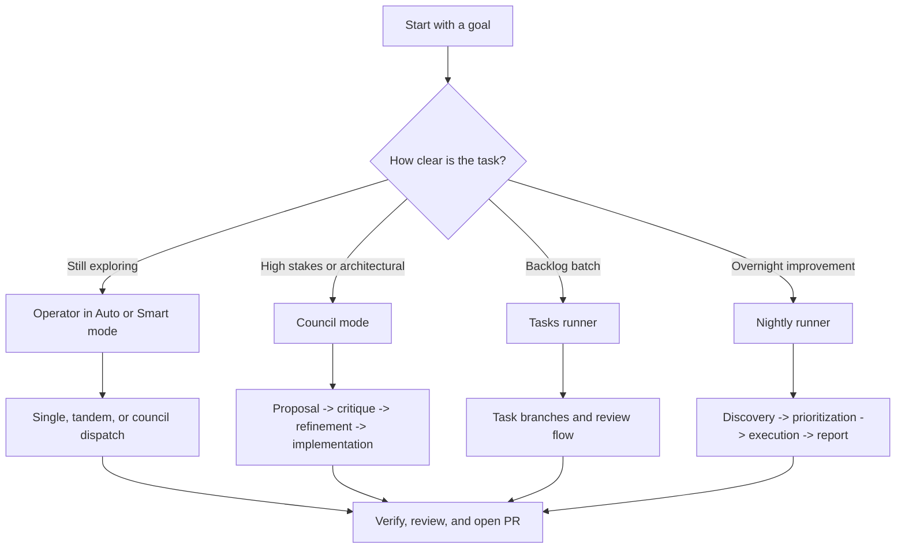
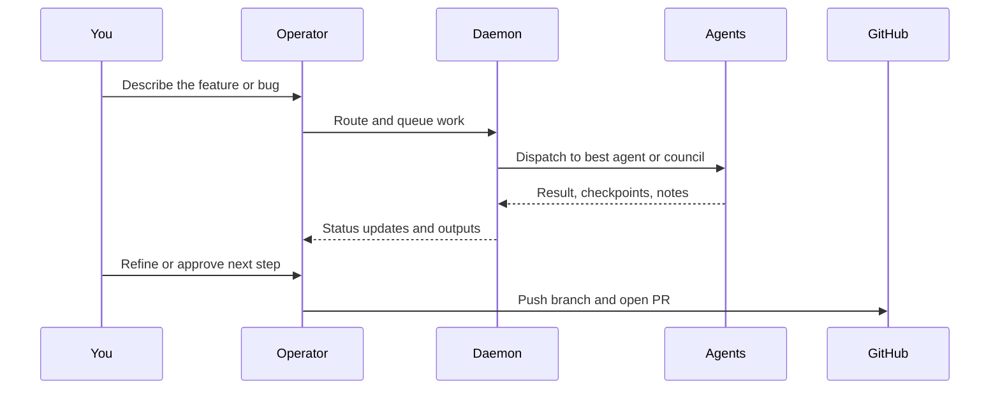
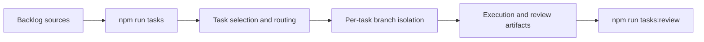

# Building Software Effectively with Hydra

Hydra is most useful when you treat it as a delivery system, not just a prompt router. The operator console, daemon, workers, council flow, and automation pipelines all support a slightly different way of working.

This guide explains when to use each workflow, how they fit together, and what effective day-to-day usage looks like when you are building software with Hydra.

## Start with the right workflow

| If you need to...                                           | Use this                                             | Why it works well                                                             |
| ----------------------------------------------------------- | ---------------------------------------------------- | ----------------------------------------------------------------------------- |
| Explore a codebase, ask questions, then turn that into work | `npm run go` in **Auto** or **Smart** mode           | The concierge can discuss first, then dispatch when the task becomes concrete |
| Make a design decision with trade-offs                      | `:mode council` or `npm run council -- prompt="..."` | Council forces proposal, critique, refinement, and implementation             |
| Implement a feature quickly with normal review loops        | Operator console + optional workers                  | Good default workflow for most software delivery                              |
| Process backlog items in batches                            | `npm run tasks`                                      | Best for TODOs, FIXMEs, and issue-driven execution                            |
| Run autonomous improvements while you are away              | `npm run nightly`                                    | Scans, prioritizes, executes, and reports                                     |
| Improve the system over repeated rounds                     | `npm run evolve`                                     | Best for longer self-improvement loops and suggestions backlogs               |

## How the main workflows connect



## Recommended delivery loop

For most product work, this is the simplest effective rhythm:



That loop works best when you keep each step explicit:

1. Ask questions until the task is clear.
2. Pick the smallest workflow that matches the risk.
3. Let Hydra do the work.
4. Verify results before merge.
5. Use review commands to keep autonomous output under control.

## Scenario 1: Build a new feature from scratch

Use this when the feature has real design choices and implementation depth.

### Recommended path

1. Start the operator:

```bash
npm run go
```

2. Explore the problem in chat or auto mode:

```text
Design a plan for adding project-level audit trails. I want to understand the architecture impact before changing code.
```

3. Escalate to council mode when the trade-offs matter:

```text
:mode council
```

```text
Add project-level audit trails with minimal overhead. Compare daemon-side event logging versus module-specific hooks, then implement the safest first step.
```

4. Review the result, then iterate with a narrower implementation prompt if needed.

5. Run quality checks, push the branch, and open a PR.

### Example interaction

```text
you> Design a safe first version of audit trails for task updates.
hydra> I can walk the codebase first, or dispatch immediately. The daemon event log already captures part of this. I recommend council mode because this affects architecture, storage, and verification.

you> :mode council
you> Add project-level audit trails for task updates. Prefer a reversible first step.
hydra> Claude proposed daemon-level hooks, Gemini challenged storage growth and queryability, Claude refined to append-only event tagging, and Codex produced the initial implementation plan plus code changes.
```

### Why this works

- The concierge helps shape the ask before you spend tokens on execution.
- Council mode gives you a better design record for architectural changes.
- The reversible-first-step bias reduces the chance of a large, risky merge.

## Scenario 2: Fix a bug quickly without over-orchestrating

Use this when the task is concrete and the goal is fast turnaround.

### Recommended path

1. Stay in **Auto** or **Smart** mode.
2. Give Hydra the symptom, expected behavior, and where to look.
3. Let it route to a single agent or tandem pair.
4. Run verification before you commit.

### Example interaction

```text
you> The operator sometimes loses the active model label after switching concierge providers. Find the regression, fix it, and run the relevant checks.
hydra> Routing this as tandem: analyze with Gemini, implement with Codex, then verify.
```

### Command pattern

```bash
npm run go
# then in the operator
:mode smart
The operator sometimes loses the active model label after switching concierge providers. Find the regression, fix it, and run the relevant checks.
```

### Why this works

- You do not pay the coordination cost of full council for a concrete bug.
- Smart mode can keep routine tasks on cheaper, faster paths.
- Tandem flow is a good default for bug fixes that still need critique.

## Scenario 3: Run a backlog cleanup campaign

Use this when you have a batch of TODOs, FIXMEs, or GitHub issues and want Hydra to process them systematically.

### Recommended path



1. Launch the curated backlog runner:

```bash
npm run tasks
```

2. Review the generated branches and reports:

```bash
npm run tasks:status
npm run tasks:review
```

3. Merge only the tasks that are ready.

### Example interaction

```text
You have 12 TODOs and 4 open issues. Use the tasks runner to pick the highest-value fixes first, isolate each change on its own branch, and present the review queue when done.
```

### Why this works

- The work stays reviewable because each task is isolated.
- You get automation without giving up control of merge decisions.
- This is better than a single giant autonomous branch.

## Scenario 4: Let Hydra improve the project overnight

Nightly is best when you want discovery plus execution, not just execution.

### Recommended path

```bash
npm run nightly
```

When it completes, review the generated output:

```bash
npm run nightly:status
npm run nightly:review
```

### What nightly is good at

- Finding neglected TODOs and issues
- Turning broad maintenance work into a prioritized queue
- Using budget-aware execution while you are away

### Example prompt for the operator before a nightly run

```text
Before I launch nightly, summarize the riskiest parts of this repo and recommend whether I should cap the run to small fixes only.
```

This helps you decide whether to keep the run conservative or let it attempt broader improvements.

## Scenario 5: Use workers for parallel throughput

Workers are useful when you want Hydra to keep pulling work from the daemon while you do something else.

### Typical flow

1. Start the daemon if it is not already running:

```bash
npm start
```

2. Start the operator or work headlessly.

3. Launch workers:

```text
:workers start
```

4. Watch progress with status commands:

```text
:status
:workers
```

### When workers help

- Repetitive documentation updates
- Batched fixes across multiple files
- Queue-based work where per-task isolation matters more than strict sequencing

## Practical habits that make Hydra effective

### 1. Pick the lightest workflow that fits the risk

Do not start every task in council mode. Use:

- **Auto / Smart** for most day-to-day work
- **Council** for architecture or high-risk changes
- **Tasks / Nightly** for batch automation
- **Workers** for queue throughput

### 2. Separate exploration from execution

The operator console is strongest when you first ask:

- What is already here?
- What are the constraints?
- What is the safest first step?

Then follow with an execution prompt once the path is clear.

### 3. Prefer reviewable increments

Hydra supports powerful automation, but reviewable output still wins. Smaller branches, smaller PRs, and explicit verification keep the system useful instead of noisy.

### 4. Use the review flows on purpose

The automation commands are only half the story:

- `npm run tasks:review`
- `npm run nightly:review`
- `npm run evolve:review`

These are where you turn autonomous work into accepted work.

### 5. Keep verification in the loop

Even for docs-heavy or routine changes, keep a validation habit:

```bash
npm run quality
npm test
```

If the repository already has baseline failures, record that clearly in the PR so reviewers know what is pre-existing versus introduced.

## Suggested team playbook

If you are introducing Hydra to a team, this progression works well:

1. Start with operator-driven feature work.
2. Add council mode for architectural changes.
3. Adopt tasks runner for backlog cleanup.
4. Turn on nightly runs once review discipline is in place.
5. Add workers and custom agents only after the team is comfortable reading Hydra output.

That order lets the team learn Hydra as a collaborator first, then as an automation platform.
