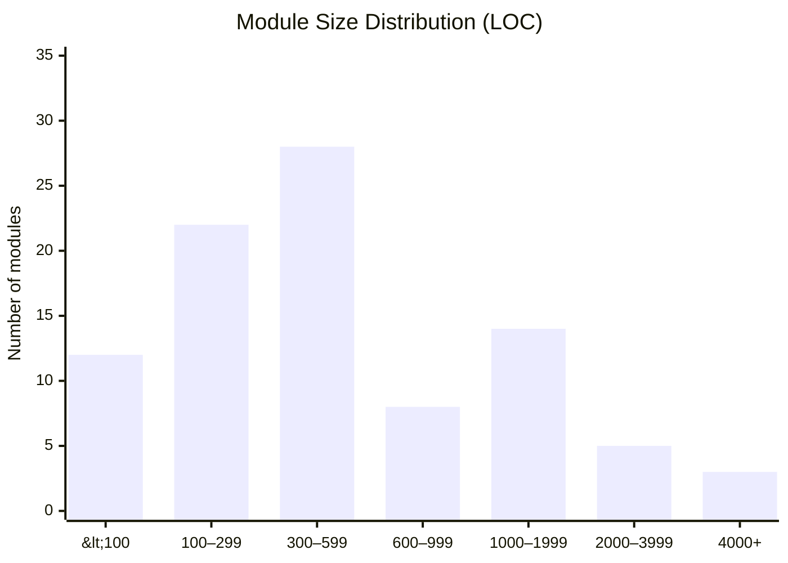
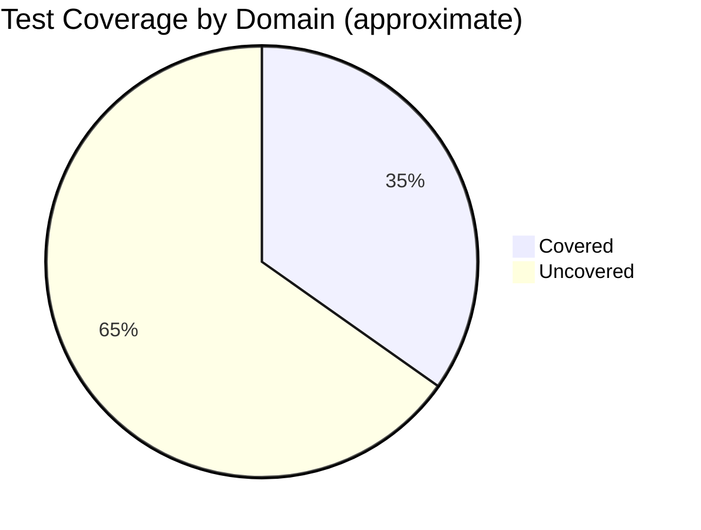
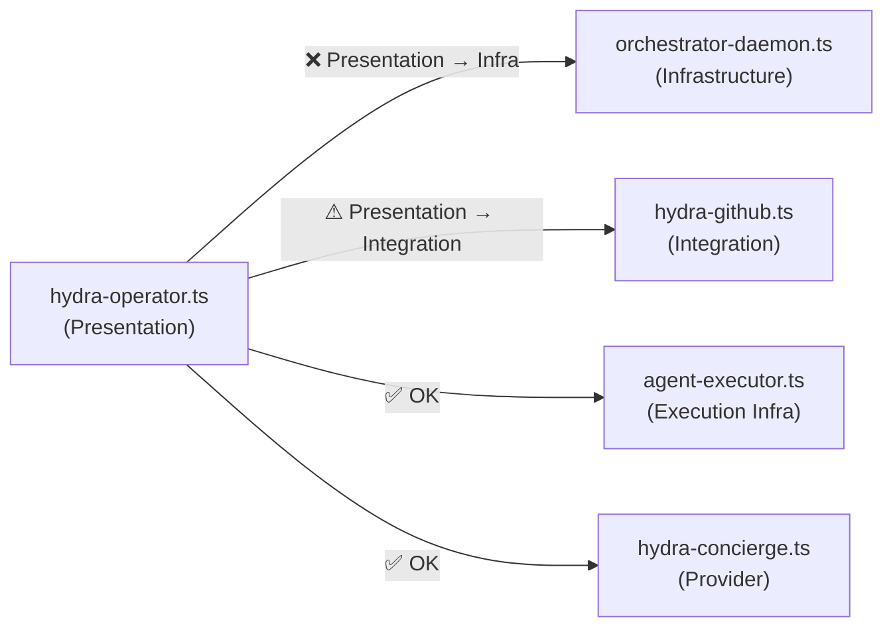
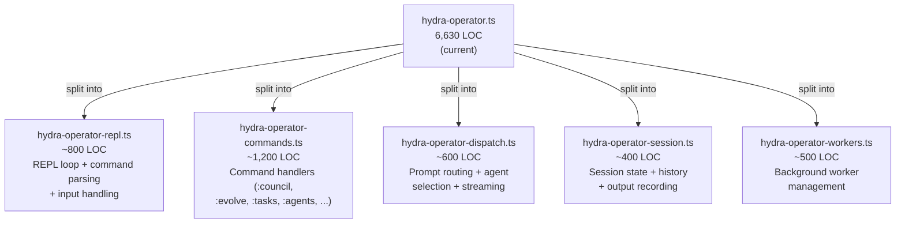
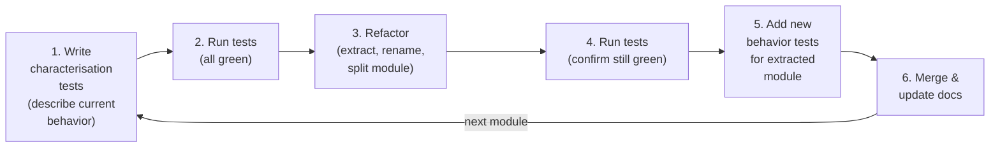
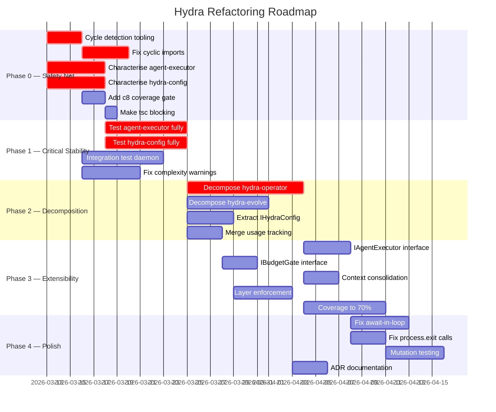
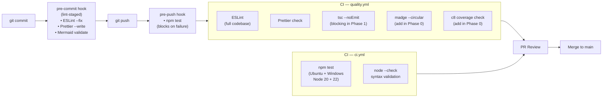

# Hydra — Refactoring Roadmap & Quality Gate Recommendations

> Generated: 2026-03-13 | Branch: `copilot/audit-source-code-compliance`
> This document is a living roadmap. Update the checklist items as work progresses.

---

## Table of Contents

1. [Executive Summary](#1-executive-summary)
2. [Complexity Metrics](#2-complexity-metrics)
3. [Current Quality Gate Inventory](#3-current-quality-gate-inventory)
4. [Recommended Quality Gates](#4-recommended-quality-gates)
5. [Code Smell Catalogue](#5-code-smell-catalogue)
6. [Architecture Findings](#6-architecture-findings)
7. [TDD Refactoring Strategy](#7-tdd-refactoring-strategy)
8. [Phase-by-Phase Roadmap](#8-phase-by-phase-roadmap)
9. [Parallel Workstream Plan](#9-parallel-workstream-plan)
10. [Risk Register](#10-risk-register)
11. [Success Metrics & Definition of Done](#11-success-metrics--definition-of-done)

---

## 1. Executive Summary

Hydra is a **92-module, 53,000-line TypeScript ESM codebase** that orchestrates multiple AI coding agents. The
TypeScript migration (PR #13) eliminated runtime type unsafety and established strong quality tooling. The next
step is architectural consolidation: breaking down oversized modules, eliminating cyclic imports, and building a
safety net of tests before refactoring critical infrastructure.

### Headline Findings

| Finding                                                                                      | Severity    | Impact                               |
| -------------------------------------------------------------------------------------------- | ----------- | ------------------------------------ |
| `hydra-operator.ts` is 6,630 lines — ~12% of total codebase                                  | 🔴 Critical | Untestable, high bug surface         |
| `hydra-config.ts` has 23 fan-in dependents — central hub bottleneck                          | 🔴 Critical | Any change ripples to 25% of modules |
| `hydra-shared/agent-executor.ts` — 1,824 lines, 5 dependents, no tests                       | 🔴 Critical | Core execution path unprotected      |
| Three cyclic import chains                                                                   | 🔴 Critical | Can cause runtime `undefined` errors |
| 60 of 92 modules (65%) have no dedicated test file                                           | 🟠 High     | Low confidence for any refactor      |
| `hydra-evolve.ts` — 3,657 lines, no tests                                                    | 🟠 High     | Evolution engine unverified          |
| No cyclomatic complexity gate                                                                | 🟡 Medium   | Complexity can grow unbounded        |
| No architectural layer enforcement                                                           | 🟡 Medium   | Presentation imports infra directly  |
| Repeated patterns: error recovery, context building, usage checking (8+ abstractions needed) | 🟡 Medium   | Duplication, inconsistent behavior   |

---

## 2. Complexity Metrics

### 2.1 Module Size Distribution



### 2.2 Complexity Hotspots

| Rank | Module                         |   LOC | Fan-Out | Fan-In | Test? | Priority   |
| ---- | ------------------------------ | ----: | ------: | -----: | :---: | ---------- |
| 1    | hydra-operator.ts              | 6,630 |      29 |      0 |  ❌   | 🔴 URGENT  |
| 2    | hydra-evolve.ts                | 3,657 |      11 |      1 |  ❌   | 🔴 URGENT  |
| 3    | hydra-council.ts               | 2,321 |      11 |      2 |  ✅   | 🟡 MONITOR |
| 4    | hydra-shared/agent-executor.ts | 1,824 |       4 |      5 |  ❌   | 🔴 URGENT  |
| 5    | orchestrator-daemon.ts         | 1,670 |      12 |      0 |  ❌   | 🟠 HIGH    |
| 6    | hydra-nightly.ts               | 1,233 |      15 |      0 |  ❌   | 🟠 HIGH    |
| 7    | hydra-model-profiles.ts        | 1,143 |       1 |      6 |  ✅   | 🟢 OK      |
| 8    | hydra-audit.ts                 | 1,126 |       4 |      0 |  ❌   | 🟡 MEDIUM  |
| 9    | hydra-config.ts                | 1,067 |       2 |     23 |  ❌   | 🔴 URGENT  |
| 10   | hydra-mcp-server.ts            | 1,059 |       9 |      0 |  ❌   | 🟡 MEDIUM  |

### 2.3 Test Coverage Overview



**Modules with NO tests and >500 LOC (highest risk):**

- `hydra-operator.ts` (6,630) — main entry point, most used
- `hydra-evolve.ts` (3,657) — autonomous AI mutation engine
- `hydra-shared/agent-executor.ts` (1,824) — executes all AI agent calls
- `orchestrator-daemon.ts` (1,670) — HTTP API server
- `hydra-nightly.ts` (1,233) — batch automation
- `hydra-audit.ts` (1,126) — audit log pipeline
- `hydra-config.ts` (1,067) — central config hub
- `hydra-mcp-server.ts` (1,059) — MCP tool handler
- `hydra-tasks.ts` (1,055) — task queue management
- `hydra-usage.ts` (1,051) — token budget enforcement

---

## 3. Current Quality Gate Inventory

| Gate                           | Tool                       | Config                     | Status              | Blocks PR?                  |
| ------------------------------ | -------------------------- | -------------------------- | ------------------- | --------------------------- |
| Lint                           | ESLint v10                 | `eslint.config.mjs`        | ✅ Active           | ✅ Yes (CI + pre-push)      |
| Format                         | Prettier v3                | `.prettierrc.json`         | ✅ Active           | ✅ Yes                      |
| Type check                     | TypeScript `tsc --noEmit`  | `tsconfig.json`            | ✅ Active           | ⚠ `continue-on-error` in CI |
| Unit tests                     | Node.js native test runner | `package.json` test script | ✅ Active           | ✅ Yes (pre-push hook)      |
| Mermaid validation             | `npm run lint:mermaid`     | `scripts/lint-mermaid.ts`  | ✅ Active           | ✅ Pre-commit staged        |
| Test coverage threshold        | —                          | —                          | ❌ **Missing**      | —                           |
| Cyclomatic complexity          | —                          | —                          | ❌ **Missing**      | —                           |
| Module size limit              | —                          | —                          | ❌ **Missing**      | —                           |
| Import cycle detection         | —                          | —                          | ❌ **Missing**      | —                           |
| Architecture layer enforcement | —                          | —                          | ❌ **Missing**      | —                           |
| Mutation testing               | —                          | —                          | ❌ **Missing**      | —                           |
| Dependency audit               | —                          | —                          | ❌ **Missing**      | —                           |
| Bundle size                    | —                          | —                          | N/A (no build step) | —                           |

---

## 4. Recommended Quality Gates

### 4.1 Immediate (add within 1 sprint)

#### A. Import Cycle Detection — `eslint-plugin-import` or `madge`

Cyclic imports between `hydra-rate-limits` ↔ `hydra-streaming-middleware` and the self-import in
`hydra-metrics` can cause `undefined` module errors at startup.

**Implementation:**

```bash
npm install --save-dev madge
```

Add to `package.json`:

```json
{
  "scripts": {
    "lint:cycles": "madge --circular --extensions ts lib/",
    "quality": "npm run lint && npm run format:check && npm run typecheck && npm run lint:cycles"
  }
}
```

Add to CI `quality.yml`:

```yaml
- name: Check circular dependencies
  run: npm run lint:cycles
```

#### B. TypeScript Type Check — Make Blocking

`quality.yml` currently runs `tsc --noEmit` with `continue-on-error: true`. Once the backlog of TS errors
is cleared, remove the flag to make type errors block PRs.

**Target**: Zero `tsc` errors by end of Phase 2 (see §8).

#### C. Module Size Lint Warning

Add a custom ESLint rule (or a standalone script) that warns when a module exceeds 800 lines.

```js
// scripts/check-module-sizes.mjs
import { readdirSync, statSync, readFileSync } from 'node:fs';
const MAX_LINES = 800;
// ... check all lib/*.ts and warn/error
```

Add to `quality` script and CI.

### 4.2 Short-Term (within 2 sprints)

#### D. Test Coverage Threshold — `c8`

```bash
npm install --save-dev c8
```

```json
{
  "scripts": {
    "test:coverage": "c8 --reporter=text --reporter=lcov npm test",
    "test:coverage:check": "c8 check-coverage --lines 60 --functions 60 --branches 50"
  }
}
```

Start at 60% line/function coverage threshold, increase by 5% per sprint.

**Coverage targets by phase:**

| Phase   | Target                                        |
| ------- | --------------------------------------------- |
| Phase 1 | 40% (add tests for untested critical modules) |
| Phase 2 | 55% (agent-executor, config, operator)        |
| Phase 3 | 70% (evolution engine, daemon)                |
| Phase 4 | 80%+ (full coverage)                          |

#### E. Cyclomatic Complexity Limit — ESLint

```js
// In eslint.config.mjs
{
  rules: {
    'complexity': ['warn', { max: 15 }],        // function-level CC
    'max-lines-per-function': ['warn', { max: 80 }],
    'max-depth': ['warn', { max: 4 }],
  }
}
```

Recommended thresholds (implement as warnings first, then errors):

| Rule                      | Warning | Error |
| ------------------------- | ------- | ----- |
| `complexity` (cyclomatic) | 15      | 25    |
| `max-lines-per-function`  | 80      | 150   |
| `max-lines` (module)      | 500     | 800   |
| `max-depth` (nesting)     | 4       | 6     |
| `max-params`              | 5       | 7     |

#### F. Import Architecture Enforcement — `eslint-plugin-boundaries`

Enforces that modules only import from the correct layer. Prevents `hydra-operator.ts` from importing
`orchestrator-daemon.ts` directly.

```bash
npm install --save-dev eslint-plugin-boundaries
```

```js
// eslint.config.mjs — add boundaries config
{
  rules: {
    'boundaries/element-types': ['error', {
      default: 'disallow',
      rules: [
        { from: 'presentation', allow: ['domain', 'observability', 'routing', 'shared'] },
        { from: 'domain', allow: ['infrastructure', 'shared', 'foundation'] },
        { from: 'infrastructure', allow: ['foundation', 'shared'] },
        { from: 'providers', allow: ['foundation', 'shared'] },
        { from: 'foundation', allow: [] },
      ]
    }]
  }
}
```

### 4.3 Medium-Term (Phase 3)

#### G. Mutation Testing — `stryker`

Mutation testing reveals tests that pass even when code is deliberately broken — catching tests that don't
actually verify behavior.

```bash
npm install --save-dev @stryker-mutator/core @stryker-mutator/typescript-checker
```

Target: mutation score ≥ 70% on core modules (`hydra-config`, `hydra-agents`, `agent-executor`).

#### H. Dependency Security Audit — `npm audit`

Add to CI:

```yaml
- name: Security audit
  run: npm audit --audit-level=high
```

---

## 5. Code Smell Catalogue

### 5.1 God Objects

| Module              |   LOC | Issue                                                                                    |
| ------------------- | ----: | ---------------------------------------------------------------------------------------- |
| `hydra-operator.ts` | 6,630 | Main REPL + dispatch + worker management + UI rendering + persistence all in one file    |
| `hydra-evolve.ts`   | 3,657 | 7-phase state machine + context building + code execution + PR management                |
| `hydra-config.ts`   | 1,067 | Config loading + saving + schema + test helpers + model selection helpers + role lookups |

### 5.2 Cyclic Dependencies (must fix before refactoring)

| Cycle       | Files                                                                           | Risk                                         |
| ----------- | ------------------------------------------------------------------------------- | -------------------------------------------- |
| **Cycle A** | `hydra-rate-limits.ts` ↔ `hydra-streaming-middleware.ts`                        | Module load failure if one initialises first |
| **Cycle B** | `hydra-metrics.ts` self-import                                                  | Causes `undefined` on first access           |
| **Cycle C** | `hydra-activity.ts` → `hydra-statusbar.ts` → `hydra-usage.ts` → (indirect loop) | Startup order sensitivity                    |

**Fix strategy:** Extract shared interfaces/types to a new `lib/hydra-streaming-types.ts` that both
`hydra-rate-limits.ts` and `hydra-streaming-middleware.ts` import without mutual dependency.

### 5.3 Repeated Patterns (DRY Violations)

| Pattern                        | Count | Location                                             | Proposed Abstraction                                           |
| ------------------------------ | ----: | ---------------------------------------------------- | -------------------------------------------------------------- |
| Agent execution boilerplate    |   15+ | operator, council, evolve, nightly, actualize, tasks | `agent-executor.ts` already exists — ensure all callers use it |
| Budget/quota check             |    8+ | operator, evolve, council, nightly, guardrails       | `hydra-shared/budget-tracker.ts` — expand API                  |
| Context building               |    8+ | council, dispatch, operator, nightly                 | `hydra-context.ts` — expose unified `buildContext()`           |
| Error recovery + retry         |   10+ | executor, operator, council, evolve                  | `hydra-model-recovery.ts` — expand + enforce usage             |
| Usage tracking after execution |   12+ | operator, council, evolve, tasks                     | `hydra-usage.ts` — expose single `recordExecution()`           |
| Git operation patterns         |    6+ | evolve, nightly, tasks, github                       | `hydra-shared/git-ops.ts` already exists                       |
| Provider presets               |    7+ | concierge, providers                                 | `hydra-concierge-providers.ts` — centralise fully              |

### 5.4 Missing Abstractions

These interfaces would reduce coupling and improve testability:

| Interface          | Purpose                            | Consumers                                 |
| ------------------ | ---------------------------------- | ----------------------------------------- |
| `IAgentExecutor`   | Decouple execution from consumers  | operator, council, evolve, tasks, nightly |
| `IConfigStore`     | Decouple config loading from users | All 23 current direct consumers           |
| `IMetricsRecorder` | Decouple metrics recording         | 10+ consumers                             |
| `IBudgetGate`      | Abstract usage checking            | 8+ consumers                              |
| `IContextProvider` | Decouple context building          | 8+ consumers                              |
| `IGitOperations`   | Abstract git commands              | 8+ consumers                              |

### 5.5 Miscellaneous Smells

- **Deep nesting**: Several functions in `hydra-operator.ts` and `hydra-evolve.ts` exceed 5 levels of nesting
- **Long parameter lists**: Some functions accept 7+ parameters — signals need for parameter objects
- **Boolean flags**: Several functions use boolean arguments to switch behavior — use strategy pattern or options objects
- **Magic strings**: Provider names, model IDs, and command strings repeated inline
- **No-await-in-loop**: 104 ESLint warnings for sequential awaits where `Promise.all` should be used
- **`process.exit()` calls**: 83 direct calls — should use `process.exitCode` and let process terminate

---

## 6. Architecture Findings

### 6.1 Layer Violations

The current architecture has no enforced layering. The following violations exist:



**Proposed Clean Layer Rules:**

```
Presentation   → Domain, Routing, Observability (read), Shared
Domain         → Execution, Routing, Integration, Config, Shared
Routing        → Config, Agents, Shared
Execution      → Config, Agents, Providers, Shared
Providers      → Config, Shared
Foundation     → (nothing internal)
```

### 6.2 `hydra-config.ts` Bottleneck

With 23 dependents, any breaking change to `hydra-config.ts` requires touching 25% of the codebase.
The recommended mitigation is to:

1. Extract a thin `IHydraConfig` interface that all consumers depend on (instead of the concrete class)
2. Use dependency injection in top-level modules (operator, daemon)
3. Keep the loader implementation in `hydra-config.ts` but only expose the interface type

### 6.3 `hydra-operator.ts` Decomposition Plan

The 6,630-line operator module should be split into ~5 focused modules:



---

## 7. TDD Refactoring Strategy

The key principle: **never refactor code that has no tests**. Write the safety net first, then move.

### 7.1 The Refactoring Loop



### 7.2 Characterisation Test Strategy

Before refactoring any large module:

1. **Identify all public exports** — these become the test surface
2. **Write input/output tests for each export** using mocked dependencies
3. **Capture current behavior** — even if buggy — to prevent regressions
4. **Run with coverage** to ensure the tests actually exercise the paths

### 7.3 Test Infrastructure Needed

| Utility                 | Purpose                              | File                                |
| ----------------------- | ------------------------------------ | ----------------------------------- |
| Mock config factory     | Create test configs without file I/O | `test/helpers/mock-config.ts`       |
| Mock agent executor     | Simulate agent responses without CLI | `test/helpers/mock-executor.ts`     |
| Mock metrics sink       | Capture metrics without side effects | `test/helpers/mock-metrics.ts`      |
| Mock GitHub client      | Simulate GitHub API responses        | `test/helpers/mock-github.ts`       |
| Ephemeral daemon helper | Spin up daemon on random port        | Already exists in integration tests |

### 7.4 Module Extraction Checklist

When extracting a sub-module from a large file:

- [ ] Write characterisation tests for the extracted functions first
- [ ] Create the new file with extracted code
- [ ] Update imports in the original file
- [ ] Ensure all tests still pass
- [ ] Add focused unit tests for the new module
- [ ] Update `docs/ARCHITECTURE.md` module table
- [ ] Update `docs/DEPENDENCY_DIAGRAMS.md` appendix table

---

## 8. Phase-by-Phase Roadmap

### Phase 0: Safety Net (1 week) 🔴 PREREQUISITE

> **Goal**: Establish minimum test coverage and tooling before any structural changes.

- [ ] Add `madge` cycle detection to `quality` script and CI (`npm run lint:cycles`)
- [ ] Fix Cycle B: `hydra-metrics.ts` self-import (remove or lazy-reference)
- [ ] Fix Cycle A: Extract `hydra-streaming-types.ts` to break `rate-limits` ↔ `streaming-middleware` cycle
- [ ] Add ESLint complexity rules as **warnings** (`complexity: 15`, `max-lines: 800`)
- [ ] Write characterisation tests for `hydra-shared/agent-executor.ts` (5 dependents, 0 tests)
- [ ] Write characterisation tests for `hydra-config.ts` (23 dependents, 0 tests)
- [ ] Add `c8` coverage with 40% threshold
- [ ] Make `tsc --noEmit` blocking in CI (remove `continue-on-error`)

**Acceptance criteria**: `npm run quality` passes with no cycles detected, 40% coverage, tsc clean.

---

### Phase 1: Critical Stability (2 weeks) 🔴

> **Goal**: Test and stabilise the execution core before any refactoring.

#### 1.1 Test `hydra-shared/agent-executor.ts`

- [ ] Unit tests for `executeAgent()` — mock process spawn
- [ ] Tests for output streaming and parsing logic
- [ ] Tests for timeout and cancellation paths
- [ ] Tests for all agent types: claude, gemini, codex, local, custom
- [ ] Target: 80% function coverage on `agent-executor.ts`

#### 1.2 Test `hydra-config.ts`

- [ ] Tests for `loadHydraConfig()` — use `_setTestConfigPath()`
- [ ] Tests for `saveHydraConfig()`
- [ ] Tests for `getRoleConfig()`, `getActiveModel()`
- [ ] Tests for config schema validation and defaults
- [ ] Tests for `_setTestConfig()` and `invalidateConfigCache()`
- [ ] Target: 80% function coverage on `hydra-config.ts`

#### 1.3 Test `orchestrator-daemon.ts`

- [ ] Integration tests for all HTTP endpoints (extend existing integration test)
- [ ] Tests for task state machine (queued → claimed → running → complete)
- [ ] Tests for worktree isolation mode
- [ ] Tests for heartbeat and timeout behavior

#### 1.4 Upgrade ESLint complexity rules from warnings to errors

- [ ] Resolve all `complexity > 25` violations
- [ ] Resolve all `max-lines > 800` violations (or add explicit suppression with comment)

---

### Phase 2: Monolith Decomposition (3 weeks) 🟠

> **Goal**: Break down the three largest modules into testable units.

#### 2.1 Decompose `hydra-operator.ts` (6,630 → ~3,500 total across 5 modules)

See §6.3 for the decomposition plan.

- [ ] Extract `hydra-operator-session.ts` (session state, history)
- [ ] Extract `hydra-operator-workers.ts` (background worker management)
- [ ] Extract `hydra-operator-dispatch.ts` (prompt routing + streaming)
- [ ] Extract `hydra-operator-commands.ts` (command handlers)
- [ ] Reduce `hydra-operator.ts` to REPL loop + wiring (~800 LOC)
- [ ] Add unit tests for each new module
- [ ] Target: `hydra-operator.ts` ≤ 1,000 LOC

#### 2.2 Decompose `hydra-evolve.ts` (3,657 → ~2,000 total across 3 modules)

- [ ] Extract `hydra-evolve-pipeline.ts` (phase state machine + transition logic)
- [ ] Extract `hydra-evolve-executor.ts` (code change execution + git operations)
- [ ] Reduce `hydra-evolve.ts` to orchestration entry point (~600 LOC)
- [ ] Add unit tests for each phase independently
- [ ] Target: `hydra-evolve.ts` ≤ 700 LOC

#### 2.3 Extract `IHydraConfig` interface

- [ ] Define `IHydraConfig` interface in `lib/types.ts`
- [ ] Update all 23 consumers to import the interface type
- [ ] Keep concrete implementation in `hydra-config.ts`
- [ ] Add tests that verify consumer contracts

#### 2.4 Merge usage tracking

- [ ] Audit all 12 inline usage tracking patterns
- [ ] Consolidate into a single `recordExecution()` call in `hydra-usage.ts`
- [ ] Update all consumers

---

### Phase 3: Extensibility (2 weeks) 🟡

> **Goal**: Extract cross-cutting abstractions to reduce duplication and coupling.

#### 3.1 Create `IAgentExecutor` Interface

- [ ] Define interface in `lib/types.ts` or `lib/hydra-shared/types.ts`
- [ ] Update `agent-executor.ts` to implement it
- [ ] Update all 5 consumers to use the interface
- [ ] Add mock implementation `MockAgentExecutor` for tests

#### 3.2 Create `IBudgetGate` Interface

- [ ] Define interface in `lib/types.ts`
- [ ] Move all 8 budget check patterns to use it
- [ ] Create `NullBudgetGate` for testing (always allows)

#### 3.3 Consolidate Context Building

- [ ] Audit 8 context building patterns
- [ ] Extend `hydra-context.ts` to cover all cases
- [ ] Update consumers

#### 3.4 Architecture Layer Enforcement

- [ ] Add `eslint-plugin-boundaries` with layer rules
- [ ] Fix all layer violations
- [ ] Add to CI quality gate

#### 3.5 Raise Coverage Threshold to 70%

- [ ] Fill coverage gaps in evolution engine
- [ ] Fill coverage gaps in nightly batch
- [ ] Fill coverage gaps in daemon routes
- [ ] Update `c8` threshold in `package.json`

---

### Phase 4: Performance & Polish (1 week) 🟢

> **Goal**: Optimize, document, and close remaining gaps.

#### 4.1 Fix `no-await-in-loop` (104 warnings)

- [ ] Audit all 104 sequential-await loops
- [ ] Convert safe cases to `Promise.all()` / `Promise.allSettled()`
- [ ] Estimate: 50% conversion rate (52 locations)

#### 4.2 Replace `process.exit()` (83 locations)

- [ ] Convert to `process.exitCode = N` + `return` or `throw`
- [ ] Fixes `n/no-process-exit` ESLint rule

#### 4.3 Add Mutation Testing

- [ ] Install and configure Stryker
- [ ] Run on `hydra-config.ts`, `agent-executor.ts`, `hydra-agents.ts`
- [ ] Target: 70% mutation score on these three modules

#### 4.4 Documentation Finalisation

- [ ] Update `docs/ARCHITECTURE.md` module table with refactored modules
- [ ] Update `docs/DEPENDENCY_DIAGRAMS.md` with post-refactor diagrams
- [ ] Add ADR (Architecture Decision Records) directory `docs/adr/`
- [ ] Write ADR-001: Module size limits
- [ ] Write ADR-002: Layer enforcement rules
- [ ] Write ADR-003: Cyclic dependency policy

---

## 9. Parallel Workstream Plan

Multiple engineers can work in parallel on different phases if they respect the following dependency order:



### Parallel Workstreams

| Stream       | Owner Role      | Modules                                      | Dependency                      |
| ------------ | --------------- | -------------------------------------------- | ------------------------------- |
| **Stream A** | Senior Engineer | `hydra-operator.ts` decomposition            | Must complete Phase 0 first     |
| **Stream B** | Senior Engineer | `hydra-evolve.ts` decomposition              | Must complete Phase 0 first     |
| **Stream C** | Engineer        | `agent-executor.ts` tests + interface        | Independent (start immediately) |
| **Stream D** | Engineer        | `hydra-config.ts` tests + interface          | Independent (start immediately) |
| **Stream E** | Engineer        | Daemon route tests + cyclic fix              | Independent (start immediately) |
| **Stream F** | DevOps/Tooling  | Quality gate tooling (madge, c8, boundaries) | Independent (start immediately) |

> **Conflict zones**: Streams A and B both touch `hydra-operator.ts` indirectly via shared imports. Coordinate
> branch merging to avoid conflicts. Recommended: Stream A and B use different feature branches with daily
> rebases on `main`.

---

## 10. Risk Register

| Risk                                                        | Probability | Impact | Mitigation                                                                    |
| ----------------------------------------------------------- | :---------: | :----: | ----------------------------------------------------------------------------- |
| Cyclic import causes startup failure after partial fix      |   Medium    |  High  | Fix all cycles in a single commit; run integration tests before merge         |
| `hydra-operator.ts` decomposition introduces regression     |    High     |  High  | Write characterisation tests before extraction; use feature flags             |
| `hydra-config.ts` interface change breaks 23 consumers      |    High     |  High  | Use interface type that matches existing shape; no behavior change in Phase 2 |
| Coverage threshold flaps due to flaky tests                 |     Low     | Medium | Mark known-flaky tests with `test.skip` + issue link                          |
| Evolution engine generates code that breaks cycle detection |   Medium    |  Low   | Add `npm run lint:cycles` to post-evolve verification commands                |
| Layer enforcement breaks undocumented cross-layer calls     |   Medium    | Medium | Start with `warn` before `error`; audit violations before enforcing           |
| Parallel streams create merge conflicts                     |    High     | Medium | Feature flags + small PRs + daily rebases + nominated merge coordinator       |
| Complexity rules generate too many false positives          |     Low     |  Low   | Tune thresholds; use inline `eslint-disable` with justification comment       |

---

## 11. Success Metrics & Definition of Done

### Quantitative Targets

| Metric                         | Baseline (now) | Phase 1 |   Phase 2    | Phase 3 | Phase 4 |
| ------------------------------ | :------------: | :-----: | :----------: | :-----: | :-----: |
| Test coverage (lines)          |      ~35%      |   50%   |     60%      |   70%   |   80%   |
| Modules > 800 LOC              |       10       |   10    |      5       |    3    |    1    |
| Modules > 1,500 LOC            |       5        |    5    |      2       |    1    |    0    |
| Cyclic imports                 |       3        |    0    |      0       |    0    |    0    |
| ESLint errors                  |      ~400      |   200   |     100      |   50    |    0    |
| `tsc --noEmit` errors          |       0        |    0    |      0       |    0    |    0    |
| Fan-in on `hydra-config.ts`    |       23       |   23    |      15      |   10    |  ≤ 10   |
| Fan-out on `hydra-operator.ts` |       29       |   29    | ≤ 10 (split) |  ≤ 10   |  ≤ 10   |
| `no-await-in-loop` warnings    |      104       |   104   |      80      |   40    |    0    |

### Qualitative Definition of Done

A module is considered **refactoring-complete** when:

- [ ] It has ≥ 80% function test coverage
- [ ] It is ≤ 800 lines
- [ ] It has no cyclic dependencies
- [ ] All functions have cyclomatic complexity ≤ 15
- [ ] It has a clear, documented purpose (single responsibility)
- [ ] Its public API is covered by an interface in `types.ts`
- [ ] It respects the architectural layer rules
- [ ] Its entry in `docs/ARCHITECTURE.md` is up to date

---

## Appendix A: Recommended New Dependencies

| Package                             | Purpose                        | Phase   | Risk   |
| ----------------------------------- | ------------------------------ | ------- | ------ |
| `madge` (devDep)                    | Circular dependency detection  | Phase 0 | Low    |
| `c8` (devDep)                       | Native V8 coverage reporter    | Phase 0 | Low    |
| `eslint-plugin-boundaries` (devDep) | Architecture layer enforcement | Phase 3 | Medium |
| `@stryker-mutator/core` (devDep)    | Mutation testing               | Phase 4 | Low    |

> All are dev-only dependencies. No production bundle impact.

---

## Appendix B: ADR Template

Create ADRs in `docs/adr/` using the following template:

```markdown
# ADR-NNN: {Title}

**Date**: YYYY-MM-DD
**Status**: Proposed | Accepted | Deprecated | Superseded

## Context

What is the issue we're facing?

## Decision

What did we decide?

## Consequences

What are the positive and negative consequences?
```

---

## Appendix C: Quality Gate Pipeline Summary


