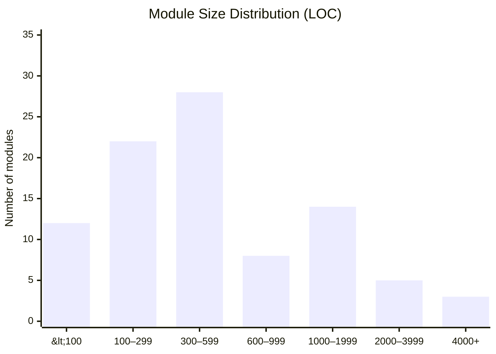
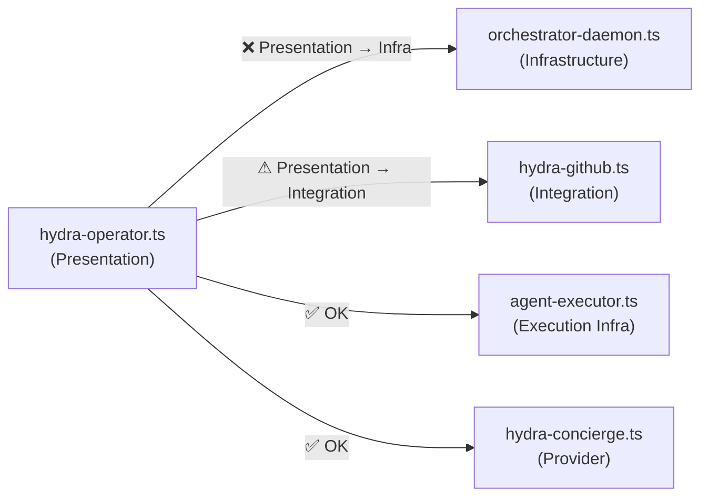
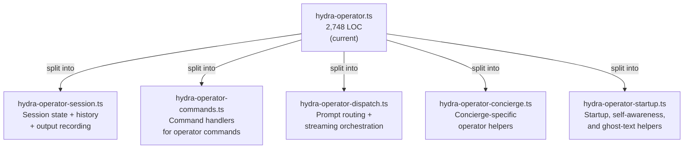
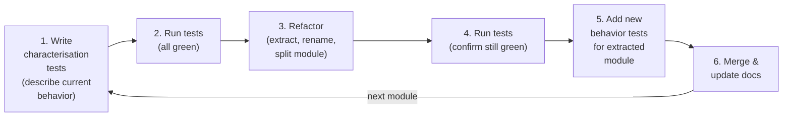
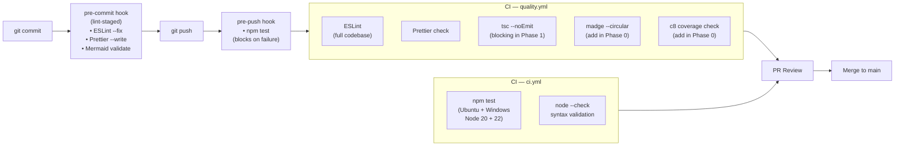

# Hydra — Refactoring Roadmap & Quality Gate Recommendations

> Generated: 2026-03-14 | Branch: `docs/update-roadmap-status`
> This document is a living roadmap. Update the checklist items as work progresses.

---

## Table of Contents

1. [Executive Summary](#1-executive-summary)
2. [Complexity Metrics](#2-complexity-metrics)
3. [Current Quality Gate Inventory](#3-current-quality-gate-inventory)
4. [Recommended Quality Gates](#4-recommended-quality-gates)
5. [Code Smell Catalogue](#5-code-smell-catalogue)
6. [Architecture Findings](#6-architecture-findings)
7. [TDD Refactoring Strategy](#7-tdd-refactoring-strategy)
8. [Phase-by-Phase Roadmap](#8-phase-by-phase-roadmap)
9. [Parallel Workstream Plan](#9-parallel-workstream-plan)
10. [Risk Register](#10-risk-register)
11. [Success Metrics & Definition of Done](#11-success-metrics--definition-of-done)

---

## 1. Executive Summary

Hydra is a **92-module, 53,000-line TypeScript ESM codebase** that orchestrates multiple AI coding agents. The
core remediation program is now largely complete: the largest hotspots have been split down, the safety net is in
place, circular imports are gone, and the quality tooling backlog has been implemented. The remaining work is now
focused on a small set of follow-on seams rather than broad structural cleanup.

### Execution Artifacts

Use this roadmap as the high-level program document, then execute from the task-oriented plans in `docs/plan/`:

- `docs/plan/refactoring-master-plan.md` — operating rules, phase gates, model roles, and validation loop
- `docs/plan/refactoring-task-breakdown.md` — dependency-ordered task matrix designed for maximum safe parallelism
- `docs/plan/refactoring-worktree-playbook.md` — repo-local worktree conventions, quality checks, and merge hygiene
- `docs/plan/worktree-setup-guide.md` — concrete commands and smoke checks for creating task worktrees
- `docs/plan/validation-gate.md` — standard per-task validation commands, evidence, and review handoff rules

The roadmap is intentionally summary-level. The task breakdown and worktree playbook are the source of truth for
day-to-day execution.

### Current Status

- **Overall progress**: ~95% complete after PR #94 (`feat/remediation`) merged to `main`
- **Current quality snapshot**: 1,884 passing tests, 0 failing tests (1,903 total, 19 todo); 0 circular imports in
  `lib/`; 0 TypeScript errors; 0 lint errors
- **Completed**: bootstrap, tooling gates, safety-net expansion, cycle remediation, hotspot decomposition, mutation
  testing, and the Phase 5 documentation refresh
- **Remaining**:
  - `rf-ab01` — introduce `IHydraConfig` (highest-value remaining abstraction task; not started)
  - `rf-pl02` — ✅ complete; all direct `process.exit()` calls in `lib/` have been migrated to the shared `gracefulExit` helper (only the intentional wrapper in `lib/hydra-process.ts` remains)
  - `rf-ab06` / `rf-ab07` follow-on consumer adoption — typed exports exist, but DI-based interface consumption is
    still pending

### Headline Findings

| Finding                                                                                      | Severity    | Impact                                                   |
| -------------------------------------------------------------------------------------------- | ----------- | -------------------------------------------------------- |
| `hydra-operator.ts` is down to 2,748 LOC from 6,630, but remains the largest entrypoint      | 🟠 High     | Still a hotspot worth monitoring                         |
| `hydra-council.ts` (2,542 LOC) and `hydra-evolve.ts` (2,245 LOC) are now the main size risks | 🟡 Medium   | Large modules remain, but they are no longer unprotected |
| `hydra-config.ts` is down to 870 LOC, but `IHydraConfig` has not started                     | 🟠 High     | Config remains the highest-value abstraction gap         |
| Circular imports are eliminated (`madge`: 0 cycles in `lib/`)                                | ✅ Resolved | Import-order failures are no longer blocking work        |
| Safety-net coverage is in place across all major hotspots                                    | ✅ Resolved | Downstream extraction work is now test-backed            |
| `process.exit()` remediation is complete — all direct calls migrated to `gracefulExit`       | ✅ Resolved | All exit paths now route through the shared helper       |
| Architecture boundaries, mutation testing, coverage gating, and audit checks are live        | ✅ Resolved | The quality gate backlog is materially complete          |

---

## 2. Complexity Metrics

### 2.1 Module Size Distribution



### 2.2 Complexity Hotspots

| Rank | Module                           | LOC (current) | Test? | Refactor status                                      | Priority   |
| ---- | -------------------------------- | ------------: | :---: | ---------------------------------------------------- | ---------- |
| 1    | `hydra-operator.ts`              |         2,748 |  ✅   | Phase 3 extraction complete (was 6,630)              | 🟡 Monitor |
| 2    | `hydra-council.ts`               |         2,542 |  ✅   | Stable but still oversized                           | 🟡 Monitor |
| 3    | `hydra-evolve.ts`                |         2,245 |  ✅   | Phase 3 extraction complete (was 3,657)              | 🟡 Monitor |
| 4    | `hydra-evolve-executor.ts`       |         2,005 |  ✅   | Extracted successfully; now a visible hotspot        | 🟡 Monitor |
| 5    | `hydra-agents.ts`                |         1,603 |  ✅   | Stable shared module                                 | 🟡 Monitor |
| 6    | `hydra-shared/agent-executor.ts` |         1,120 |  ✅   | Reduced from 1,824; covered and partially abstracted | 🟡 Monitor |
| 7    | `hydra-config.ts`                |           870 |  ✅   | Reduced from 1,067; `IHydraConfig` still pending     | 🟠 Next up |

### 2.3 Test Coverage Overview

**Current test snapshot:**

- **1,884 passing**, **0 failing**, **1,903 total** tests (**19 todo**)
- All characterization safety-net tracks (`rf-sn01` through `rf-sn12`) are complete
- The previously highest-risk hotspots now have direct test coverage, including:
  - `hydra-operator.ts`
  - `hydra-evolve.ts`
  - `hydra-shared/agent-executor.ts`
  - `orchestrator-daemon.ts`
  - `hydra-config.ts`
  - `hydra-nightly.ts`
  - `hydra-audit.ts`
  - `hydra-mcp-server.ts`
  - `hydra-tasks.ts`
  - `hydra-usage.ts`
- Mutation testing is also in place for `lib/hydra-shared/**/*.ts`

---

## 3. Current Quality Gate Inventory

| Gate                           | Tool                       | Config / Entry Point        | Status                      | Blocks PR?                        |
| ------------------------------ | -------------------------- | --------------------------- | --------------------------- | --------------------------------- |
| Lint                           | ESLint v10                 | `eslint.config.mjs`         | ✅ Implemented              | ✅ Yes (CI + hooks)               |
| Format                         | Prettier v3                | `.prettierrc.json`          | ✅ Implemented              | ✅ Yes                            |
| Type check                     | TypeScript `tsc --noEmit`  | `tsconfig.json`             | ✅ Implemented              | ⚠ Warn-only in part of CI         |
| TypeScript strict mode         | TypeScript                 | `tsconfig.json`             | ✅ Implemented              | ✅ Enforced in local verification |
| Unit tests                     | Node.js native test runner | `package.json` test script  | ✅ Implemented              | ✅ Yes (pre-push hook)            |
| Mermaid validation             | `npm run lint:mermaid`     | `scripts/lint-mermaid.ts`   | ✅ Implemented              | ✅ Pre-commit staged              |
| Test coverage threshold        | `c8`                       | coverage scripts + CI       | ✅ Implemented              | ✅ Yes                            |
| Cyclomatic complexity          | ESLint                     | `eslint.config.mjs`         | ✅ Implemented (visibility) | ✅ Yes                            |
| Module size limit              | hotspot tracking           | roadmap + ESLint visibility | ⚠ Visibility only           | ❌ No dedicated hard gate yet     |
| Import cycle detection         | `madge`                    | `npm run lint:cycles` + CI  | ✅ Implemented              | ✅ Yes                            |
| Architecture layer enforcement | `eslint-plugin-boundaries` | `eslint.config.mjs`         | ✅ Implemented              | ✅ Yes                            |
| Mutation testing               | Stryker                    | `stryker.config.json`       | ✅ Implemented              | ⚠ Warn-only CI job                |
| Dependency audit               | `npm audit`                | `ci.yml`                    | ✅ Implemented              | ⚠ Warn-only CI job                |
| Bundle size                    | —                          | —                           | N/A (no build step)         | —                                 |

---

## 4. Recommended Quality Gates

### 4.1 Immediate (add within 1 sprint)

- [x] Import cycle detection (`madge`)
- [x] TypeScript strict checking
- [ ] Module size warning / hard gate

#### A. Import Cycle Detection — `madge` ✅ Implemented

Cyclic imports between `hydra-rate-limits` ↔ `hydra-streaming-middleware` and the self-import in
`hydra-metrics` can cause `undefined` module errors at startup.

**Implementation:**

```bash
npm install --save-dev madge
```

Add to `package.json`:

```json
{
  "scripts": {
    "lint:cycles": "madge --circular --extensions ts lib/",
    "quality": "npm run lint && npm run format:check && npm run typecheck && npm run lint:cycles"
  }
}
```

Add to CI `quality.yml`:

```yaml
- name: Check circular dependencies
  run: npm run lint:cycles
```

#### B. TypeScript Type Check — strict mode ✅ Implemented

The repository is now on a **0 TypeScript error** baseline and strict mode is in place. Some CI jobs still report
typecheck in a warn-only posture, but the implementation work itself is complete and clean.

**Target achieved** ✅: Zero `tsc` errors — reached during Phase 4/5 remediation (PR #94).

#### C. Module Size Lint Warning

Add a custom ESLint rule (or a standalone script) that warns when a module exceeds 800 lines.

```js
// scripts/check-module-sizes.mjs
import { readdirSync, statSync, readFileSync } from 'node:fs';
const MAX_LINES = 800;
// ... check all lib/*.ts and warn/error
```

Add to `quality` script and CI.

### 4.2 Short-Term (within 2 sprints)

- [x] Test coverage threshold (`c8`)
- [x] Cyclomatic complexity visibility (ESLint)
- [x] Import architecture enforcement (`eslint-plugin-boundaries`)

#### D. Test Coverage Threshold — `c8` ✅ Implemented

```bash
npm install --save-dev c8
```

```json
{
  "scripts": {
    "test:coverage": "c8 --reporter=text --reporter=lcov npm test",
    "test:coverage:check": "c8 check-coverage --lines 60 --functions 60 --branches 50"
  }
}
```

Implemented via `c8` rollout and kept in the repo's quality path.

**Coverage targets by phase:**

| Phase   | Target                                        |
| ------- | --------------------------------------------- |
| Phase 1 | 40% (add tests for untested critical modules) |
| Phase 2 | 55% (agent-executor, config, operator)        |
| Phase 3 | 70% (evolution engine, daemon)                |
| Phase 4 | 80%+ (full coverage)                          |

#### E. Cyclomatic Complexity Limit — ESLint ✅ Implemented (warning-level visibility)

```js
// In eslint.config.mjs
{
  rules: {
    'complexity': ['warn', { max: 15 }],        // function-level CC
    'max-lines-per-function': ['warn', { max: 80 }],
    'max-depth': ['warn', { max: 4 }],
  }
}
```

Current warning-level thresholds are active and were added specifically to surface hotspots without blocking the
refactor program prematurely.

| Rule                      | Warning | Error |
| ------------------------- | ------- | ----- |
| `complexity` (cyclomatic) | 15      | 25    |
| `max-lines-per-function`  | 80      | 150   |
| `max-lines` (module)      | 500     | 800   |
| `max-depth` (nesting)     | 4       | 6     |
| `max-params`              | 5       | 7     |

#### F. Import Architecture Enforcement — `eslint-plugin-boundaries` ✅ Implemented

Enforces that modules only import from the correct layer. Prevents `hydra-operator.ts` from importing
`orchestrator-daemon.ts` directly.

```bash
npm install --save-dev eslint-plugin-boundaries
```

```js
// eslint.config.mjs — add boundaries config
{
  rules: {
    'boundaries/element-types': ['error', {
      default: 'disallow',
      rules: [
        { from: 'presentation', allow: ['domain', 'observability', 'routing', 'shared'] },
        { from: 'domain', allow: ['infrastructure', 'shared', 'foundation'] },
        { from: 'infrastructure', allow: ['foundation', 'shared'] },
        { from: 'providers', allow: ['foundation', 'shared'] },
        { from: 'foundation', allow: [] },
      ]
    }]
  }
}
```

### 4.3 Medium-Term (Phase 3 / Phase 5 delivery)

- [x] Mutation testing (`Stryker`)
- [x] Dependency security audit (`npm audit`)

#### G. Mutation Testing — `stryker` ✅ Done (Phase 5)

Mutation testing reveals tests that pass even when code is deliberately broken — catching tests that don't
actually verify behavior.

```bash
npm install --save-dev @stryker-mutator/core @stryker-mutator/typescript-checker
```

Installed in Phase 5. `stryker.config.json` targets `lib/hydra-shared/**/*.ts`. Thresholds: warn below 60%,
break below 40%. Run with `npm run test:mutation`. Warn-only CI job added to `ci.yml`.

#### H. Dependency Security Audit — `npm audit` ✅ Done (Phase 5)

Added to CI (`ci.yml`) as a warn-only job:

```yaml
- name: Security audit
  run: npm audit --audit-level=high
```

Currently 0 high/critical vulnerabilities. Job uses `continue-on-error: true` until a clean baseline is
confirmed.

---

## 5. Code Smell Catalogue

### 5.1 God Objects

| Module                     |   LOC | Current concern                                                                          |
| -------------------------- | ----: | ---------------------------------------------------------------------------------------- |
| `hydra-operator.ts`        | 2,748 | Main entrypoint is much smaller, but still carries enough orchestration logic to monitor |
| `hydra-council.ts`         | 2,542 | Still large and cross-cutting, though now covered                                        |
| `hydra-evolve.ts`          | 2,245 | Entry-point shell improved, but the evolve path remains a sizable workflow               |
| `hydra-evolve-executor.ts` | 2,005 | Extraction succeeded, but the new executor module is now a visible hotspot               |
| `hydra-config.ts`          |   870 | Close to target size; `IHydraConfig` is the main remaining seam                          |

### 5.2 Cyclic Dependencies (resolved)

| Cycle       | Files                                                                           | Status               | Resolution                       |
| ----------- | ------------------------------------------------------------------------------- | -------------------- | -------------------------------- |
| **Cycle A** | `hydra-rate-limits.ts` ↔ `hydra-streaming-middleware.ts`                        | ✅ Fixed (`rf-cy02`) | Shared streaming types extracted |
| **Cycle B** | `hydra-metrics.ts` self-import                                                  | ✅ Fixed (`rf-cy01`) | Self-import removed              |
| **Cycle C** | `hydra-activity.ts` → `hydra-statusbar.ts` → `hydra-usage.ts` → (indirect loop) | ✅ Fixed (`rf-cy03`) | Activity / usage loop untangled  |

**Current state:** `madge` reports **0 circular imports** in `lib/`, so cycle removal is no longer on the
critical path for follow-on work.

### 5.3 Repeated Patterns (DRY Violations)

| Pattern                        | Count | Location                                             | Proposed Abstraction                                                                |
| ------------------------------ | ----: | ---------------------------------------------------- | ----------------------------------------------------------------------------------- |
| Agent execution boilerplate    |   15+ | operator, council, evolve, nightly, actualize, tasks | `agent-executor.ts` already exists — ensure all callers use it                      |
| Budget/quota check             |    8+ | operator, evolve, council, nightly, guardrails       | `hydra-shared/budget-tracker.ts` — expand API                                       |
| Context building               |    8+ | council, dispatch, operator, nightly                 | `hydra-context.ts` — expose unified `buildContext()`                                |
| Error recovery + retry         |   10+ | executor, operator, council, evolve                  | `hydra-model-recovery.ts` — expand + enforce usage                                  |
| Usage tracking after execution |   12+ | operator, council, evolve, tasks                     | `hydra-usage.ts` — expose single `recordExecution()` (deferred — see Phase 2 notes) |
| Git operation patterns         |    6+ | evolve, nightly, tasks, github                       | `hydra-shared/git-ops.ts` already exists                                            |
| Provider presets               |    7+ | concierge, providers                                 | `hydra-concierge-providers.ts` — centralise fully                                   |

### 5.4 Missing Abstractions

These interfaces would reduce coupling and improve testability:

| Interface          | Purpose                            | Consumers                                 | Status                                                                          |
| ------------------ | ---------------------------------- | ----------------------------------------- | ------------------------------------------------------------------------------- |
| `IAgentExecutor`   | Decouple execution from consumers  | operator, council, evolve, tasks, nightly | ✅ Defined and adopted for covered consumers                                    |
| `IHydraConfig`     | Decouple config loading from users | All 23 current direct consumers           | ⏳ Not started (`rf-ab01`, highest-priority remaining abstraction task)         |
| `IMetricsRecorder` | Decouple metrics recording         | 10+ consumers                             | ⚠ Interface defined and typed export landed; consumer DI adoption still pending |
| `IBudgetGate`      | Abstract usage checking            | 8+ consumers                              | ✅ Defined and adopted                                                          |
| `IContextProvider` | Decouple context building          | 8+ consumers                              | ✅ Context consolidation completed in `hydra-context.ts`                        |
| `IGitOperations`   | Abstract git commands              | 8+ consumers                              | ⚠ Interface defined and typed export landed; consumer DI adoption still pending |

### 5.5 Miscellaneous Smells

- **Deep nesting**: Several functions in `hydra-operator.ts` and `hydra-evolve.ts` exceed 5 levels of nesting
- **Long parameter lists**: Some functions accept 7+ parameters — signals need for parameter objects
- **Boolean flags**: Several functions use boolean arguments to switch behavior — use strategy pattern or options objects
- **Magic strings**: Provider names, model IDs, and command strings repeated inline
- **No-await-in-loop**: safe cases are complete; 27 remaining sequential loops are documented as intentional
- **`process.exit()` calls**: ✅ All direct calls migrated to `gracefulExit`; only the intentional wrapper in `lib/hydra-process.ts` remains

---

## 6. Architecture Findings

### 6.1 Layer Violations

Layering is now enforced with `eslint-plugin-boundaries`, so these examples are best read as the historical
violations this program was designed to eliminate:



**Proposed Clean Layer Rules:**

```
Presentation   → Domain, Routing, Observability (read), Shared
Domain         → Execution, Routing, Integration, Config, Shared
Routing        → Config, Agents, Shared
Execution      → Config, Agents, Providers, Shared
Providers      → Config, Shared
Foundation     → (nothing internal)
```

### 6.2 `hydra-config.ts` Bottleneck

With 23 dependents, any breaking change to `hydra-config.ts` requires touching 25% of the codebase.
The recommended mitigation is to:

1. Extract a thin `IHydraConfig` interface that all consumers depend on (instead of the concrete class)
2. Use dependency injection in top-level modules (operator, daemon)
3. Keep the loader implementation in `hydra-config.ts` but only expose the interface type

### 6.3 `hydra-operator.ts` Decomposition Outcome

The operator hotspot has already been split. The remaining entrypoint is **2,748 LOC** (down from 6,630), with the
largest extracted responsibilities now living in focused supporting modules:



---

## 7. TDD Refactoring Strategy

The key principle: **never refactor code that has no tests**. Write the safety net first, then move.

### 7.1 The Refactoring Loop



### 7.2 Characterisation Test Strategy

Before refactoring any large module:

1. **Identify all public exports** — these become the test surface
2. **Write input/output tests for each export** using mocked dependencies
3. **Capture current behavior** — even if buggy — to prevent regressions
4. **Run with coverage** to ensure the tests actually exercise the paths

For this roadmap, **adequate tests** means:

- every public export or externally consumed contract is exercised,
- the main success path and the important failure paths are covered,
- state transitions or side effects that could break downstream callers are asserted,
- the target module has enough focused coverage to make the refactor mechanically safe, with 80% function coverage
  as the default bar for hotspot modules unless a stronger task-specific contract is defined.

This 80% function-coverage bar is a **per-module hotspot gate**. The lower phase-level percentages elsewhere in this
roadmap are the **repo-wide floor**, not a replacement for hotspot safety-net expectations.

### 7.3 Test Infrastructure Needed

| Utility                 | Purpose                              | File                                |
| ----------------------- | ------------------------------------ | ----------------------------------- |
| Mock config factory     | Create test configs without file I/O | `test/helpers/mock-config.ts`       |
| Mock agent executor     | Simulate agent responses without CLI | `test/helpers/mock-executor.ts`     |
| Mock metrics sink       | Capture metrics without side effects | `test/helpers/mock-metrics.ts`      |
| Mock GitHub client      | Simulate GitHub API responses        | `test/helpers/mock-github.ts`       |
| Ephemeral daemon helper | Spin up daemon on random port        | Already exists in integration tests |

### 7.4 Module Extraction Checklist

When extracting a sub-module from a large file:

- [ ] Write characterisation tests for the extracted functions first
- [ ] Create the new file with extracted code
- [ ] Update imports in the original file
- [ ] Ensure all tests still pass
- [ ] Add focused unit tests for the new module
- [ ] Update `docs/ARCHITECTURE.md` module table
- [ ] Update `docs/DEPENDENCY_DIAGRAMS.md` appendix table

### 7.5 Non-Negotiable Execution Rules

- [ ] Refactor only behind an adequate safety net. If the component lacks tests, the first task is to add
      characterization or contract tests.
- [ ] Use one dedicated git worktree per task under a repo-local `.worktrees/` directory. Never mix unrelated work
      in the same worktree.
- [ ] Keep git hooks enabled. Do not use `--no-verify`, do not bypass pre-commit or pre-push checks, and do not
      merge work that only passes with hooks disabled.
- [ ] Always run formatting and linting on the changed files before review, then run the task's required test set.
- [ ] Treat lint suppressions as exceptional debt, not a normal escape hatch. If a narrowly scoped suppression is
      ever unavoidable, it must be approved, documented inline with a concrete justification, and tracked with a
      follow-up issue. Broad or silent bypasses are not acceptable.
- [ ] Every task must be validated by subagents before merge. Use subagents aggressively for exploration,
      edge-case review, and change critique so the primary coordinator keeps only the durable summary in context.

### 7.6 Subagent Validation Protocol

Use multiple models deliberately instead of sending every question to the same reviewer:

| Model / Agent         | Best use in this program                                                                | Required handoff                                          |
| --------------------- | --------------------------------------------------------------------------------------- | --------------------------------------------------------- |
| **GPT-5.4**           | Implementation planning, task synthesis, extracting actionable next steps from findings | Produces the initial task plan or change summary          |
| **Claude Sonnet 4.6** | Architecture critique, module boundary review, decomposition safety, API shape review   | Reviews any structural refactor plan before coding starts |
| **Gemini**            | Edge cases, failure modes, coverage gaps, regression risk, alternative test scenarios   | Reviews any safety-net or verification plan before merge  |

Minimum validation loop per task:

1. Primary implementer drafts the change in an isolated worktree.
2. A subagent reviews the touched files and the stated assumptions.
3. A second model reviews only the summary plus diff for risk, coverage, and regression blind spots.
4. The coordinator keeps the distilled findings, not the full exploration trail, to preserve context budget.

---

## 8. Phase-by-Phase Roadmap

This roadmap is now dependency-driven rather than date-driven. Use the detailed task matrix in
`docs/plan/refactoring-task-breakdown.md` for day-to-day execution.

### Phase 0: Program Bootstrap & Execution Guardrails ✅ Complete

> **Goal**: Make parallel delivery safe before changing behavior.

- [x] Adopt repo-local worktree convention: one task per `.worktrees/<task-id>` checkout
- [x] Add `.worktrees/` to `.gitignore` before execution begins
- [x] Define task IDs, ownership, and verifier assignments from `docs/plan/refactoring-task-breakdown.md`
- [x] Standardize the per-task validation loop: format, lint, targeted tests, subagent critique, second-model critique
- [x] Confirm every refactor task has an explicit test-first entry criterion

**Exit gate**: Every planned task has a worktree name, dependency list, and validation recipe.

---

### Phase 1: Safety Net Expansion ✅ Complete

> **Goal**: Build confidence in the most fragile modules and remove import hazards.

Parallel-ready tracks:

- [x] Tooling track: add cycle detection, coverage reporting, and complexity visibility without weakening existing gates
- [x] Cycle track: resolve Cycle A, Cycle B, and investigate/untangle Cycle C
- [x] Core tests track: characterization tests for `hydra-shared/agent-executor.ts`
- [x] Config tests track: characterization tests for `hydra-config.ts`
- [x] Daemon tests track: endpoint, task-state, heartbeat, and worktree-isolation coverage for `orchestrator-daemon.ts`
- [x] Hotspot tests track: characterization tests for `hydra-operator.ts`, `hydra-evolve.ts`, `hydra-metrics.ts`, and
      `hydra-usage.ts` before extraction or semantic cleanup begins

**Exit gate**: Critical modules have adequate characterization coverage and import cycles no longer block safe extraction work.

---

### Phase 2: Core Stability & Contract Hardening 🟡 Mostly complete

> **Goal**: Make shared services refactorable by locking in current contracts.

- [x] Finish deeper contract tests for `agent-executor`, including streaming, timeout, cancellation, and agent-specific paths
- [x] Finish deeper contract tests for `hydra-config`, including defaults, persistence, cache invalidation, and role/model helpers
- [ ] Consolidate usage tracking behind a tested `recordExecution()` path — **Deferred (`rf-cs03`)**. The current handle-based API (`recordCallStart()` / `recordCallComplete()` / `recordCallError()` in `hydra-metrics.ts`) already covers per-call tracking used by all execution paths. A higher-level wrapper may still help deduplicate post-call bookkeeping after future interface adoption work.
- [x] Keep the TypeScript strict, zero-error baseline in place
- [x] Promote complexity visibility after the targeted modules have safety nets

**Exit gate**: Core execution/config behavior is test-backed, and quality gates can tighten without destabilizing unrelated work.

---

### Phase 3: Monolith Decomposition ✅ Complete

> **Goal**: Split the largest files into modules with narrow responsibilities and explicit seams.
>
> **Status**: Complete (merged via feat/phase3-decomposition). All targets met or exceeded.

Parallel-ready tracks after the safety-net gate:

- [x] `hydra-operator.ts` extracts:
  - `hydra-operator-session.ts`
  - `hydra-operator-dispatch.ts`
  - `hydra-operator-commands.ts`
  - `hydra-operator-concierge.ts`
  - `hydra-operator-startup.ts`
  - `hydra-operator-self-awareness.ts`
  - `hydra-operator-ghost-text.ts`
  - shrunk `hydra-operator.ts` 6,630 → 2,748 LOC (−59%)
- [x] `hydra-evolve.ts` extracts:
  - `hydra-evolve-executor.ts`
  - shrunk `hydra-evolve.ts` 3,657 → 2,245 LOC (−39%)
- [x] `hydra-config.ts` seam work:
  - `hydra-config.ts` 1,067 → 870 LOC (−18%)
- [x] `hydra-shared/agent-executor.ts` extracts:
  - `hydra-shared/error-diagnosis.ts`
  - `hydra-shared/gemini-executor.ts`
  - `hydra-shared/execute-custom-agents.ts`
  - shrunk 1,824 → 1,120 LOC (−39%)
- [x] `orchestrator-daemon.ts` extracts:
  - `lib/daemon/state.ts`
  - `lib/daemon/task-helpers.ts`
  - `lib/daemon/archive.ts`
  - `lib/daemon/worktree.ts`
  - `lib/daemon/http-utils.ts`
  - `lib/daemon/cli-commands.ts`
  - `lib/daemon/read-routes.ts`
  - `lib/daemon/write-routes.ts`
- [x] `hydra-project.ts` extracted from operator

**Exit gate**: Each extracted component has characterization tests before extraction and focused unit tests after extraction. ✅ 100+ new tests added across Phase 3.

> **Hotspot rule**: tasks that edit the same hotspot source file should be serialized unless the merge coordinator has
> explicitly split the work into non-overlapping slices with a proven low-conflict plan.

---

### Phase 4: Shared Abstractions & Architectural Boundaries 🟡 Mostly complete

> **Goal**: Reduce duplication and lock in layering after the high-risk splits have landed.

- [ ] Introduce `IHydraConfig` and migrate covered consumers (`rf-ab01` — not started)
- [x] Introduce `IAgentExecutor` and migrate consumers
- [x] Introduce `IBudgetGate` and eliminate duplicated budget-check paths
- [x] Consolidate context-building through `hydra-context.ts`
- [x] Enforce architecture layers with `eslint-plugin-boundaries`
- [x] Land typed exports for `IMetricsRecorder` and `IGitOperations`
- [ ] Complete DI-based consumer adoption for `IMetricsRecorder` / `IGitOperations`

**Exit gate**: Shared APIs are narrow, consumers depend on interfaces where practical, and layer rules are enforced instead of aspirational.

---

### Phase 5: Cleanup, Performance, and Documentation ✅ Complete

> **Goal**: Finish the long tail without reopening structural risk.

- [x] Reduce safe `no-await-in-loop` cases with behavior-preserving concurrency changes (PR #92: 2 sequential loops converted to `Promise.all` in `hydra-operator-session.ts`; 27 intentional sequential loops documented)
- [x] Replace remaining `process.exit()` calls with testable exit-path handling (PR #93 migrated 12 call sites across 7 files; all remaining direct calls subsequently migrated to `gracefulExit`)
- [x] Add mutation testing to the most critical shared modules (PR #90: Stryker installed, targeting `lib/hydra-shared/**/*.ts`, `npm run test:mutation`, warn-only CI job)
- [x] Update `docs/ARCHITECTURE.md`, `docs/DEPENDENCY_DIAGRAMS.md`, and ADRs after structural changes settle

**Also completed in Phase 5:**

- PR #89: npm audit CI job (warn-only, 0 high/critical vulnerabilities) + ESLint complexity rules (complexity warn@15, max-lines-per-function warn@80, max-depth warn@4)
- PR #91: Formal interface extraction — `IContextProvider`, `IGitOperations`, `IMetricsRecorder`, `GitResult`, `MetricsCallResult` added to `lib/types.ts`; 8 contract tests in `test/hydra-interfaces.test.ts`
- Fixed single-chunk stdout truncation bug in `lib/hydra-shared/agent-executor.ts`
- Removed committed `node_modules` symlink from git tracking
- Fixed Coverage Gate CI job (was calling `test:coverage:check` without first generating coverage data)

**Current test count**: 1,884 pass, 0 fail (1,903 total, 19 todo).

**Exit gate**: Remaining cleanup is measurable, verified, and does not rely on relaxed hooks, relaxed linting, or undocumented exceptions.

---

## 9. Parallel Workstream Plan

The program should be split into the smallest safe work packages that minimize shared-file overlap. Use the task
matrix in `docs/plan/refactoring-task-breakdown.md` as the operational backlog.

### Parallel Lanes

| Lane       | Focus                  | Examples                                                               | Can start when                                  | Preferred models     |
| ---------- | ---------------------- | ---------------------------------------------------------------------- | ----------------------------------------------- | -------------------- |
| **Lane A** | Worktree/bootstrap     | `.worktrees/` setup, task naming, merge coordinator rules              | Immediately                                     | GPT-5.4 + Sonnet 4.6 |
| **Lane B** | Tooling & gates        | cycle detection, coverage plumbing, complexity visibility              | Immediately                                     | GPT-5.4 + Gemini     |
| **Lane C** | Safety-net tests       | `agent-executor`, `hydra-config`, `orchestrator-daemon`                | Immediately                                     | GPT-5.4 + Gemini     |
| **Lane D** | Cycle remediation      | Cycle A/B/C fixes once failing shapes are reproduced in tests          | After the relevant characterization tests exist | Sonnet 4.6 + Gemini  |
| **Lane E** | Operator decomposition | session/workers/dispatch/commands extracts                             | After core operator safety-net tasks are green  | GPT-5.4 + Sonnet 4.6 |
| **Lane F** | Evolve decomposition   | pipeline/executor extracts                                             | After evolve safety-net tasks are green         | GPT-5.4 + Sonnet 4.6 |
| **Lane G** | Shared abstractions    | `IHydraConfig`, `IAgentExecutor`, `IBudgetGate`, context consolidation | After affected callers have contract tests      | Sonnet 4.6 + GPT-5.4 |
| **Lane H** | Polish & docs          | ADRs, dependency diagrams, mutation testing, long-tail cleanup         | After structural lanes settle                   | GPT-5.4 + Gemini     |

### Worktree Rules for Parallel Lanes

- Create one branch and one worktree per task, not per phase.
- Name worktrees after the task ID, for example `.worktrees/rf-ax01-agent-executor-contracts`.
- Rebase or merge from `main` before starting a new coding session in that worktree.
- Do not share a worktree across multiple subagents. Let subagents inspect or critique the task, but keep the
  implementing checkout single-purpose.
- Merge small, validated PRs back through `main` before unblocking downstream lanes.

### Merge Coordination

- Keep one merge coordinator responsible for sequencing merges into `main`.
- Prefer dependency-first landing order: tooling/tests before structural extraction, interfaces after proving tests.
- If two tasks touch the same hotspot file, split them further or force them into sequential merge order.
- Preserve context budget by having subagents return concise findings summaries rather than long transcripts.

---

## 10. Risk Register

| Risk                                                        | Probability | Impact | Mitigation                                                                             |
| ----------------------------------------------------------- | :---------: | :----: | -------------------------------------------------------------------------------------- |
| Cyclic import causes startup failure after partial fix      |   Medium    |  High  | Fix all cycles in a single commit; run integration tests before merge                  |
| `hydra-operator.ts` decomposition introduces regression     |    High     |  High  | Write characterisation tests before extraction; use feature flags                      |
| `hydra-config.ts` interface change breaks 23 consumers      |    High     |  High  | Use interface type that matches existing shape; no behavior change in Phase 2          |
| Coverage threshold flaps due to flaky tests                 |     Low     | Medium | Mark known-flaky tests with `test.skip` + issue link                                   |
| Evolution engine generates code that breaks cycle detection |   Medium    |  Low   | Add `npm run lint:cycles` to post-evolve verification commands                         |
| Layer enforcement breaks undocumented cross-layer calls     |   Medium    | Medium | Start with `warn` before `error`; audit violations before enforcing                    |
| Parallel streams create merge conflicts                     |    High     | Medium | One task per worktree, small PRs, dependency-first merges, nominated merge coordinator |
| Complexity rules generate too many false positives          |     Low     |  Low   | Tune thresholds; require approval for any scoped suppression and track cleanup         |

---

## 11. Success Metrics & Definition of Done

### Quantitative Targets

| Metric                                  | Current value                                        | Target / Interpretation                              |
| --------------------------------------- | ---------------------------------------------------- | ---------------------------------------------------- |
| Test results                            | **1,884 passing / 0 failing** (1,903 total, 19 todo) | ✅ Safety-net and downstream validation are in place |
| Circular imports                        | **0**                                                | ✅ Target met                                        |
| TypeScript errors                       | **0**                                                | ✅ Target met                                        |
| ESLint errors                           | **0**                                                | ✅ Target met                                        |
| `hydra-operator.ts` LOC                 | **2,748**                                            | ⚠ Improved from 6,630; still above long-term goal    |
| `hydra-council.ts` LOC                  | **2,542**                                            | ⚠ Large but covered                                  |
| `hydra-evolve.ts` LOC                   | **2,245**                                            | ⚠ Improved from 3,657; still above long-term goal    |
| `hydra-evolve-executor.ts` LOC          | **2,005**                                            | ⚠ New extracted hotspot                              |
| `hydra-shared/agent-executor.ts` LOC    | **1,120**                                            | ⚠ Improved from 1,824; still above long-term goal    |
| `hydra-config.ts` LOC                   | **870**                                              | ⚠ Close to target; `IHydraConfig` still pending      |
| Direct `process.exit()` calls in `lib/` | **0**                                                | ✅ All migrated to `gracefulExit` helper             |

**Long-term targets that still define success**:

- bring the remaining hotspot modules toward the long-term ≤800 LOC goal where justified,
- finish `IHydraConfig` and the consumer-adoption follow-on work for `IMetricsRecorder` / `IGitOperations`.

### Qualitative Definition of Done

A module is considered **refactoring-complete** when:

- [ ] It has ≥ 80% function test coverage
- [ ] It is ≤ 800 lines
- [ ] It has no cyclic dependencies
- [ ] All functions have cyclomatic complexity ≤ 15
- [ ] It has a clear, documented purpose (single responsibility)
- [ ] Its public API is covered by an interface in `types.ts`
- [ ] It respects the architectural layer rules
- [ ] Its entry in `docs/ARCHITECTURE.md` is up to date

---

## Appendix A: Recommended New Dependencies

| Package                             | Purpose                        | Phase   | Risk   |
| ----------------------------------- | ------------------------------ | ------- | ------ |
| `madge` (devDep)                    | Circular dependency detection  | Phase 0 | Low    |
| `c8` (devDep)                       | Native V8 coverage reporter    | Phase 0 | Low    |
| `eslint-plugin-boundaries` (devDep) | Architecture layer enforcement | Phase 3 | Medium |
| `@stryker-mutator/core` (devDep)    | Mutation testing               | Phase 4 | Low    |

> All are dev-only dependencies. No production bundle impact.

---

## Appendix B: ADR Template

Create ADRs in `docs/adr/` using the following template:

```markdown
# ADR-NNN: {Title}

**Date**: YYYY-MM-DD
**Status**: Proposed | Accepted | Deprecated | Superseded

## Context

What is the issue we're facing?

## Decision

What did we decide?

## Consequences

What are the positive and negative consequences?
```

---

## Appendix C: Quality Gate Pipeline Summary


