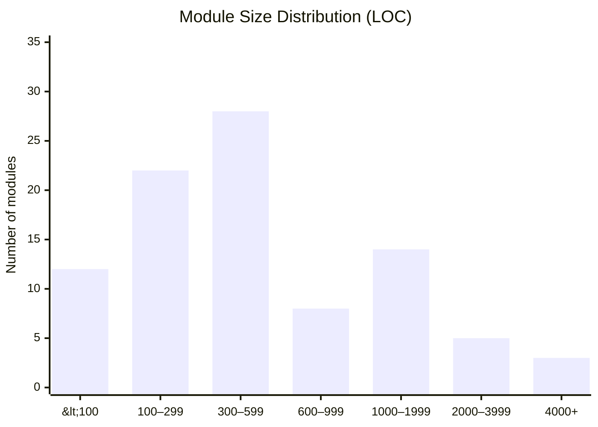
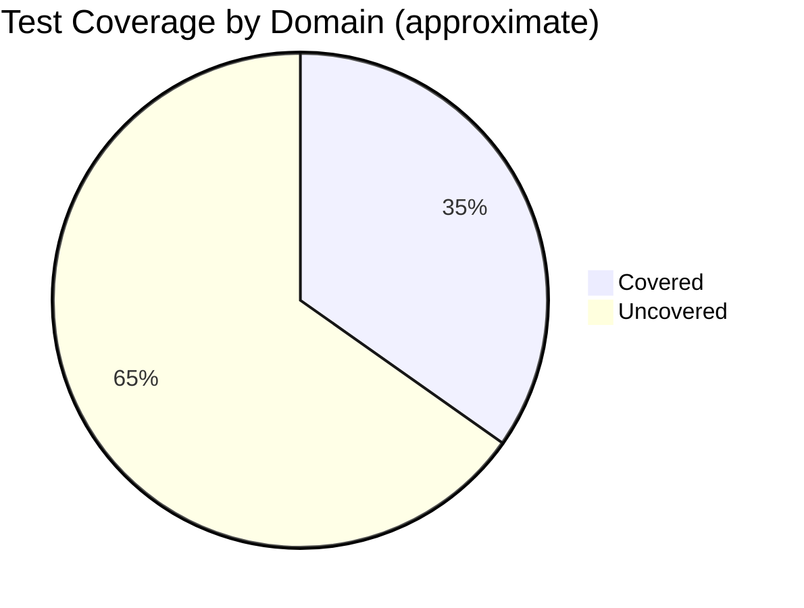
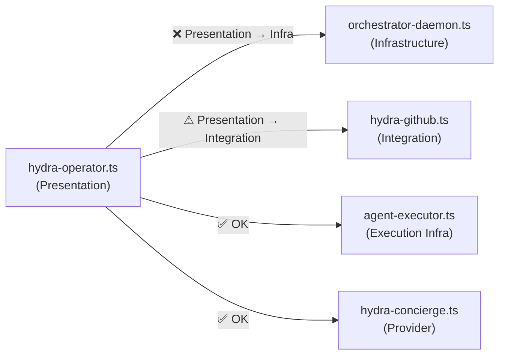
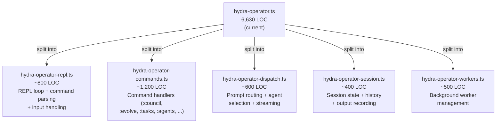
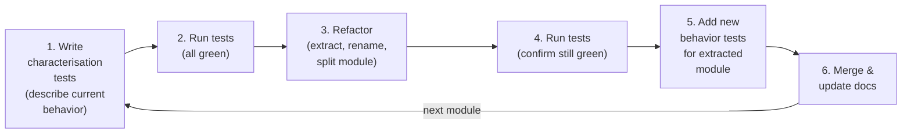
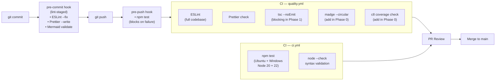

# Hydra — Refactoring Roadmap & Quality Gate Recommendations

> Generated: 2026-03-13 | Branch: `copilot/audit-source-code-compliance`
> This document is a living roadmap. Update the checklist items as work progresses.

---

## Table of Contents

1. [Executive Summary](#1-executive-summary)
2. [Complexity Metrics](#2-complexity-metrics)
3. [Current Quality Gate Inventory](#3-current-quality-gate-inventory)
4. [Recommended Quality Gates](#4-recommended-quality-gates)
5. [Code Smell Catalogue](#5-code-smell-catalogue)
6. [Architecture Findings](#6-architecture-findings)
7. [TDD Refactoring Strategy](#7-tdd-refactoring-strategy)
8. [Phase-by-Phase Roadmap](#8-phase-by-phase-roadmap)
9. [Parallel Workstream Plan](#9-parallel-workstream-plan)
10. [Risk Register](#10-risk-register)
11. [Success Metrics & Definition of Done](#11-success-metrics--definition-of-done)

---

## 1. Executive Summary

Hydra is a **92-module, 53,000-line TypeScript ESM codebase** that orchestrates multiple AI coding agents. The
TypeScript migration (PR #13) eliminated runtime type unsafety and established strong quality tooling. The next
step is architectural consolidation: breaking down oversized modules, eliminating cyclic imports, and building a
safety net of tests before refactoring critical infrastructure.

### Execution Artifacts

Use this roadmap as the high-level program document, then execute from the task-oriented plans in `docs/plan/`:

- `docs/plan/refactoring-master-plan.md` — operating rules, phase gates, model roles, and validation loop
- `docs/plan/refactoring-task-breakdown.md` — dependency-ordered task matrix designed for maximum safe parallelism
- `docs/plan/refactoring-worktree-playbook.md` — repo-local worktree conventions, quality checks, and merge hygiene
- `docs/plan/worktree-setup-guide.md` — concrete commands and smoke checks for creating task worktrees
- `docs/plan/validation-gate.md` — standard per-task validation commands, evidence, and review handoff rules

The roadmap is intentionally summary-level. The task breakdown and worktree playbook are the source of truth for
day-to-day execution.

### Headline Findings

| Finding                                                                                      | Severity    | Impact                               |
| -------------------------------------------------------------------------------------------- | ----------- | ------------------------------------ |
| `hydra-operator.ts` is 6,630 lines — ~12% of total codebase                                  | 🔴 Critical | Untestable, high bug surface         |
| `hydra-config.ts` has 23 fan-in dependents — central hub bottleneck                          | 🔴 Critical | Any change ripples to 25% of modules |
| `hydra-shared/agent-executor.ts` — 1,824 lines, 5 dependents, no tests                       | 🔴 Critical | Core execution path unprotected      |
| Three cyclic import chains                                                                   | 🔴 Critical | Can cause runtime `undefined` errors |
| 60 of 92 modules (65%) have no dedicated test file                                           | 🟠 High     | Low confidence for any refactor      |
| `hydra-evolve.ts` — 3,657 lines, no tests                                                    | 🟠 High     | Evolution engine unverified          |
| No cyclomatic complexity gate                                                                | 🟡 Medium   | Complexity can grow unbounded        |
| No architectural layer enforcement                                                           | 🟡 Medium   | Presentation imports infra directly  |
| Repeated patterns: error recovery, context building, usage checking (8+ abstractions needed) | 🟡 Medium   | Duplication, inconsistent behavior   |

---

## 2. Complexity Metrics

### 2.1 Module Size Distribution



### 2.2 Complexity Hotspots

| Rank | Module                         |   LOC | Fan-Out | Fan-In | Test? | Priority   |
| ---- | ------------------------------ | ----: | ------: | -----: | :---: | ---------- |
| 1    | hydra-operator.ts              | 6,630 |      29 |      0 |  ❌   | 🔴 URGENT  |
| 2    | hydra-evolve.ts                | 3,657 |      11 |      1 |  ❌   | 🔴 URGENT  |
| 3    | hydra-council.ts               | 2,321 |      11 |      2 |  ✅   | 🟡 MONITOR |
| 4    | hydra-shared/agent-executor.ts | 1,824 |       4 |      5 |  ❌   | 🔴 URGENT  |
| 5    | orchestrator-daemon.ts         | 1,670 |      12 |      0 |  ❌   | 🟠 HIGH    |
| 6    | hydra-nightly.ts               | 1,233 |      15 |      0 |  ❌   | 🟠 HIGH    |
| 7    | hydra-model-profiles.ts        | 1,143 |       1 |      6 |  ✅   | 🟢 OK      |
| 8    | hydra-audit.ts                 | 1,126 |       4 |      0 |  ❌   | 🟡 MEDIUM  |
| 9    | hydra-config.ts                | 1,067 |       2 |     23 |  ❌   | 🔴 URGENT  |
| 10   | hydra-mcp-server.ts            | 1,059 |       9 |      0 |  ❌   | 🟡 MEDIUM  |

### 2.3 Test Coverage Overview



**Modules with NO tests and >500 LOC (highest risk):**

- `hydra-operator.ts` (6,630) — main entry point, most used
- `hydra-evolve.ts` (3,657) — autonomous AI mutation engine
- `hydra-shared/agent-executor.ts` (1,824) — executes all AI agent calls
- `orchestrator-daemon.ts` (1,670) — HTTP API server
- `hydra-nightly.ts` (1,233) — batch automation
- `hydra-audit.ts` (1,126) — audit log pipeline
- `hydra-config.ts` (1,067) — central config hub
- `hydra-mcp-server.ts` (1,059) — MCP tool handler
- `hydra-tasks.ts` (1,055) — task queue management
- `hydra-usage.ts` (1,051) — token budget enforcement

---

## 3. Current Quality Gate Inventory

| Gate                           | Tool                       | Config                     | Status              | Blocks PR?                  |
| ------------------------------ | -------------------------- | -------------------------- | ------------------- | --------------------------- |
| Lint                           | ESLint v10                 | `eslint.config.mjs`        | ✅ Active           | ✅ Yes (CI + pre-push)      |
| Format                         | Prettier v3                | `.prettierrc.json`         | ✅ Active           | ✅ Yes                      |
| Type check                     | TypeScript `tsc --noEmit`  | `tsconfig.json`            | ✅ Active           | ⚠ `continue-on-error` in CI |
| Unit tests                     | Node.js native test runner | `package.json` test script | ✅ Active           | ✅ Yes (pre-push hook)      |
| Mermaid validation             | `npm run lint:mermaid`     | `scripts/lint-mermaid.ts`  | ✅ Active           | ✅ Pre-commit staged        |
| Test coverage threshold        | —                          | —                          | ❌ **Missing**      | —                           |
| Cyclomatic complexity          | —                          | —                          | ❌ **Missing**      | —                           |
| Module size limit              | —                          | —                          | ❌ **Missing**      | —                           |
| Import cycle detection         | —                          | —                          | ❌ **Missing**      | —                           |
| Architecture layer enforcement | —                          | —                          | ❌ **Missing**      | —                           |
| Mutation testing               | —                          | —                          | ❌ **Missing**      | —                           |
| Dependency audit               | —                          | —                          | ❌ **Missing**      | —                           |
| Bundle size                    | —                          | —                          | N/A (no build step) | —                           |

---

## 4. Recommended Quality Gates

### 4.1 Immediate (add within 1 sprint)

#### A. Import Cycle Detection — `eslint-plugin-import` or `madge`

Cyclic imports between `hydra-rate-limits` ↔ `hydra-streaming-middleware` and the self-import in
`hydra-metrics` can cause `undefined` module errors at startup.

**Implementation:**

```bash
npm install --save-dev madge
```

Add to `package.json`:

```json
{
  "scripts": {
    "lint:cycles": "madge --circular --extensions ts lib/",
    "quality": "npm run lint && npm run format:check && npm run typecheck && npm run lint:cycles"
  }
}
```

Add to CI `quality.yml`:

```yaml
- name: Check circular dependencies
  run: npm run lint:cycles
```

#### B. TypeScript Type Check — Make Blocking

`quality.yml` currently runs `tsc --noEmit` with `continue-on-error: true`. Once the backlog of TS errors
is cleared, remove the flag to make type errors block PRs.

**Target**: Zero `tsc` errors by end of Phase 2 (see §8).

#### C. Module Size Lint Warning

Add a custom ESLint rule (or a standalone script) that warns when a module exceeds 800 lines.

```js
// scripts/check-module-sizes.mjs
import { readdirSync, statSync, readFileSync } from 'node:fs';
const MAX_LINES = 800;
// ... check all lib/*.ts and warn/error
```

Add to `quality` script and CI.

### 4.2 Short-Term (within 2 sprints)

#### D. Test Coverage Threshold — `c8`

```bash
npm install --save-dev c8
```

```json
{
  "scripts": {
    "test:coverage": "c8 --reporter=text --reporter=lcov npm test",
    "test:coverage:check": "c8 check-coverage --lines 60 --functions 60 --branches 50"
  }
}
```

Start at 60% line/function coverage threshold, increase by 5% per sprint.

**Coverage targets by phase:**

| Phase   | Target                                        |
| ------- | --------------------------------------------- |
| Phase 1 | 40% (add tests for untested critical modules) |
| Phase 2 | 55% (agent-executor, config, operator)        |
| Phase 3 | 70% (evolution engine, daemon)                |
| Phase 4 | 80%+ (full coverage)                          |

#### E. Cyclomatic Complexity Limit — ESLint

```js
// In eslint.config.mjs
{
  rules: {
    'complexity': ['warn', { max: 15 }],        // function-level CC
    'max-lines-per-function': ['warn', { max: 80 }],
    'max-depth': ['warn', { max: 4 }],
  }
}
```

Recommended thresholds (implement as warnings first, then errors):

| Rule                      | Warning | Error |
| ------------------------- | ------- | ----- |
| `complexity` (cyclomatic) | 15      | 25    |
| `max-lines-per-function`  | 80      | 150   |
| `max-lines` (module)      | 500     | 800   |
| `max-depth` (nesting)     | 4       | 6     |
| `max-params`              | 5       | 7     |

#### F. Import Architecture Enforcement — `eslint-plugin-boundaries`

Enforces that modules only import from the correct layer. Prevents `hydra-operator.ts` from importing
`orchestrator-daemon.ts` directly.

```bash
npm install --save-dev eslint-plugin-boundaries
```

```js
// eslint.config.mjs — add boundaries config
{
  rules: {
    'boundaries/element-types': ['error', {
      default: 'disallow',
      rules: [
        { from: 'presentation', allow: ['domain', 'observability', 'routing', 'shared'] },
        { from: 'domain', allow: ['infrastructure', 'shared', 'foundation'] },
        { from: 'infrastructure', allow: ['foundation', 'shared'] },
        { from: 'providers', allow: ['foundation', 'shared'] },
        { from: 'foundation', allow: [] },
      ]
    }]
  }
}
```

### 4.3 Medium-Term (Phase 3)

#### G. Mutation Testing — `stryker`

Mutation testing reveals tests that pass even when code is deliberately broken — catching tests that don't
actually verify behavior.

```bash
npm install --save-dev @stryker-mutator/core @stryker-mutator/typescript-checker
```

Target: mutation score ≥ 70% on core modules (`hydra-config`, `hydra-agents`, `agent-executor`).

#### H. Dependency Security Audit — `npm audit`

Add to CI:

```yaml
- name: Security audit
  run: npm audit --audit-level=high
```

---

## 5. Code Smell Catalogue

### 5.1 God Objects

| Module              |   LOC | Issue                                                                                    |
| ------------------- | ----: | ---------------------------------------------------------------------------------------- |
| `hydra-operator.ts` | 6,630 | Main REPL + dispatch + worker management + UI rendering + persistence all in one file    |
| `hydra-evolve.ts`   | 3,657 | 7-phase state machine + context building + code execution + PR management                |
| `hydra-config.ts`   | 1,067 | Config loading + saving + schema + test helpers + model selection helpers + role lookups |

### 5.2 Cyclic Dependencies (must fix before refactoring)

| Cycle       | Files                                                                           | Risk                                         |
| ----------- | ------------------------------------------------------------------------------- | -------------------------------------------- |
| **Cycle A** | `hydra-rate-limits.ts` ↔ `hydra-streaming-middleware.ts`                        | Module load failure if one initialises first |
| **Cycle B** | `hydra-metrics.ts` self-import                                                  | Causes `undefined` on first access           |
| **Cycle C** | `hydra-activity.ts` → `hydra-statusbar.ts` → `hydra-usage.ts` → (indirect loop) | Startup order sensitivity                    |

**Fix strategy:** Extract shared interfaces/types to a new `lib/hydra-streaming-types.ts` that both
`hydra-rate-limits.ts` and `hydra-streaming-middleware.ts` import without mutual dependency.

### 5.3 Repeated Patterns (DRY Violations)

| Pattern                        | Count | Location                                             | Proposed Abstraction                                           |
| ------------------------------ | ----: | ---------------------------------------------------- | -------------------------------------------------------------- |
| Agent execution boilerplate    |   15+ | operator, council, evolve, nightly, actualize, tasks | `agent-executor.ts` already exists — ensure all callers use it |
| Budget/quota check             |    8+ | operator, evolve, council, nightly, guardrails       | `hydra-shared/budget-tracker.ts` — expand API                  |
| Context building               |    8+ | council, dispatch, operator, nightly                 | `hydra-context.ts` — expose unified `buildContext()`           |
| Error recovery + retry         |   10+ | executor, operator, council, evolve                  | `hydra-model-recovery.ts` — expand + enforce usage             |
| Usage tracking after execution |   12+ | operator, council, evolve, tasks                     | `hydra-usage.ts` — expose single `recordExecution()`           |
| Git operation patterns         |    6+ | evolve, nightly, tasks, github                       | `hydra-shared/git-ops.ts` already exists                       |
| Provider presets               |    7+ | concierge, providers                                 | `hydra-concierge-providers.ts` — centralise fully              |

### 5.4 Missing Abstractions

These interfaces would reduce coupling and improve testability:

| Interface          | Purpose                            | Consumers                                 |
| ------------------ | ---------------------------------- | ----------------------------------------- |
| `IAgentExecutor`   | Decouple execution from consumers  | operator, council, evolve, tasks, nightly |
| `IConfigStore`     | Decouple config loading from users | All 23 current direct consumers           |
| `IMetricsRecorder` | Decouple metrics recording         | 10+ consumers                             |
| `IBudgetGate`      | Abstract usage checking            | 8+ consumers                              |
| `IContextProvider` | Decouple context building          | 8+ consumers                              |
| `IGitOperations`   | Abstract git commands              | 8+ consumers                              |

### 5.5 Miscellaneous Smells

- **Deep nesting**: Several functions in `hydra-operator.ts` and `hydra-evolve.ts` exceed 5 levels of nesting
- **Long parameter lists**: Some functions accept 7+ parameters — signals need for parameter objects
- **Boolean flags**: Several functions use boolean arguments to switch behavior — use strategy pattern or options objects
- **Magic strings**: Provider names, model IDs, and command strings repeated inline
- **No-await-in-loop**: 104 ESLint warnings for sequential awaits where `Promise.all` should be used
- **`process.exit()` calls**: 83 direct calls — should use `process.exitCode` and let process terminate

---

## 6. Architecture Findings

### 6.1 Layer Violations

The current architecture has no enforced layering. The following violations exist:



**Proposed Clean Layer Rules:**

```
Presentation   → Domain, Routing, Observability (read), Shared
Domain         → Execution, Routing, Integration, Config, Shared
Routing        → Config, Agents, Shared
Execution      → Config, Agents, Providers, Shared
Providers      → Config, Shared
Foundation     → (nothing internal)
```

### 6.2 `hydra-config.ts` Bottleneck

With 23 dependents, any breaking change to `hydra-config.ts` requires touching 25% of the codebase.
The recommended mitigation is to:

1. Extract a thin `IHydraConfig` interface that all consumers depend on (instead of the concrete class)
2. Use dependency injection in top-level modules (operator, daemon)
3. Keep the loader implementation in `hydra-config.ts` but only expose the interface type

### 6.3 `hydra-operator.ts` Decomposition Plan

The 6,630-line operator module should be split into ~5 focused modules:



---

## 7. TDD Refactoring Strategy

The key principle: **never refactor code that has no tests**. Write the safety net first, then move.

### 7.1 The Refactoring Loop



### 7.2 Characterisation Test Strategy

Before refactoring any large module:

1. **Identify all public exports** — these become the test surface
2. **Write input/output tests for each export** using mocked dependencies
3. **Capture current behavior** — even if buggy — to prevent regressions
4. **Run with coverage** to ensure the tests actually exercise the paths

For this roadmap, **adequate tests** means:

- every public export or externally consumed contract is exercised,
- the main success path and the important failure paths are covered,
- state transitions or side effects that could break downstream callers are asserted,
- the target module has enough focused coverage to make the refactor mechanically safe, with 80% function coverage
  as the default bar for hotspot modules unless a stronger task-specific contract is defined.

This 80% function-coverage bar is a **per-module hotspot gate**. The lower phase-level percentages elsewhere in this
roadmap are the **repo-wide floor**, not a replacement for hotspot safety-net expectations.

### 7.3 Test Infrastructure Needed

| Utility                 | Purpose                              | File                                |
| ----------------------- | ------------------------------------ | ----------------------------------- |
| Mock config factory     | Create test configs without file I/O | `test/helpers/mock-config.ts`       |
| Mock agent executor     | Simulate agent responses without CLI | `test/helpers/mock-executor.ts`     |
| Mock metrics sink       | Capture metrics without side effects | `test/helpers/mock-metrics.ts`      |
| Mock GitHub client      | Simulate GitHub API responses        | `test/helpers/mock-github.ts`       |
| Ephemeral daemon helper | Spin up daemon on random port        | Already exists in integration tests |

### 7.4 Module Extraction Checklist

When extracting a sub-module from a large file:

- [ ] Write characterisation tests for the extracted functions first
- [ ] Create the new file with extracted code
- [ ] Update imports in the original file
- [ ] Ensure all tests still pass
- [ ] Add focused unit tests for the new module
- [ ] Update `docs/ARCHITECTURE.md` module table
- [ ] Update `docs/DEPENDENCY_DIAGRAMS.md` appendix table

### 7.5 Non-Negotiable Execution Rules

- [ ] Refactor only behind an adequate safety net. If the component lacks tests, the first task is to add
      characterization or contract tests.
- [ ] Use one dedicated git worktree per task under a repo-local `.worktrees/` directory. Never mix unrelated work
      in the same worktree.
- [ ] Keep git hooks enabled. Do not use `--no-verify`, do not bypass pre-commit or pre-push checks, and do not
      merge work that only passes with hooks disabled.
- [ ] Always run formatting and linting on the changed files before review, then run the task's required test set.
- [ ] Treat lint suppressions as exceptional debt, not a normal escape hatch. If a narrowly scoped suppression is
      ever unavoidable, it must be approved, documented inline with a concrete justification, and tracked with a
      follow-up issue. Broad or silent bypasses are not acceptable.
- [ ] Every task must be validated by subagents before merge. Use subagents aggressively for exploration,
      edge-case review, and change critique so the primary coordinator keeps only the durable summary in context.

### 7.6 Subagent Validation Protocol

Use multiple models deliberately instead of sending every question to the same reviewer:

| Model / Agent         | Best use in this program                                                                | Required handoff                                          |
| --------------------- | --------------------------------------------------------------------------------------- | --------------------------------------------------------- |
| **GPT-5.4**           | Implementation planning, task synthesis, extracting actionable next steps from findings | Produces the initial task plan or change summary          |
| **Claude Sonnet 4.6** | Architecture critique, module boundary review, decomposition safety, API shape review   | Reviews any structural refactor plan before coding starts |
| **Gemini**            | Edge cases, failure modes, coverage gaps, regression risk, alternative test scenarios   | Reviews any safety-net or verification plan before merge  |

Minimum validation loop per task:

1. Primary implementer drafts the change in an isolated worktree.
2. A subagent reviews the touched files and the stated assumptions.
3. A second model reviews only the summary plus diff for risk, coverage, and regression blind spots.
4. The coordinator keeps the distilled findings, not the full exploration trail, to preserve context budget.

---

## 8. Phase-by-Phase Roadmap

This roadmap is now dependency-driven rather than date-driven. Use the detailed task matrix in
`docs/plan/refactoring-task-breakdown.md` for day-to-day execution.

### Phase 0: Program Bootstrap & Execution Guardrails 🔴

> **Goal**: Make parallel delivery safe before changing behavior.

- [ ] Adopt repo-local worktree convention: one task per `.worktrees/<task-id>` checkout
- [ ] Add `.worktrees/` to `.gitignore` before execution begins
- [ ] Define task IDs, ownership, and verifier assignments from `docs/plan/refactoring-task-breakdown.md`
- [ ] Standardize the per-task validation loop: format, lint, targeted tests, subagent critique, second-model critique
- [ ] Confirm every refactor task has an explicit test-first entry criterion

**Exit gate**: Every planned task has a worktree name, dependency list, and validation recipe.

---

### Phase 1: Safety Net Expansion 🔴

> **Goal**: Build confidence in the most fragile modules and remove import hazards.

Parallel-ready tracks:

- [ ] Tooling track: add cycle detection, coverage reporting, and complexity visibility without weakening existing gates
- [ ] Cycle track: resolve Cycle A, Cycle B, and investigate/untangle Cycle C
- [ ] Core tests track: characterization tests for `hydra-shared/agent-executor.ts`
- [ ] Config tests track: characterization tests for `hydra-config.ts`
- [ ] Daemon tests track: endpoint, task-state, heartbeat, and worktree-isolation coverage for `orchestrator-daemon.ts`
- [ ] Hotspot tests track: characterization tests for `hydra-operator.ts`, `hydra-evolve.ts`, `hydra-metrics.ts`, and
      `hydra-usage.ts` before extraction or semantic cleanup begins

**Exit gate**: Critical modules have adequate characterization coverage and import cycles no longer block safe extraction work.

---

### Phase 2: Core Stability & Contract Hardening 🔴

> **Goal**: Make shared services refactorable by locking in current contracts.

- [ ] Finish deeper contract tests for `agent-executor`, including streaming, timeout, cancellation, and agent-specific paths
- [ ] Finish deeper contract tests for `hydra-config`, including defaults, persistence, cache invalidation, and role/model helpers
- [ ] Consolidate usage tracking behind a tested `recordExecution()` path
- [ ] Make typecheck fully blocking once the task matrix shows the path is clean
- [ ] Promote complexity and size rules from visibility to enforcement only after the targeted modules have safety nets

**Exit gate**: Core execution/config behavior is test-backed, and quality gates can tighten without destabilizing unrelated work.

---

### Phase 3: Monolith Decomposition ✅

> **Goal**: Split the largest files into modules with narrow responsibilities and explicit seams.
>
> **Status**: Complete (merged via feat/phase3-decomposition). All targets met or exceeded.

Parallel-ready tracks after the safety-net gate:

- [x] `hydra-operator.ts` extracts:
  - `hydra-operator-session.ts`
  - `hydra-operator-dispatch.ts`
  - `hydra-operator-commands.ts`
  - `hydra-operator-concierge.ts`
  - `hydra-operator-startup.ts`
  - `hydra-operator-self-awareness.ts`
  - `hydra-operator-ghost-text.ts`
  - shrunk `hydra-operator.ts` 6,630 → 2,630 LOC (−60%)
- [x] `hydra-evolve.ts` extracts:
  - `hydra-evolve-executor.ts`
  - shrunk `orchestrator-daemon.ts` 1,670 → 765 LOC (−54%)
- [x] `hydra-config.ts` seam work:
  - `hydra-config.ts` 1,067 → 870 LOC (−18%)
- [x] `hydra-shared/agent-executor.ts` extracts:
  - `hydra-shared/error-diagnosis.ts`
  - `hydra-shared/gemini-executor.ts`
  - `hydra-shared/execute-custom-agents.ts`
  - shrunk 1,824 → 835 LOC (−54%)
- [x] `orchestrator-daemon.ts` extracts:
  - `lib/daemon/state.ts`
  - `lib/daemon/task-helpers.ts`
  - `lib/daemon/archive.ts`
  - `lib/daemon/worktree.ts`
  - `lib/daemon/http-utils.ts`
  - `lib/daemon/cli-commands.ts`
  - `lib/daemon/read-routes.ts`
  - `lib/daemon/write-routes.ts`
- [x] `hydra-project.ts` extracted from operator

**Exit gate**: Each extracted component has characterization tests before extraction and focused unit tests after extraction. ✅ 100+ new tests added across Phase 3.

> **Hotspot rule**: tasks that edit the same hotspot source file should be serialized unless the merge coordinator has
> explicitly split the work into non-overlapping slices with a proven low-conflict plan.

---

### Phase 4: Shared Abstractions & Architectural Boundaries 🟡

> **Goal**: Reduce duplication and lock in layering after the high-risk splits have landed.

- [ ] Introduce `IAgentExecutor` and migrate consumers
- [ ] Introduce `IBudgetGate` and eliminate duplicated budget-check paths
- [ ] Consolidate context-building through `hydra-context.ts`
- [ ] Enforce architecture layers with `eslint-plugin-boundaries`
- [ ] Raise coverage targets only after each newly shared abstraction has tests and at least one proving consumer migration

**Exit gate**: Shared APIs are narrow, consumers depend on interfaces where practical, and layer rules are enforced instead of aspirational.

---

### Phase 5: Cleanup, Performance, and Documentation 🟢

> **Goal**: Finish the long tail without reopening structural risk.

- [ ] Reduce safe `no-await-in-loop` cases with behavior-preserving concurrency changes
- [ ] Replace `process.exit()` with testable exit-path handling
- [ ] Add mutation testing to the most critical shared modules
- [ ] Update `docs/ARCHITECTURE.md`, `docs/DEPENDENCY_DIAGRAMS.md`, and ADRs after structural changes settle

**Exit gate**: Remaining cleanup is measurable, verified, and does not rely on relaxed hooks, relaxed linting, or undocumented exceptions.

---

## 9. Parallel Workstream Plan

The program should be split into the smallest safe work packages that minimize shared-file overlap. Use the task
matrix in `docs/plan/refactoring-task-breakdown.md` as the operational backlog.

### Parallel Lanes

| Lane       | Focus                  | Examples                                                               | Can start when                                  | Preferred models     |
| ---------- | ---------------------- | ---------------------------------------------------------------------- | ----------------------------------------------- | -------------------- |
| **Lane A** | Worktree/bootstrap     | `.worktrees/` setup, task naming, merge coordinator rules              | Immediately                                     | GPT-5.4 + Sonnet 4.6 |
| **Lane B** | Tooling & gates        | cycle detection, coverage plumbing, complexity visibility              | Immediately                                     | GPT-5.4 + Gemini     |
| **Lane C** | Safety-net tests       | `agent-executor`, `hydra-config`, `orchestrator-daemon`                | Immediately                                     | GPT-5.4 + Gemini     |
| **Lane D** | Cycle remediation      | Cycle A/B/C fixes once failing shapes are reproduced in tests          | After the relevant characterization tests exist | Sonnet 4.6 + Gemini  |
| **Lane E** | Operator decomposition | session/workers/dispatch/commands extracts                             | After core operator safety-net tasks are green  | GPT-5.4 + Sonnet 4.6 |
| **Lane F** | Evolve decomposition   | pipeline/executor extracts                                             | After evolve safety-net tasks are green         | GPT-5.4 + Sonnet 4.6 |
| **Lane G** | Shared abstractions    | `IHydraConfig`, `IAgentExecutor`, `IBudgetGate`, context consolidation | After affected callers have contract tests      | Sonnet 4.6 + GPT-5.4 |
| **Lane H** | Polish & docs          | ADRs, dependency diagrams, mutation testing, long-tail cleanup         | After structural lanes settle                   | GPT-5.4 + Gemini     |

### Worktree Rules for Parallel Lanes

- Create one branch and one worktree per task, not per phase.
- Name worktrees after the task ID, for example `.worktrees/rf-ax01-agent-executor-contracts`.
- Rebase or merge from `main` before starting a new coding session in that worktree.
- Do not share a worktree across multiple subagents. Let subagents inspect or critique the task, but keep the
  implementing checkout single-purpose.
- Merge small, validated PRs back through `main` before unblocking downstream lanes.

### Merge Coordination

- Keep one merge coordinator responsible for sequencing merges into `main`.
- Prefer dependency-first landing order: tooling/tests before structural extraction, interfaces after proving tests.
- If two tasks touch the same hotspot file, split them further or force them into sequential merge order.
- Preserve context budget by having subagents return concise findings summaries rather than long transcripts.

---

## 10. Risk Register

| Risk                                                        | Probability | Impact | Mitigation                                                                             |
| ----------------------------------------------------------- | :---------: | :----: | -------------------------------------------------------------------------------------- |
| Cyclic import causes startup failure after partial fix      |   Medium    |  High  | Fix all cycles in a single commit; run integration tests before merge                  |
| `hydra-operator.ts` decomposition introduces regression     |    High     |  High  | Write characterisation tests before extraction; use feature flags                      |
| `hydra-config.ts` interface change breaks 23 consumers      |    High     |  High  | Use interface type that matches existing shape; no behavior change in Phase 2          |
| Coverage threshold flaps due to flaky tests                 |     Low     | Medium | Mark known-flaky tests with `test.skip` + issue link                                   |
| Evolution engine generates code that breaks cycle detection |   Medium    |  Low   | Add `npm run lint:cycles` to post-evolve verification commands                         |
| Layer enforcement breaks undocumented cross-layer calls     |   Medium    | Medium | Start with `warn` before `error`; audit violations before enforcing                    |
| Parallel streams create merge conflicts                     |    High     | Medium | One task per worktree, small PRs, dependency-first merges, nominated merge coordinator |
| Complexity rules generate too many false positives          |     Low     |  Low   | Tune thresholds; require approval for any scoped suppression and track cleanup         |

---

## 11. Success Metrics & Definition of Done

### Quantitative Targets

| Metric                         | Baseline (now) | Phase 1 |   Phase 2    |     Phase 3     | Phase 4 |
| ------------------------------ | :------------: | :-----: | :----------: | :-------------: | :-----: |
| Test coverage (lines)          |      ~35%      |   50%   |     60%      |       70%       |   80%   |
| Modules > 800 LOC              |       10       |   10    |      5       |   **3** ✅ 3    |    1    |
| Modules > 1,500 LOC            |       5        |    5    |      2       |   **1** ✅ 1    |    0    |
| Cyclic imports                 |       3        |    0    |      0       |   **0** ✅ 0    |    0    |
| ESLint errors                  |      ~400      |   200   |     100      |       50        |    0    |
| `tsc --noEmit` errors          |       0        |    0    |      0       |   **0** ✅ 0    |    0    |
| Fan-in on `hydra-config.ts`    |       23       |   23    |      15      |       10        |  ≤ 10   |
| Fan-out on `hydra-operator.ts` |       29       |   29    | ≤ 10 (split) | ≤ 10 (split) ✅ |  ≤ 10   |
| `no-await-in-loop` warnings    |      104       |   104   |      80      |       40        |    0    |

### Qualitative Definition of Done

A module is considered **refactoring-complete** when:

- [ ] It has ≥ 80% function test coverage
- [ ] It is ≤ 800 lines
- [ ] It has no cyclic dependencies
- [ ] All functions have cyclomatic complexity ≤ 15
- [ ] It has a clear, documented purpose (single responsibility)
- [ ] Its public API is covered by an interface in `types.ts`
- [ ] It respects the architectural layer rules
- [ ] Its entry in `docs/ARCHITECTURE.md` is up to date

---

## Appendix A: Recommended New Dependencies

| Package                             | Purpose                        | Phase   | Risk   |
| ----------------------------------- | ------------------------------ | ------- | ------ |
| `madge` (devDep)                    | Circular dependency detection  | Phase 0 | Low    |
| `c8` (devDep)                       | Native V8 coverage reporter    | Phase 0 | Low    |
| `eslint-plugin-boundaries` (devDep) | Architecture layer enforcement | Phase 3 | Medium |
| `@stryker-mutator/core` (devDep)    | Mutation testing               | Phase 4 | Low    |

> All are dev-only dependencies. No production bundle impact.

---

## Appendix B: ADR Template

Create ADRs in `docs/adr/` using the following template:

```markdown
# ADR-NNN: {Title}

**Date**: YYYY-MM-DD
**Status**: Proposed | Accepted | Deprecated | Superseded

## Context

What is the issue we're facing?

## Decision

What did we decide?

## Consequences

What are the positive and negative consequences?
```

---

## Appendix C: Quality Gate Pipeline Summary


