# Hydra Web Interface — Design & Architecture

> **Status:** Proposal / Research Document
> **Scope:** Local-network web UI providing full operator parity with the terminal REPL

---

## Table of Contents

1. [Overview](#overview)
2. [Proposed Features](#proposed-features)
3. [Framework Research & Recommendation](#framework-research--recommendation)
4. [Architecture Overview](#architecture-overview)
5. [Dataflow Diagrams](#dataflow-diagrams)
6. [Workflow Diagrams](#workflow-diagrams)
7. [How the App Works with the Daemon](#how-the-app-works-with-the-daemon)
8. [Security Model](#security-model)
9. [Threat Model](#threat-model)
10. [Implementation Roadmap](#implementation-roadmap)

---

## Overview

The Hydra operator today is a terminal REPL (`npm run go`). While powerful, it is inaccessible from a phone, tablet, or second machine on the local network. A web interface would:

- Mirror every operator command through a browser-based chat and control panel
- Expose real-time event streams, task queues, agent statuses, and token budgets
- Allow configuration editing, model selection, and automation triggers without SSH
- Remain **lightweight, dependency-minimal, and easy to modify** by any developer

The web server acts as a **thin authenticated proxy** between the browser and the existing daemon
(port `4173`). No business logic moves to the web layer — the daemon stays the single source of
truth.

---

## Proposed Features

### Core Chat & Dispatch

| Feature                   | Description                                                                                                                                                |
| ------------------------- | ---------------------------------------------------------------------------------------------------------------------------------------------------------- |
| **Chat interface**        | Full-screen conversational UI replacing the terminal REPL. Supports all 5 dispatch modes (auto / smart / council / dispatch / chat) selectable via toolbar |
| **Mode switcher**         | Toggle between auto, smart, council, dispatch, chat modes from a dropdown                                                                                  |
| **Agent lock**            | Pin dispatch to a specific agent (claude / gemini / codex / local / custom)                                                                                |
| **Tandem/council badges** | Response cards show which agents participated, round count, consensus score                                                                                |
| **Message history**       | Scrollable, searchable session transcript with copy-to-clipboard per response                                                                              |
| **Ghost text suggestion** | When a task is blocked, auto-suggest a follow-up prompt (mirrors terminal ghost text)                                                                      |
| **Dry-run toggle**        | Preview routing decision without executing; shows route card before dispatch                                                                               |

### Task Management

| Feature                 | Description                                                                       |
| ----------------------- | --------------------------------------------------------------------------------- |
| **Task board**          | Kanban-style columns: To-Do → In-Progress → Blocked → Done. Live-updating via SSE |
| **Task detail panel**   | Click any task for full description, checkpoints, agent assignment, cost estimate |
| **Add task form**       | Create tasks directly from the UI (invokes `POST /task/add`)                      |
| **Dead-letter queue**   | View and retry exhausted tasks with one click                                     |
| **Stale task detector** | Visual badge on tasks that have exceeded heartbeat timeout                        |
| **Worktree status**     | Table of active git worktrees per task (if worktree isolation is enabled)         |

### Agent & Model Management

| Feature                                 | Description                                                                         |
| --------------------------------------- | ----------------------------------------------------------------------------------- |
| **Agent roster**                        | Live card per agent showing status, active model, last heartbeat, token spend       |
| **Model switcher**                      | Swap active model per agent from a dropdown populated by `GET /self`                |
| **Custom agent wizard**                 | Multi-step web form equivalent of `:agents add` (CLI/API type, name, args template) |
| **Provider picker**                     | Select concierge provider (OpenAI → Anthropic → Google fallback)                    |
| **Economy/balanced/performance toggle** | Visual routing-mode selector that writes to config and restarts routing logic       |

### Automation Pipelines

| Feature                | Description                                                                           |
| ---------------------- | ------------------------------------------------------------------------------------- |
| **Pipeline launcher**  | One-click buttons for: Evolve, Nightly, Audit, Actualize, Tasks, Council deliberation |
| **Pipeline status**    | Live progress view: phase name, current step, elapsed time, token spend               |
| **Budget gauge**       | Visual daily/weekly token gauge with color-coded warning thresholds                   |
| **Scheduled triggers** | Simple cron UI to schedule nightly/evolve runs (stored in `hydra.config.json`)        |

### Configuration

| Feature                    | Description                                                                                    |
| -------------------------- | ---------------------------------------------------------------------------------------------- |
| **Config editor**          | Structured form for all `hydra.config.json` sections (models, routing, agents, budgets, roles) |
| **Role editor**            | Assign agent + model per role (architect / analyst / implementer)                              |
| **HYDRA.md viewer/editor** | In-browser Markdown editor for context files                                                   |
| **Environment inspector**  | Read-only view of detected env vars (keys only, values masked)                                 |

### Monitoring & Observability

| Feature                  | Description                                                                                       |
| ------------------------ | ------------------------------------------------------------------------------------------------- |
| **Real-time status bar** | Web equivalent of the terminal status bar: agent badges, token gauge, last dispatch, session cost |
| **Event stream viewer**  | Scrollable, filterable log of daemon events (mirrors `GET /events/stream` SSE)                    |
| **Usage statistics**     | Charts for token spend per agent/day/model (pulls from `GET /stats`)                              |
| **Session history**      | List of past sessions with cost, task counts, agents used                                         |
| **Health panel**         | Daemon version, uptime, Node.js version, config path, coordDir size                               |

### Security Controls (UI)

| Feature               | Description                                                                                      |
| --------------------- | ------------------------------------------------------------------------------------------------ |
| **Token gate**        | Login screen requiring the bearer token; token stored in `sessionStorage` (cleared on tab close) |
| **Activity log**      | Timestamped log of all actions taken through the UI (audit trail)                                |
| **Rate-limit status** | Show per-provider token-bucket level (from `GET /self`)                                          |

---

## Framework Research & Recommendation

The key constraints are: **lightweight, no build step required to modify, fast load, easy to
understand**.

### Options Evaluated

#### Option A — Vanilla HTML + CSS + JavaScript (ES Modules)

- **Size:** 0 KB framework overhead
- **Simplicity:** A developer only needs to know HTML/CSS/JS — no framework mental model
- **Modifications:** Edit one `.html` / `.js` file; refresh browser. Zero toolchain needed
- **Realtime:** Native `EventSource` API for SSE; `fetch()` for REST calls
- **Drawbacks:** Managing DOM state manually gets verbose for complex reactive panels; no component
  reuse primitives
- **Best for:** Simple read-only dashboards or very small UIs

#### Option B — HTMX + Alpine.js

- **Size:** HTMX ~14 KB (min+gz) + Alpine.js ~15 KB. Total < 30 KB (when combined with Preact + htm for the chat shell, the full hybrid bundle is ~35 KB)
- **Simplicity:** HTML stays as the primary language. `hx-get` / `hx-post` declaratively call the
  daemon. Alpine `x-data` handles local state. No build step
- **Modifications:** Add a new panel by adding a `<div hx-get="/state">` — no JS required
- **Realtime:** HTMX has built-in SSE extension (`hx-ext="sse"`) that replaces DOM fragments on
  server-sent events
- **Drawbacks:** Interactivity beyond simple CRUD (e.g., chat streaming, nested component trees)
  requires more Alpine boilerplate; SSE HTML fragments must be rendered server-side
- **Best for:** Config editors, task boards, monitoring panels

#### Option C — Preact + htm (no build step)

- **Size:** Preact ~4 KB (min+gz) + htm tag literal ~1 KB. Total ~5 KB
- **Simplicity:** Familiar React API (hooks, components) with zero JSX compilation — components are
  written with `html\`\`` template literals
- **Modifications:** Add a new component in a single `.js` file, import it via ES module
- **Realtime:** Standard `EventSource` + `useState`/`useEffect` hooks
- **Drawbacks:** Still a virtual DOM; debugging requires understanding of component tree
- **Best for:** Chat interfaces, interactive multi-panel dashboards with shared state

#### Option D — SvelteKit / Vite + Svelte

- **Size:** Svelte runtime ~10 KB; build output well-optimised
- **Simplicity:** Very readable `.svelte` components; Svelte compiles away the framework overhead
- **Modifications:** Requires Node.js + `npm run dev` to iterate — not zero-toolchain
- **Best for:** Teams comfortable with build tools who want a polished SPA

#### Option E — Vue 3 (CDN, no build)

- **Size:** ~40 KB (min+gz) via CDN
- **Simplicity:** Vue's Options API is approachable; CDN import means no build step
- **Modifications:** Edit `.html` file, use `<script type="module">` to import Vue from CDN
- **Drawbacks:** Larger than Preact + htm; CDN dependency introduces supply-chain risk

### Recommendation

**Use Preact + htm for the primary interactive shell (chat + task board) with HTMX for
secondary panels (config editor, monitoring).**

Rationale:

- The chat interface needs reactive streaming state — Preact hooks handle this elegantly at ~5 KB
  total overhead
- Config and monitoring panels are best expressed as server-driven HTML fragments — HTMX `hx-get`
  polls or subscribes with zero JS
- Zero build step: browsers import Preact + htm directly from a bundled CDN-style `vendor.js` that
  ships with Hydra (`web/vendor.js`)
- A developer modifies a single `web/*.js` or `web/*.html` file and refreshes — no toolchain
- The web server can be a minimal **Express.js** or **Fastify** server (already a common dep in the
  Node ecosystem) that:
  - Serves `web/` as static files
  - Proxies all `/api/*` requests to `http://127.0.0.1:4173` after validating the session token
  - Streams the SSE endpoint from the daemon to the browser

---

## Architecture Overview

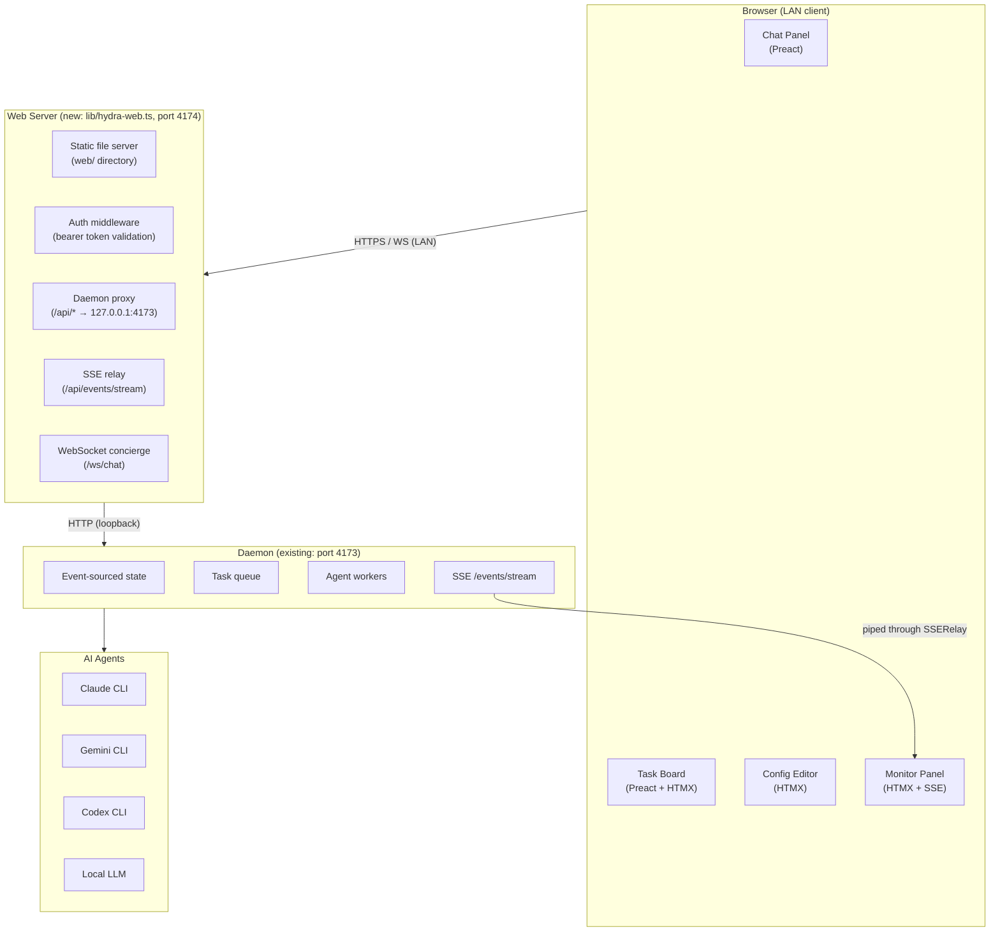

### Component Responsibilities

| Component                  | Responsibility                                                                                                                                  |
| -------------------------- | ----------------------------------------------------------------------------------------------------------------------------------------------- |
| `lib/hydra-web.ts` _(new)_ | Thin Express/Fastify server; serves `web/`; validates bearer token; proxies `/api/*` to daemon; relays SSE; proxies WebSocket chat to concierge |
| `web/index.html` _(new)_   | Single-page shell; loads Preact + htm + Alpine from `vendor.js`                                                                                 |
| `web/chat.js` _(new)_      | Chat panel component; dispatches prompts via WebSocket; receives task status chunks via SSE relay; renders chat bubbles                         |
| `web/tasks.js` _(new)_     | Task board component; polls `GET /api/state`; subscribes to SSE                                                                                 |
| `web/config.js` _(new)_    | Config editor; loads `GET /api/self`; posts to config save endpoint                                                                             |
| `web/monitor.js` _(new)_   | Event viewer + usage charts; subscribes to SSE event stream                                                                                     |
| `web/vendor.js` _(new)_    | Pre-bundled Preact + htm + Alpine (committed, no npm install needed)                                                                            |

---

## Dataflow Diagrams

### Chat Message Dispatch

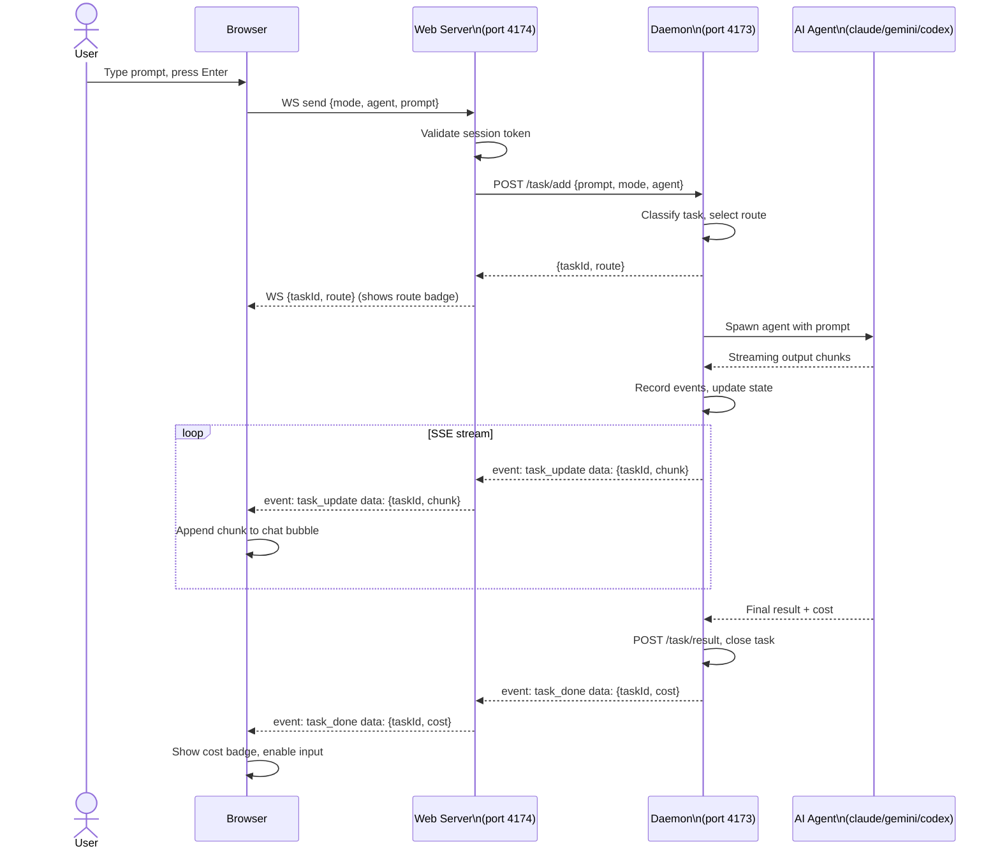

### Config Save Flow

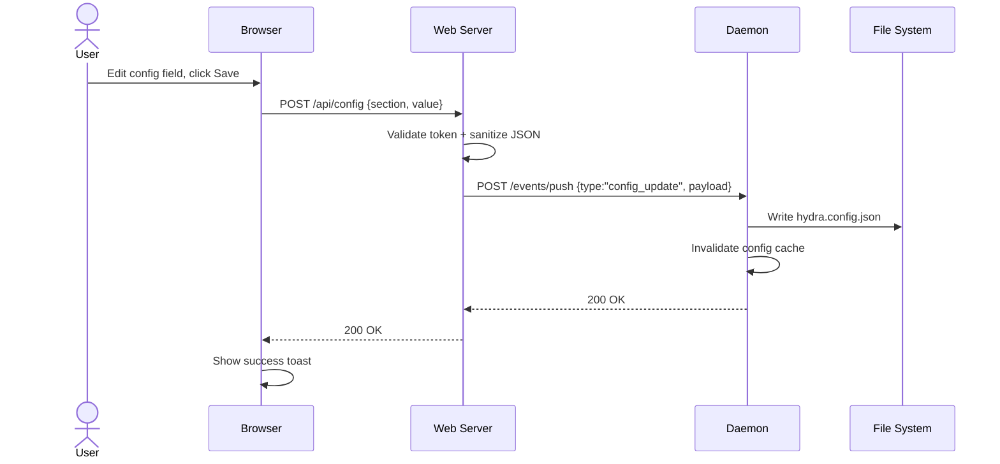

### Pipeline Trigger Flow (Evolve/Nightly/Audit)

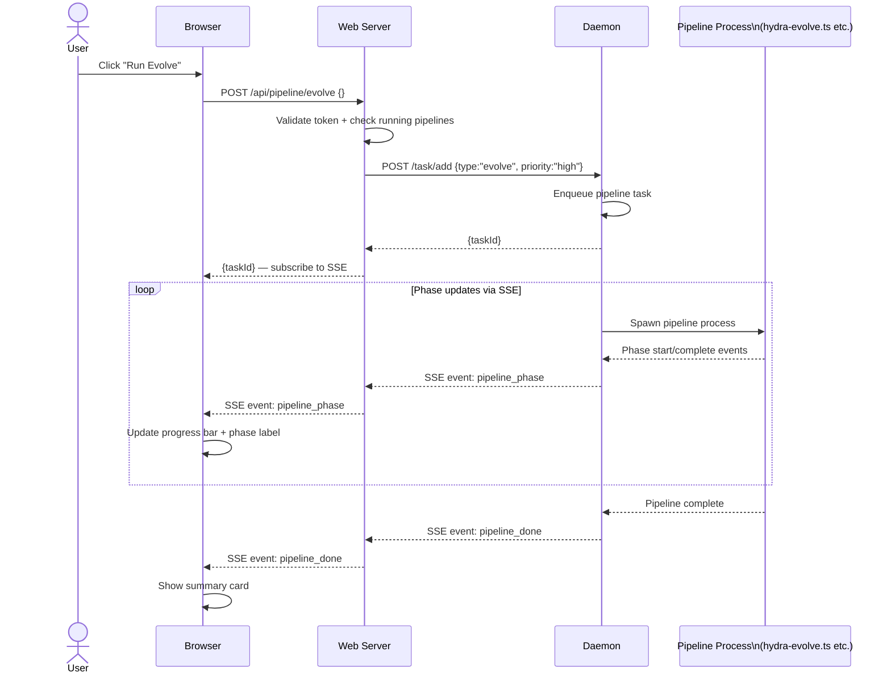

### SSE Event Relay

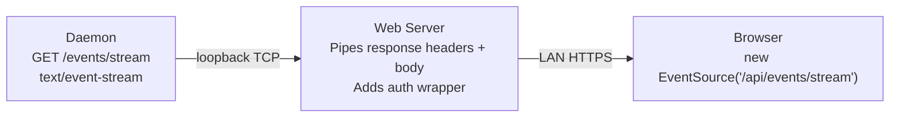

---

## Workflow Diagrams

### Session Lifecycle

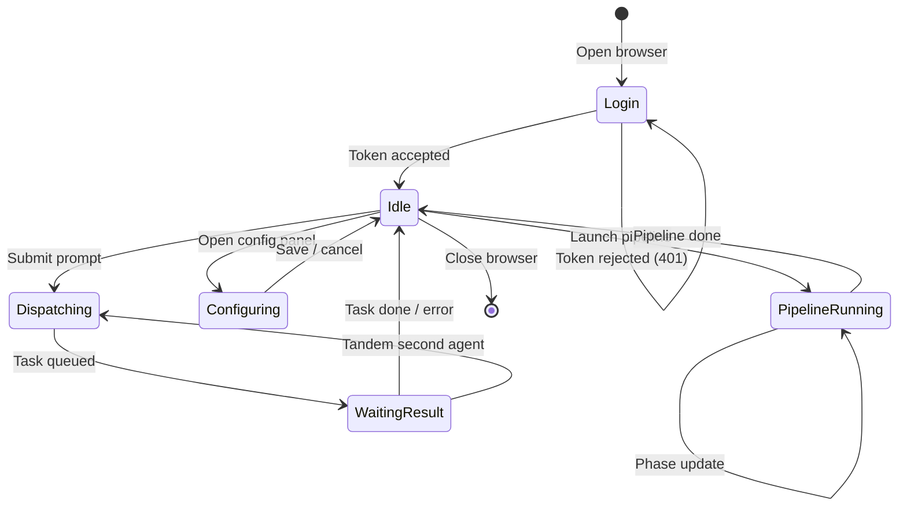

### Task Board Update Cycle

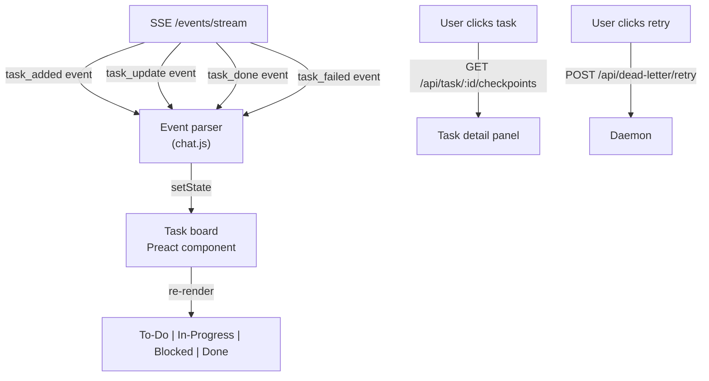

### Council Deliberation View

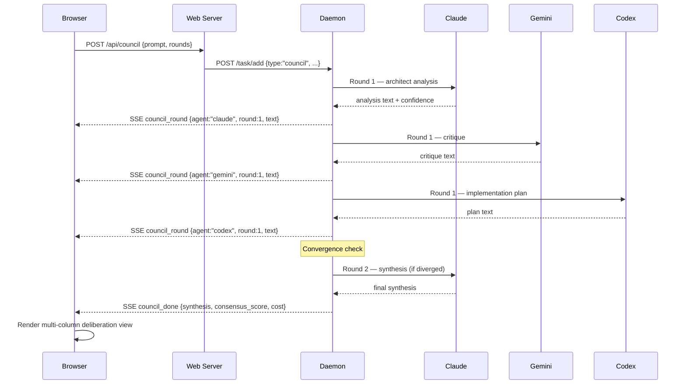

---

## How the App Works with the Daemon

The web interface is a **read/write client** of the daemon, identical in privilege to the terminal
operator. The daemon does not change — the web server is a new thin process that:

1. **Starts alongside the daemon** — `npm run web` or as an optional flag to `npm start`
2. **Authenticates the browser** — validates a session token before forwarding any request
3. **Proxies all state reads/writes** to the daemon's existing HTTP API
4. **Relays the SSE event stream** so the browser receives real-time updates
5. **Proxies chat messages** as `POST /task/add` requests, using the same dispatch pipeline

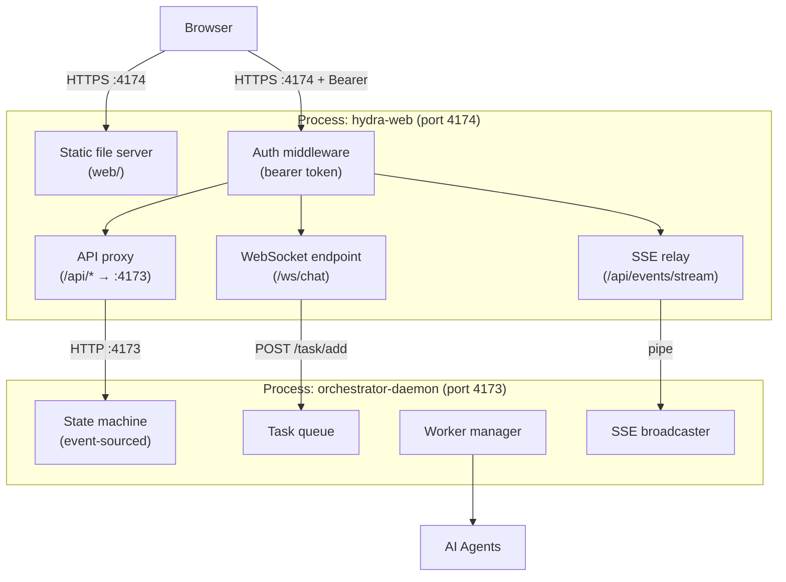

### Integration Points

| Web Server Route              | Daemon Endpoint                  | Purpose                                  |
| ----------------------------- | -------------------------------- | ---------------------------------------- |
| `GET /api/health`             | `GET /health`                    | Health check                             |
| `GET /api/state`              | `GET /state`                     | Full task/handoff state                  |
| `GET /api/self`               | `GET /self`                      | System snapshot (models, agents, config) |
| `GET /api/stats`              | `GET /stats`                     | Usage statistics                         |
| `GET /api/events`             | `GET /events`                    | Event log                                |
| `GET /api/events/stream`      | `GET /events/stream`             | SSE live stream                          |
| `POST /api/task/add`          | `POST /task/add`                 | Queue new task                           |
| `POST /api/task/update`       | `POST /task/update`              | Update task                              |
| `POST /api/dead-letter/retry` | `POST /dead-letter/retry`        | Retry failed task                        |
| `POST /api/session/start`     | `POST /session/start`            | Start new session                        |
| `POST /api/pipeline/:name`    | `POST /task/add` with type       | Trigger pipeline                         |
| `POST /api/config`            | `POST /events/push` + file write | Save config                              |
| `POST /api/shutdown`          | `POST /shutdown`                 | Stop daemon                              |

---

## Security Model

### Design Principles

1. **Local-network only by default** — the web server binds to `0.0.0.0` (LAN-accessible) but the
   daemon remains bound to `127.0.0.1` (loopback-only). The daemon is never directly exposed
2. **Single shared secret** — a bearer token (extending `AI_ORCH_TOKEN`) authenticates all
   requests. The browser stores it in `sessionStorage` (cleared on tab close, never `localStorage`)
3. **HTTPS enforced** — TLS with a self-signed certificate (auto-generated on first start).
   Browsers show a warning once; after trust the connection is encrypted on the LAN
4. **Origin pinning** — CORS headers allow only the server's own origin; API requests from other
   origins are rejected
5. **No secrets in responses** — API key values, token values, and `.env` contents are never sent
   to the browser. The environment inspector shows key names only
6. **Immutable daemon** — the daemon API is unchanged; the web server adds auth on top of existing
   endpoints. No new unauthenticated write surface is created

### Auth Flow

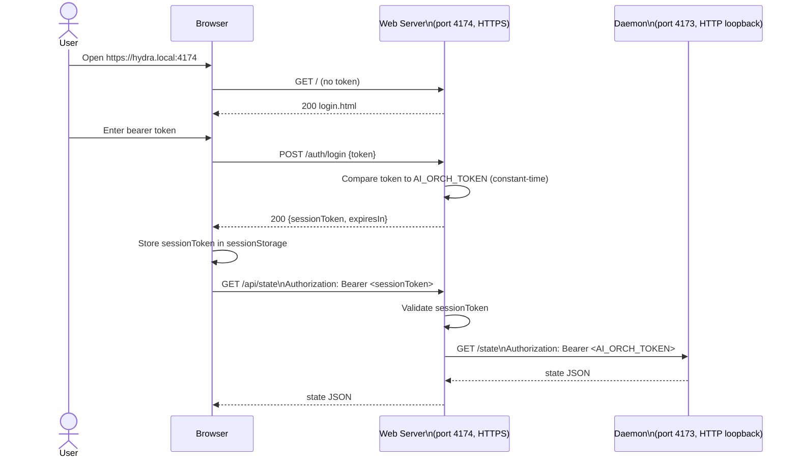

### Session Token Design

- The web server issues a **short-lived session token** (HMAC-SHA256 over a random nonce + timestamp, signed with a **separate server-side secret** generated at startup and stored in `certs/web-secret.key` — distinct from `AI_ORCH_TOKEN` so that session token exposure does not reveal the daemon credential)
- Default expiry: **8 hours** (configurable: `web.sessionTtlHours` in `hydra.config.json`)
- The session token is separate from `AI_ORCH_TOKEN` — the browser never sees the raw daemon token
- Token refresh happens automatically when 1 hour remains

### TLS Certificate

Certificates use **ECDSA P-256** (preferred over 2048-bit RSA for better performance and equivalent
security; easy to regenerate since the cert is local-only).

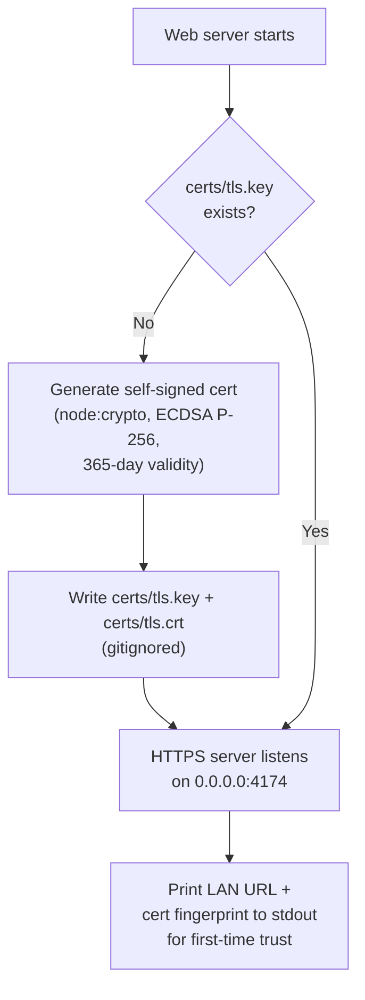

### Headers & CORS

```
Content-Security-Policy: default-src 'self'; script-src 'self'; style-src 'self' 'unsafe-inline'
X-Frame-Options: DENY
X-Content-Type-Options: nosniff
Referrer-Policy: no-referrer
Strict-Transport-Security: max-age=31536000
Access-Control-Allow-Origin: https://<server-hostname>:4174
Access-Control-Allow-Methods: GET, POST
Access-Control-Allow-Headers: Authorization, Content-Type
```

---

## Threat Model

### Scope

- **Target:** Developer workstation or home lab server running Hydra on a trusted LAN
- **Out of scope:** Public internet exposure (Hydra is explicitly not designed for this)

### STRIDE Analysis

#### Spoofing (Identity)

| Threat                                                          | Mitigation                                                                                                                                                                                                                                              |
| --------------------------------------------------------------- | ------------------------------------------------------------------------------------------------------------------------------------------------------------------------------------------------------------------------------------------------------- |
| Attacker on LAN guesses bearer token                            | Require 32+ character random token; rate-limit `/auth/login` (5 attempts then exponential back-off; hard lock after 20 attempts per IP within 15 min — note that IP-based limiting has limited effectiveness on LANs, so combine with account lock-out) |
| Session token forgery                                           | HMAC-SHA256 with server-side secret; verification is constant-time                                                                                                                                                                                      |
| DNS rebinding attack (attacker's page calls `hydra.local:4174`) | `Host` header validation — reject requests where `Host` is not the configured hostname; CSP blocks cross-origin scripts                                                                                                                                 |

#### Tampering (Integrity)

| Threat                                      | Mitigation                                                                                                                                                                                                                                                                                                                                                                                                                                         |
| ------------------------------------------- | -------------------------------------------------------------------------------------------------------------------------------------------------------------------------------------------------------------------------------------------------------------------------------------------------------------------------------------------------------------------------------------------------------------------------------------------------- |
| MITM on LAN intercepts chat messages        | HTTPS enforced; HSTS header; self-signed cert trust required on first connect                                                                                                                                                                                                                                                                                                                                                                      |
| Malicious config payload via config editor  | JSON schema validation server-side before writing `hydra.config.json`; no `eval`; sanitise all string fields                                                                                                                                                                                                                                                                                                                                       |
| Prompt injection via task description field | Task descriptions are passed as data to agents, not executed by the web server. However, web-originated prompts should have content length limits enforced (already noted in DoS section) and optionally run through the existing `gateIntent()` pre-screening before forwarding to the daemon. Document that web-sourced prompts cannot be fully sanitized from indirect prompt injection — this is a known limitation of LLM agent architectures |

#### Repudiation (Non-repudiation)

| Threat                             | Mitigation                                                                                                       |
| ---------------------------------- | ---------------------------------------------------------------------------------------------------------------- |
| Unauthorized action denied by user | Activity log with timestamp, source IP, session token hash, and action written to `activity.jsonl` in `coordDir` |

#### Information Disclosure

| Threat                                      | Mitigation                                                              |
| ------------------------------------------- | ----------------------------------------------------------------------- |
| Browser reads `AI_ORCH_TOKEN` from response | Web server never forwards raw token; session token is distinct          |
| Event stream leaks API key values           | Daemon events contain task/agent data only, never API keys              |
| TLS cert private key exposed                | Key stored in `certs/` directory (gitignored); file permissions `0600`  |
| Config endpoint returns secrets             | Config API masks all `*_KEY`, `*_TOKEN`, `*_SECRET` fields with `"***"` |

#### Denial of Service

| Threat                                 | Mitigation                                                                                        |
| -------------------------------------- | ------------------------------------------------------------------------------------------------- |
| Flood of task submissions from browser | Rate limiting on `POST /api/task/add` (60 req/min per session); daemon task queue has depth limit |
| Pipeline triggered repeatedly          | Lock: only one instance of each pipeline type can run; UI button disabled while running           |
| SSE stream held open indefinitely      | Max 10 concurrent SSE connections; idle connections timed out after 5 min of no events            |
| Large prompt causing high token spend  | Existing daemon budget gates apply; web server rejects prompts > 32 KB                            |

#### Elevation of Privilege

| Threat                                    | Mitigation                                                                           |
| ----------------------------------------- | ------------------------------------------------------------------------------------ |
| Web server process spawns shell commands  | No shell execution in web server; all operations go through daemon HTTP API only     |
| Config editor writes arbitrary file paths | Config save endpoint only writes `hydra.config.json`; no `path.join` with user input |
| Unauthenticated access to daemon directly | Daemon binds to `127.0.0.1` only; not accessible from LAN directly                   |

### Trust Boundary Diagram

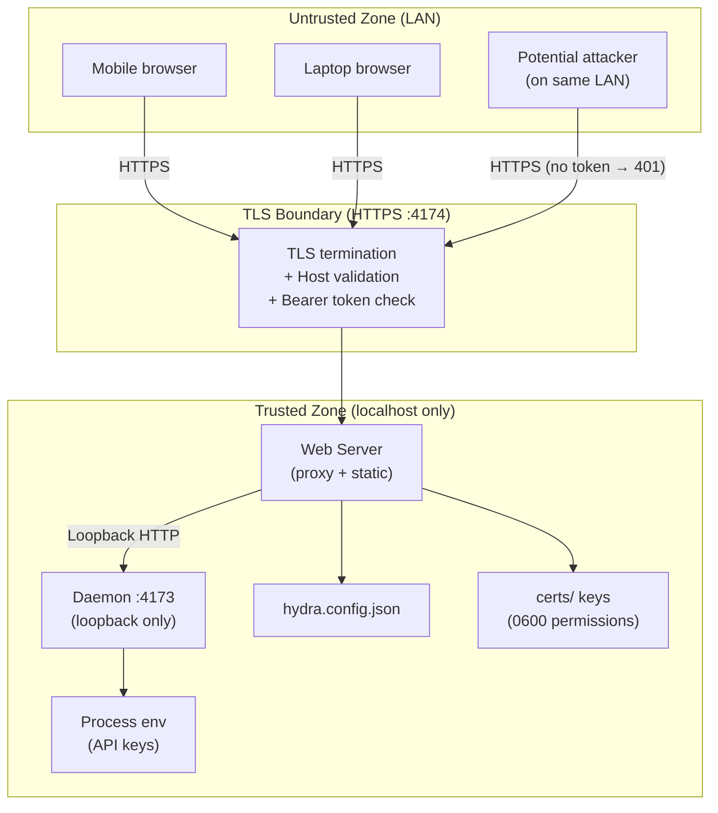

### Known Residual Risks

| Risk                                                          | Likelihood         | Impact   | Owner Action                                                               |
| ------------------------------------------------------------- | ------------------ | -------- | -------------------------------------------------------------------------- |
| Self-signed cert pinning bypass (user ignores warning + MITM) | Low on home LAN    | High     | Document that users should pin the cert fingerprint; provide mDNS hostname |
| Compromised LAN device sends valid session token              | Medium             | High     | Add optional IP allowlist (`web.allowedIPs` in config)                     |
| Physical access to server reads certs/ or env                 | Low (home lab)     | Critical | Outside scope; OS-level controls apply                                     |
| Dependency vulnerability in web framework                     | Low (minimal deps) | Medium   | `npm audit` in CI; pin framework to exact version                          |

---

## Implementation Roadmap

### Phase 1 — Minimal Viable Web Shell (2–3 days)

- [ ] `lib/hydra-web.ts` — Express/Fastify server on port `4174`; static file serving; bearer token auth; daemon proxy
- [ ] TLS self-signed cert generation on first start (ECDSA P-256)
- [ ] Separate `web-secret.key` for session token signing (not `AI_ORCH_TOKEN`)
- [ ] `web/index.html` — Login page + single-page shell
- [ ] `web/vendor.js` — Bundled Preact + htm + Alpine
- [ ] `web/chat.js` — Basic chat panel connecting to daemon via WebSocket proxy
- [ ] `npm run web` script

### Phase 2 — Task Board & Monitoring (2–3 days)

- [ ] `web/tasks.js` — Kanban task board with SSE live updates
- [ ] `web/monitor.js` — Event stream viewer + health panel
- [ ] `web/statusbar.js` — Web equivalent of terminal status bar
- [ ] Rate limiting + activity log

### Phase 3 — Config & Pipelines (2–3 days)

- [ ] `web/config.js` — Config editor (structured form)
- [ ] `web/pipelines.js` — Pipeline launcher + progress view
- [ ] `web/agents.js` — Agent roster + model switcher + custom agent wizard

### Phase 4 — Polish & Security Hardening (1–2 days)

- [ ] IP allowlist support
- [ ] Session expiry + refresh
- [ ] CSP headers + security audit
- [ ] `npm run web:dev` hot-reload mode for development
- [ ] Documentation updates (README, ARCHITECTURE.md)

---

## Further Considerations

### mDNS / Local Discovery

A `hydra.local` mDNS hostname (using the `mdns` npm package or Avahi on Linux) would let users
reach the UI without knowing the server's IP. This also helps with TLS `Subject Alternative Name`
binding.

### Mobile-First Layout

The web UI should be usable on a phone. Key affordances:

- Large tap targets for mode switcher and agent selector
- Chat bubbles that wrap correctly at 320px width
- Collapsible side panels (task board, config) behind a hamburger menu
- No horizontal scroll on the main chat view

### Offline / Disconnected Handling

When the browser loses the SSE connection (daemon restart, network blip), the UI should:

1. Show a reconnecting banner
2. `EventSource` auto-reconnects with exponential back-off
3. Re-fetch `GET /api/state` on reconnect to reconcile missed events

### Multi-User Considerations

Hydra is designed for a single operator. Multiple simultaneous web sessions from the same token are
allowed but share the same daemon state. A future enhancement could add per-session namespacing.

### Integration with Existing MCP Server

The web interface could optionally expose an MCP-over-HTTP endpoint at `/mcp`, allowing AI
assistants to call Hydra tools over the LAN without a local CLI. This reuses `lib/hydra-mcp-server.ts`
with an HTTP transport adapter.
