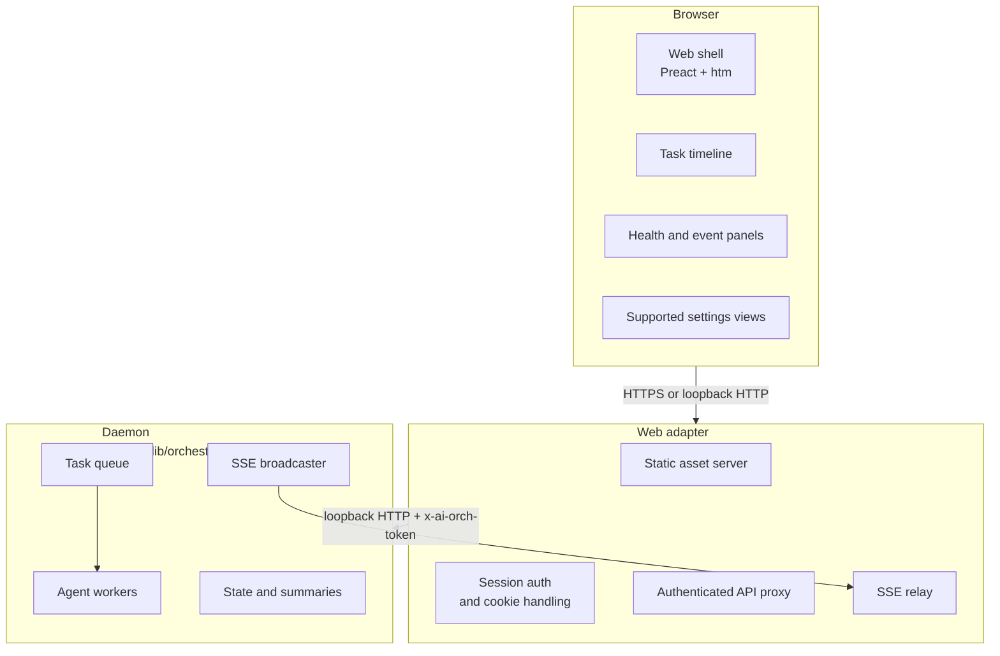
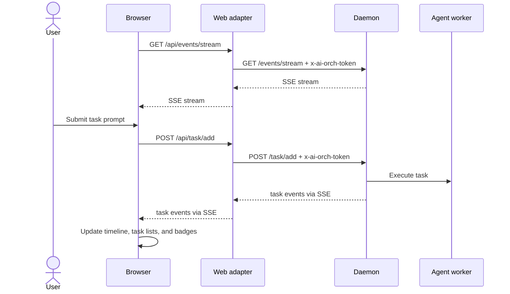
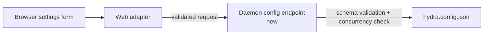

# Hydra Web Interface — Design & Architecture

> **Status:** Proposal / Revised design document
> **Scope:** Progressive, authenticated web UI for Hydra, starting with the daemon capabilities that already exist today

---

## Table of Contents

1. [Overview](#overview)
2. [Guiding Decisions](#guiding-decisions)
3. [Goals and Non-Goals](#goals-and-non-goals)
4. [Proposed Capabilities](#proposed-capabilities)
5. [Framework Recommendation](#framework-recommendation)
6. [Architecture Overview](#architecture-overview)
7. [Current Daemon Alignment and Required Additions](#current-daemon-alignment-and-required-additions)
8. [Data Flows](#data-flows)
9. [Security Model](#security-model)
10. [Threat Model](#threat-model)
11. [Implementation Roadmap](#implementation-roadmap)
12. [Testing, Packaging, and Rollout](#testing-packaging-and-rollout)
13. [Further Considerations and Open Questions](#further-considerations-and-open-questions)

---

## Overview

Hydra's primary operator experience today is the terminal REPL (`npm run go`) backed by the local
HTTP daemon (`lib/orchestrator-daemon.ts`). A web interface is still desirable because it would let
an operator:

- check state from a phone, tablet, or second machine on the same network;
- create and monitor tasks without opening an SSH session;
- observe live agent activity, budgets, and daemon health from a browser; and
- perform a carefully selected subset of write actions through a friendlier UI.

The original proposal overreached in two ways:

1. it promised "full operator parity" before the backend contracts exist to support that safely;
2. it described the web layer as a "thin proxy" while also assigning it responsibility for config
   writes, pipeline launches, session management, and richer streaming semantics.

This revised design keeps the architecture honest:

- the **daemon remains the authority** for state, task lifecycle, and any future filesystem or
  process mutations;
- the **web server is an authenticated same-origin adapter** that serves assets, manages browser
  sessions, and forwards allowed requests to the daemon; and
- the **MVP is progressive parity**, not a browser clone of every TTY-native workflow.

That framing gives Hydra a useful web surface quickly without introducing protocol bridges,
framework sprawl, or a second source of truth.

---

## Guiding Decisions

1. **Progressive parity, not full REPL parity.**
   The first versions should cover dashboarding, task creation, live monitoring, and a small number
   of safe write flows. TTY-native interactions, multi-step prompts, and arbitrary filesystem edits
   are explicitly out of the MVP.

2. **Single UI approach.**
   Use one client-side rendering model for the browser shell. Mixing Preact, HTMX, and Alpine in
   the same app creates split state ownership and harder maintenance for a small team.

3. **No new heavyweight runtime framework for the server.**
   Hydra already ships a raw `node:http` daemon. The web adapter should use built-in
   `node:http`/`node:https` plus small local helpers, not Express or Fastify.

4. **Same-origin browser session, server-side daemon auth.**
   The browser should authenticate once to the web adapter, receive a secure session cookie, and
   never persist or reuse the raw daemon token for normal requests. The adapter forwards to the
   daemon using the existing `x-ai-orch-token` header.

5. **New durable writes belong in the daemon.**
   If a feature needs to mutate `hydra.config.json`, launch child processes, manage schedules, or
   write other files, it should be added as a daemon-owned capability. The web adapter should not
   become a second control plane.

6. **LAN exposure is opt-in.**
   Like the daemon today, the web service should default to loopback and require explicit operator
   intent before binding to `0.0.0.0`.

7. **Browser transport should stay simple.**
   Prefer `fetch()` + SSE over a custom WebSocket bridge unless a later requirement proves that WS
   is necessary.

---

## Goals and Non-Goals

### Goals

- Provide a browser-accessible operator view for Hydra on the local machine or trusted LAN.
- Reuse the daemon's existing read APIs and event stream wherever possible.
- Support authenticated task creation and monitoring without exposing the daemon directly.
- Keep the implementation dependency-light and aligned with Hydra's current architecture.
- Make failure modes visible: daemon offline, auth expired, disconnected SSE, blocked tasks, and
  throttled actions should all be explicit in the UI.

### Non-Goals for the MVP

- Full terminal REPL parity.
- Public internet exposure.
- Multi-user RBAC or tenant isolation.
- Browser-driven arbitrary file editing (`HYDRA.md`, shell scripts, or free-form config files).
- Interactive TTY flows that require prompts, confirmations, or curses-like input handling.
- A second orchestration engine outside the daemon.

---

## Proposed Capabilities

| Capability                                                       | Phase  | Notes                                                             |
| ---------------------------------------------------------------- | ------ | ----------------------------------------------------------------- |
| Authenticated dashboard (`/health`, `/self`, `/state`, `/stats`) | MVP    | Uses existing daemon APIs through the adapter                     |
| Live event stream viewer                                         | MVP    | Backed by daemon SSE relay                                        |
| Task create / update / retry                                     | MVP    | Uses existing `/task/add`, `/task/update`, `/dead-letter/retry`   |
| Task detail and checkpoints                                      | MVP    | Uses existing `GET /task/:id/checkpoints`                         |
| Chat-like dispatch timeline                                      | MVP    | UI metaphor only; still built on task creation + SSE              |
| Agent/mode selector for new tasks                                | MVP    | Maps onto existing task dispatch parameters only                  |
| Session and daemon offline states                                | MVP    | Required for a usable browser experience                          |
| Mobile-friendly layout                                           | MVP    | Core screens must work on phone-sized viewports                   |
| Read-only worktree / session summaries                           | Later  | Depends on which existing daemon endpoints are exposed in the UI  |
| Config viewer with secret masking                                | Later  | Read-only first; leverage `/self` snapshot                        |
| Config editor for a supported subset                             | Later  | Requires new daemon-owned config endpoints and concurrency checks |
| Pipeline launcher                                                | Later  | Requires daemon-owned process orchestration contract              |
| Scheduled automation management                                  | Later  | Requires persistence and scheduler ownership model                |
| Custom agent wizard                                              | Future | Large scope; defer until base web surface is proven               |
| HYDRA.md browser editor                                          | Future | High-risk file editing surface; explicitly not in MVP             |
| TTY-equivalent interactive command flows                         | Future | Needs a dedicated transport and UX model                          |

A useful rule of thumb: if a feature can be expressed as "authenticated read + existing write
endpoint + SSE updates," it is a good MVP candidate. If it needs new daemon contracts, process
spawning, or filesystem mutation, it belongs in a later phase.

---

## Framework Recommendation

### Options Considered

| Option                                | Pros                                                     | Cons                                                                               | Fit                                                          |
| ------------------------------------- | -------------------------------------------------------- | ---------------------------------------------------------------------------------- | ------------------------------------------------------------ |
| Vanilla HTML/CSS/JS                   | Zero framework overhead; easy to inspect                 | Manual state management becomes noisy for a live task UI                           | Good for tiny dashboards; weak for Hydra's shared live state |
| HTMX + Alpine                         | Good for server-driven fragments; no build required      | Splits state between server HTML and client JS; awkward for chat-like streaming UI | Poor fit for a unified interactive shell                     |
| Preact + htm                          | Small runtime, component model, no JSX compiler required | Still needs a disciplined asset strategy for browser delivery                      | Best fit for a single reactive shell                         |
| Svelte/Vite or other SPA build stacks | Excellent developer experience                           | Introduces a full frontend toolchain Hydra does not otherwise need                 | Too heavy for this project right now                         |

### Recommendation

Use **Preact + htm for the browser UI** and **built-in `node:http`/`node:https` for the web
adapter**.

Why this is the best fit:

- Hydra already expects contributors to be comfortable with JavaScript and ESM.
- The UI needs shared state for task lists, stream updates, connection state, and auth expiry.
- Preact + htm keeps the UI small without introducing JSX compilation.
- A single rendering model is easier to reason about than a Preact/HTMX/Alpine hybrid.
- Built-in Node HTTP primitives preserve Hydra's dependency-minimal server posture.

### Asset Strategy

The original `web/vendor.js` idea was convenient but too opaque. Instead:

- keep browser app code in readable ESM modules under `web/`;
- vendor only the minimal pinned browser dependencies under `web/vendor/` or generate them from a
  small script using the already-present `esbuild` dev dependency;
- do not rely on runtime CDNs; and
- ensure packaged distributions include the browser assets explicitly.

This keeps the runtime self-contained without checking in an opaque monolithic bundle that is hard
to diff or audit.

---

## Architecture Overview



### Process Roles

| Component                  | Responsibility                                                                                                                         |
| -------------------------- | -------------------------------------------------------------------------------------------------------------------------------------- |
| `lib/hydra-web.ts` _(new)_ | Serves browser assets, authenticates browser sessions, proxies allowed daemon routes, relays SSE, exposes a small login/logout surface |
| `web/index.html` _(new)_   | App shell entry point                                                                                                                  |
| `web/app.js` _(new)_       | Top-level UI state, routing between panels, reconnect handling                                                                         |
| `web/chat.js` _(new)_      | Task-dispatch composer and chat-like timeline built on task events                                                                     |
| `web/tasks.js` _(new)_     | Task lists, retry/update actions, checkpoint viewer                                                                                    |
| `web/monitor.js` _(new)_   | Event stream, stats, health, and connection status                                                                                     |
| `web/settings.js` _(new)_  | Read-only or later writable settings surfaces, gated by supported backend endpoints                                                    |
| Daemon                     | Owns authoritative state and any future config/process mutations                                                                       |

### Default Bindings

- **Daemon:** unchanged; defaults to `127.0.0.1:${AI_ORCH_PORT:-4173}`.
- **Web adapter:** defaults to `127.0.0.1:${HYDRA_WEB_PORT:-4174}`.
- **LAN mode:** explicit opt-in via config or env. When LAN mode is enabled, HTTPS is required.

---

## Current Daemon Alignment and Required Additions

The daemon already exposes enough surface for a useful dashboard MVP. The web work should start from
that reality instead of inventing new protocols up front.

### Existing Endpoints the MVP Can Reuse

| Capability        | Existing support            | Notes                                                          |
| ----------------- | --------------------------- | -------------------------------------------------------------- |
| Health            | `GET /health`               | Suitable for adapter and daemon liveness display               |
| System snapshot   | `GET /self`                 | Includes masked config-oriented data via `buildSelfSnapshot()` |
| State snapshot    | `GET /state`                | Primary task/session snapshot                                  |
| Stats             | `GET /stats`                | Suitable for charts and token summaries                        |
| Event log         | `GET /events`               | Useful for recent event history                                |
| Live stream       | `GET /events/stream`        | Browser subscribes through adapter relay                       |
| Task creation     | `POST /task/add`            | Core dispatch action                                           |
| Task update       | `POST /task/update`         | Retry/unblock-like flows where already supported               |
| Dead-letter retry | `POST /dead-letter/retry`   | Existing recovery surface                                      |
| Session start     | `POST /session/start`       | Available if the UI later needs explicit session creation      |
| Task checkpoints  | `GET /task/:id/checkpoints` | Already exists and should be surfaced in task details          |

### Features That Need New Backend Contracts

| Feature                                                       | Why current contracts are insufficient                               | Recommended owner     |
| ------------------------------------------------------------- | -------------------------------------------------------------------- | --------------------- |
| Writable config editor                                        | No config-write daemon endpoint exists today                         | Daemon                |
| Pipeline launcher (`evolve`, `nightly`, `audit`, `actualize`) | These are separate CLI processes, not daemon task types              | Daemon                |
| Scheduled triggers                                            | Needs persistence and a long-lived scheduler model                   | Daemon                |
| HYDRA.md editing                                              | No safe file-edit API exists                                         | Daemon, if ever added |
| Interactive browser command flows                             | No browser-safe equivalent of TTY prompts exists                     | Future design         |
| Fine-grained council round visualisation                      | Current SSE/task model does not provide a dedicated council protocol | Daemon, if needed     |

### Ownership Rule

If the feature needs one of the following, it should be designed as a daemon capability first:

- filesystem writes,
- child-process spawning or lifecycle control,
- long-lived schedules,
- additional persisted state,
- or richer event semantics than the current task/event stream.

That rule keeps the web adapter small and prevents business logic from splitting across two servers.

---

## Data Flows

### Authentication and Session Bootstrap

The browser must be able to call authenticated `fetch()` routes and `EventSource` without manually
attaching custom auth headers. That makes a **same-origin secure cookie** the right session model.

```mermaid
sequenceDiagram
    actor User
    participant Browser
    participant Web as Web adapter
    participant Daemon

    User->>Browser: Open web UI
    Browser->>Web: GET /
    Web-->>Browser: Login shell
    User->>Browser: Submit operator token or magic link
    Browser->>Web: POST /auth/login
    Web->>Web: Constant-time token check
    Web-->>Browser: Set-Cookie: hydra_session=...; HttpOnly; Secure; SameSite=Strict
    Browser->>Web: GET /api/self (cookie sent automatically)
    Web->>Daemon: GET /self + x-ai-orch-token
    Daemon-->>Web: Snapshot JSON
    Web-->>Browser: Snapshot JSON
```

Notes:

- The browser sees the raw operator token only during the login submission itself; it should not be
  stored in normal browser state afterward.
- A "magic link" printed by the CLI can be offered as a convenience, but the adapter should still
  convert it into a normal session cookie immediately.
- State-changing browser requests should validate `Origin` in addition to the session cookie.

### Task Dispatch and Live Updates

The web UI does not need a WebSocket bridge for the MVP. A normal task create request plus the
existing event stream is enough.



Implications:

- The browser app should treat the timeline as a projection of task events, not as a separate chat
  transport.
- Council/tandem UI can still exist, but it should render whatever the daemon already emits instead
  of inventing a browser-only protocol.
- If richer streaming semantics are needed later, add them to the daemon deliberately instead of
  hiding them inside the adapter.

### Future Controlled Config Writes

A config editor is feasible only after the daemon gains explicit write support.



Required properties of that future flow:

- optimistic concurrency (hash or mtime check);
- secret masking on reads;
- allowlisted writable fields only;
- explicit audit events for every write.

---

## Security Model

### Design Principles

1. **Same-origin session cookie, not bearer token in app state.**
   Native `EventSource` cannot attach arbitrary auth headers. A secure cookie lets the browser call
   both JSON routes and SSE consistently.

2. **The daemon token stays server-side after login.**
   The adapter talks to the daemon with `x-ai-orch-token`; the browser never reuses that header.

3. **Loopback by default, LAN only by explicit opt-in.**
   Exposing the UI should be a conscious choice, not the default runtime posture.

4. **No unauthenticated browser access to daemon state.**
   The adapter should require auth for all proxied routes, including read-only ones.

5. **Runtime secrets and certs live outside the repository tree.**
   Store web runtime material under `coordDir/web/` (or the runtime root), not `certs/` in the repo.

6. **Dangerous actions must be deliberately surfaced.**
   Shutdown, destructive retries, future config writes, and future pipeline launches should be
   feature-gated and clearly labelled.

### Session Design

Recommended session properties:

- cookie name: `hydra_session`;
- attributes: `HttpOnly`, `Secure` in HTTPS mode, `SameSite=Strict`, path `/`;
- short TTL with idle refresh semantics;
- server-side validation using an adapter-owned signing secret;
- logout endpoint that clears the cookie immediately.

If the UI later needs CSRF protection beyond `SameSite=Strict`, add `Origin` validation and a simple
synchronizer or double-submit token for state-changing forms.

### TLS and Certificates

For loopback-only development, plain HTTP is acceptable. For LAN mode, HTTPS is required.

Recommended certificate policy:

- prefer operator-supplied certs or `mkcert`-generated local-trust certs when available;
- fall back to adapter-generated self-signed certs only when needed;
- store private keys and cert material under `coordDir/web/` with restricted permissions;
- print the URL and certificate fingerprint when starting in LAN mode.

This is more realistic than assuming browsers will smoothly accept a self-signed cert once and never
warn again, especially on mobile devices.

### Headers and Origin Policy

Recommended defaults:

```text
Content-Security-Policy: default-src 'self'; script-src 'self'; style-src 'self' 'unsafe-inline'; connect-src 'self'; img-src 'self' data:
X-Frame-Options: DENY
X-Content-Type-Options: nosniff
Referrer-Policy: no-referrer
Permissions-Policy: geolocation=(), microphone=(), camera=()
```

Additional controls:

- validate `Host` for DNS rebinding resistance when LAN mode is enabled;
- validate `Origin` on state-changing requests;
- do not enable broad CORS; same-origin browser access is sufficient;
- rate-limit `/auth/login` and any mutating API routes.

### Daemon Offline and Session Expiry UX

The UI must treat these as first-class states:

- **daemon offline:** show a clear banner, disable mutating actions, retry health/state polling;
- **SSE disconnected:** show reconnect status and re-fetch state after reconnect;
- **session expired:** redirect to login with a preserved return path where safe.

---

## Threat Model

### Scope

- **Target environment:** developer workstation or trusted home-lab machine.
- **Primary access modes:** local browser on loopback, or an explicitly exposed LAN browser.
- **Out of scope:** public internet exposure, hostile enterprise multi-tenant hosting, and strong
  multi-user identity isolation.

### STRIDE Summary

| Category               | Example threat                                        | Mitigation                                                                                    |
| ---------------------- | ----------------------------------------------------- | --------------------------------------------------------------------------------------------- |
| Spoofing               | Guessing the operator token or session cookie         | Strong operator token, rate limits, signed short-lived session cookie, constant-time compares |
| Tampering              | Browser or LAN actor submits malformed config write   | No config writes in MVP; future writes must be allowlisted and validated by daemon            |
| Repudiation            | Operator disputes a browser action                    | Write audit events for login, logout, task creation, retries, and future config changes       |
| Information disclosure | Browser receives secrets from `/self` or config views | Secret masking on daemon snapshots; adapter never forwards raw daemon token                   |
| Denial of service      | Flood of login attempts or task submissions           | Adapter rate limits, UI-side backpressure, existing daemon queue protections                  |
| Elevation of privilege | Web adapter grows its own file/process control plane  | Keep durable writes in daemon; keep adapter focused on auth, assets, and proxying             |

### Residual Risks

| Risk                                         | Why it remains                                           | Response                                              |
| -------------------------------------------- | -------------------------------------------------------- | ----------------------------------------------------- |
| Compromised LAN device with a valid session  | Hydra is not designed as a hardened multi-user appliance | Keep LAN mode opt-in and document trust assumptions   |
| Self-signed cert distrust on mobile browsers | Browser UX varies and may be hostile to local certs      | Prefer `mkcert` or user-supplied certs                |
| Browser task UI cannot cover all TTY flows   | Some Hydra workflows are terminal-native today           | Keep those flows out of MVP and document the boundary |

---

## Implementation Roadmap

### Phase 0 — Contract and Scope Alignment

- Finalize the ownership rule: new durable writes belong in the daemon.
- Add a small config surface for the web adapter itself (`web.enabled`, `web.host`, `web.port`,
  `web.lan`, `web.tlsMode` or equivalent).
- Decide which existing daemon routes are exposed in the first UI.
- Confirm that MVP chat is task dispatch + SSE, not a separate WebSocket protocol.
- Document unsupported workflows explicitly.

### Phase 1 — Authenticated Dashboard MVP

- Add `lib/hydra-web.ts` using built-in Node HTTP primitives.
- Add login/logout and secure session cookie handling.
- Serve a minimal browser shell from `web/`.
- Proxy read routes: `/health`, `/self`, `/state`, `/stats`, `/events`, `/events/stream`.
- Proxy safe task routes: `/task/add`, `/task/update`, `/dead-letter/retry`,
  `/task/:id/checkpoints`.
- Implement daemon-offline state, session-expired state, and SSE reconnect UX.
- Ship a responsive mobile-friendly layout for the core screens.

### Phase 2 — Dispatch-Centric Workspace

- Improve the task timeline and filters.
- Add agent/mode selectors mapped to current daemon dispatch options.
- Add checkpoint and dead-letter views.
- Add session summaries and lightweight historical views where daemon APIs already support them.
- Render council/tandem activity only from existing task/event data.

### Phase 3 — Controlled Write Surfaces

- Add daemon-owned config read/write endpoints for an allowlisted subset of settings.
- Add optimistic concurrency for config writes.
- Decide whether pipeline launch becomes a daemon capability; if yes, add explicit daemon endpoints
  and audit events.
- Gate destructive actions behind clear UI affordances and configuration flags.

### Phase 4 — Hardening and Packaging

- Include browser assets in npm packaging and executable packaging.
- Update lint boundaries and any architectural rules needed for `lib/hydra-web.ts` and `web/`.
- Finalize LAN documentation, cert handling, and runtime storage paths.
- Improve accessibility, keyboard navigation, and empty/error states.
- Add clear rollback and disablement procedures.

### Future Work

- richer multi-session views;
- optional pipeline scheduling once ownership is well-defined;
- custom agent setup flows;
- any browser support for interactive multi-step command prompts.

---

## Testing, Packaging, and Rollout

### Testing Expectations

Hydra's quality bar means the web work needs tests from the first phase.

**Unit tests**

- session signing/verification;
- login/logout handlers;
- proxy header behaviour (`x-ai-orch-token` server-side only);
- Host and Origin validation;
- SSE relay connection lifecycle;
- daemon-offline error mapping.

**Integration tests**

- spawn daemon and adapter on ephemeral ports;
- verify authenticated read proxying;
- verify task creation through the adapter;
- verify SSE relay reaches the browser-facing endpoint;
- verify expired/invalid sessions are rejected.

**Manual/browser smoke checks**

- desktop and phone-sized layouts;
- reconnect after daemon restart;
- LAN-mode login with trusted cert;
- logout and session expiry behaviour.

### Packaging Requirements

The current package metadata does not yet account for a web surface. Before shipping:

- include `web/` assets in published artifacts;
- account for them in executable packaging if the project continues to ship packaged binaries;
- document the runtime location of generated certs/secrets;
- avoid hidden asset build steps that are easy to forget during release.

### Rollout and Rollback

Recommended rollout posture:

- ship the adapter behind an explicit `web.enabled`-style flag or dedicated startup command;
- keep the daemon fully usable without the web adapter;
- treat browser access as an optional feature, not a required runtime mode;
- make rollback trivial: disable the adapter and leave the daemon untouched.

---

## Further Considerations and Open Questions

### Operational Questions

1. Should Hydra support a helper command that prints a one-time login URL for the web adapter?
2. Should loopback-only mode default to HTTP while LAN mode requires HTTPS?
3. Which daemon routes are safe enough to expose immediately, and which should remain terminal-only?
4. What performance budget should the UI target for initial load and steady-state SSE usage?

### Product Questions

1. Is the intended experience a browser dashboard with task control, or true operator parity over
   time?
2. Which settings are safe and valuable enough to edit in the browser first?
3. Which terminal-only workflows should remain deliberately out of scope even long term?

### Optional Enhancements

- mDNS discovery such as `hydra.local`;
- a clearer council/tandem visualisation once the daemon emits enough structure to support it;
- a read-only environment inspector that continues to mask values;
- richer session history views if the daemon surfaces stable historical APIs.

The key takeaway is that Hydra does not need a "mini web app platform." It needs a small,
authenticated browser surface that starts by reusing the daemon it already has, then grows only when
new backend contracts are explicit, tested, and owned by the daemon.
