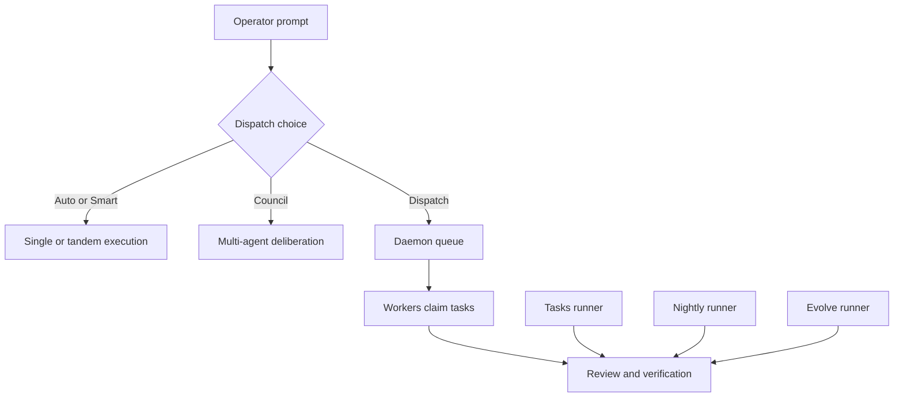
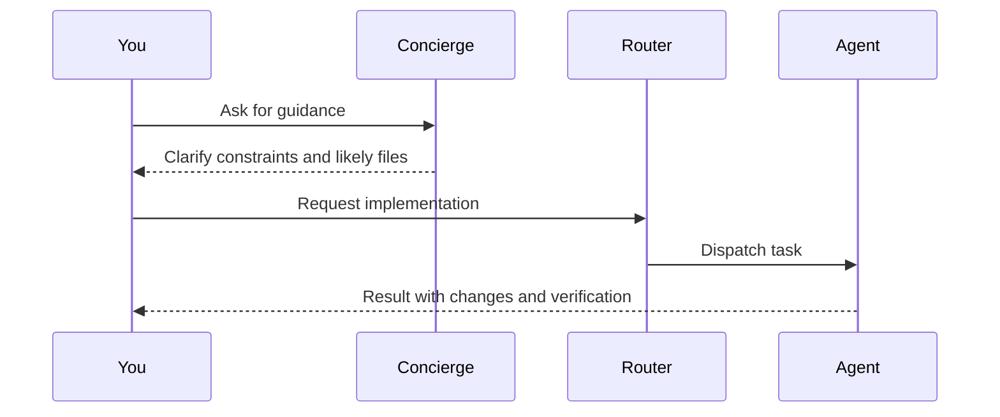
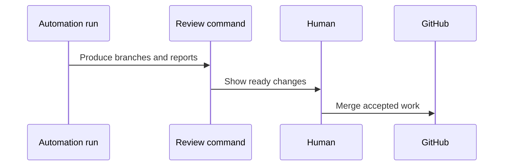

# Workflow Scenarios and Walkthroughs

This guide shows what Hydra's main workflows feel like in practice. Use it alongside [USAGE.md](./USAGE.md) for the raw command reference and [EFFECTIVE_BUILDING.md](./EFFECTIVE_BUILDING.md) for workflow strategy.

## Workflow map



## Scenario A: Operator-led feature work

This is the best starting point for a human-in-the-loop workflow.

### Walkthrough

1. Start the operator:

```bash
npm run go
```

2. Ask a concrete product question:

```text
I want to add a guided setup flow for first-time users. Show me the modules involved and recommend the least disruptive implementation path.
```

3. Let Hydra answer conversationally first.

4. Turn that into work:

```text
Implement the first slice and run the relevant checks.
```

### What is happening underneath



### Example interaction

```text
you> I want to add a guided setup flow for first-time users. Show me the modules involved and recommend the least disruptive implementation path.
hydra> The likely touch points are the operator entry flow, setup helpers, and the install docs. I recommend starting with a docs-backed operator prompt before changing automation behavior.

you> Implement the first slice and run the relevant checks.
hydra> Dispatching to the best-fit implementation path.
```

## Scenario B: Architectural decision in council mode

Use this when there are meaningful trade-offs, such as storage design, verification policy, or workflow changes.

### Walkthrough

```bash
npm run council -- prompt="Compare two ways to add audit metadata to task events, pick the safer reversible first step, and sketch the implementation."
```

Or from inside the operator:

```text
:mode council
Compare two ways to add audit metadata to task events, pick the safer reversible first step, and sketch the implementation.
```

### Council flow


### What to look for in the output

- The assumptions Claude made first
- The failure modes Gemini surfaced
- Whether the refined plan is easier to reverse than the original
- Whether the implementation matches the refined plan

## Scenario C: Batch TODO cleanup with the tasks runner

Use this when the work is known but too repetitive to do by hand.

### Walkthrough

```bash
npm run tasks
```

Then review:

```bash
npm run tasks:status
npm run tasks:review
```

### Example outcome

```text
- 7 TODOs were selected
- 5 branches are ready for review
- 2 tasks were blocked by missing context
```

### Why this workflow is useful

- It preserves reviewability.
- It keeps unrelated fixes off the same branch.
- It gives you a structured handoff point instead of a pile of ad hoc edits.

## Scenario D: Nightly automation for repo maintenance

Nightly is the best fit when you want Hydra to discover work and execute it while you are away.

### Walkthrough

```bash
npm run nightly
```

In the morning:

```bash
npm run nightly:status
npm run nightly:review
```

### Nightly lifecycle


### Example operator interaction before launch

```text
Summarize which parts of the codebase are stable enough for an overnight maintenance run and which should stay out of scope.
```

That prompt is useful when you want to constrain nightly behavior before you start it.

## Scenario E: Add a custom agent for a specialized workflow

Hydra can coordinate more than the built-in agents.

### Walkthrough

1. Open the operator:

```bash
npm run go
```

2. Launch the wizard:

```text
:agents add
```

3. Choose either:

- a CLI-backed agent
- an API-backed agent

4. Test it:

```text
:agents test <name>
```

### Example use case

Register a local OpenAI-compatible model as a cheaper implementation path for routine documentation or refactor work, while keeping council and critique on the stronger remote agents.

## Scenario F: Human-guided review after automation

Hydra works best when automation ends in a visible review step.

### Review pattern



### Checklist

- Review the branch purpose.
- Confirm the changed files match that purpose.
- Run validation commands if needed.
- Merge only the branches that are coherent and reversible.

## Picking the right walkthrough

| Situation                                          | Start here |
| -------------------------------------------------- | ---------- |
| First time using Hydra                             | Scenario A |
| Design trade-off with real risk                    | Scenario B |
| Backlog cleanup                                    | Scenario C |
| Repo maintenance while away                        | Scenario D |
| Specialized local or external model                | Scenario E |
| Converting autonomous output into accepted changes | Scenario F |
