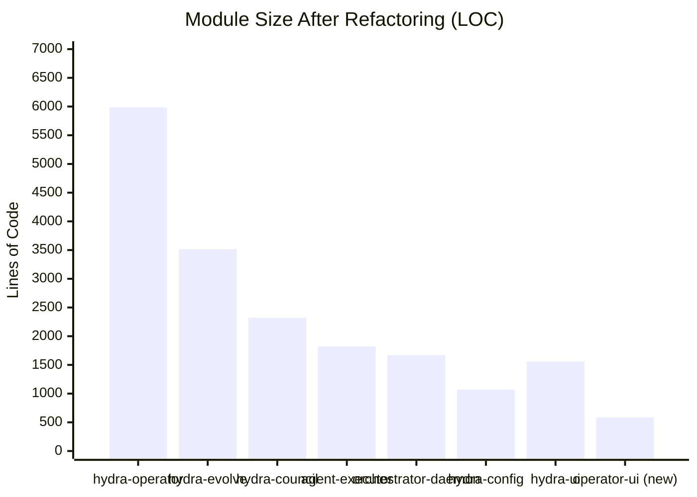
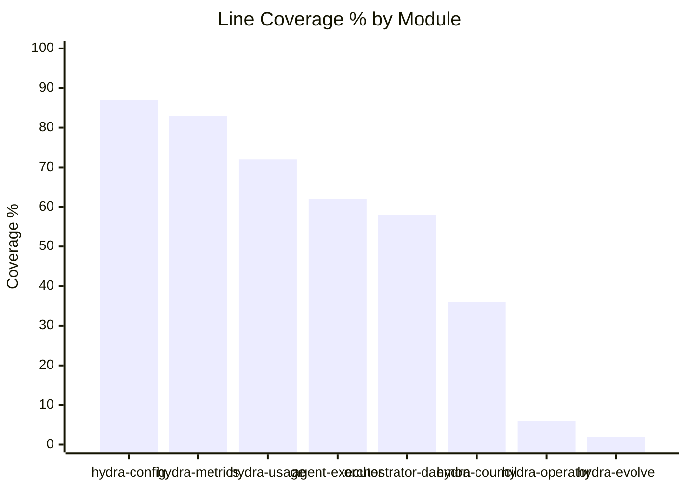
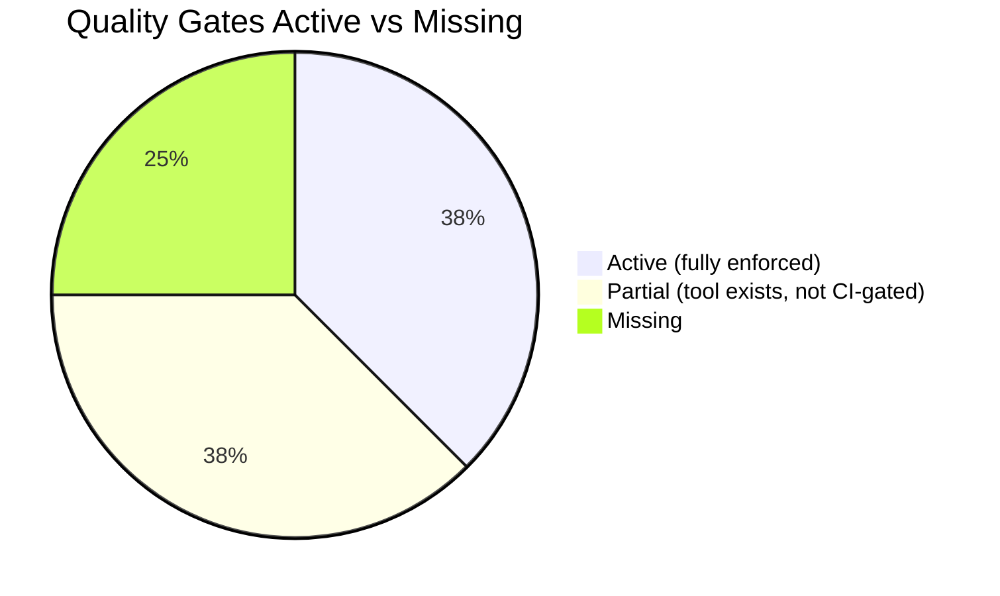
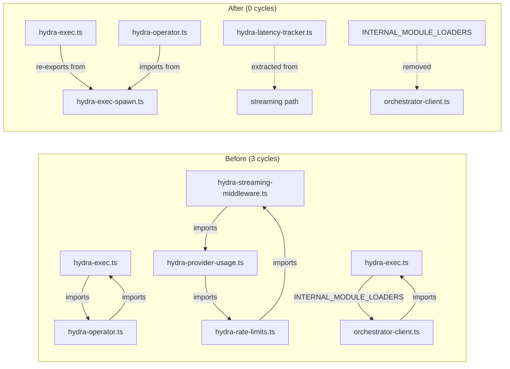
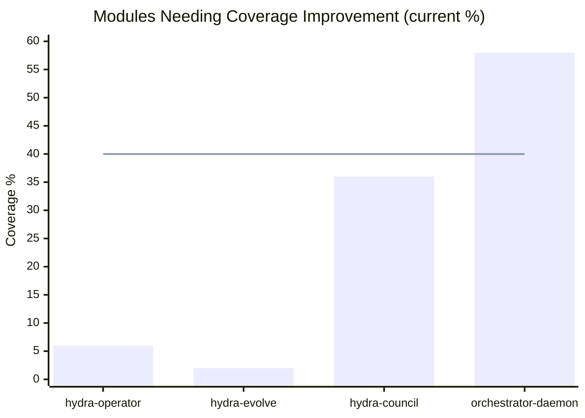

# Hydra Refactoring — Completion Report

> Generated: 2026-03-13 | Branch: `copilot/audit-source-code-compliance`
> Reviewed by: Gemini (agent-46, gap analysis), GPT-5.4 (quality gate audit), Claude Sonnet 4.6 (synthesis)

---

## Executive Summary

This branch delivered **Phase 0 (Safety Nets), Phase 1 (Tooling), Phase 2 (Cycle Elimination), and the first
tranche of Phase 3 (Module Decomposition)**. The codebase is now safer to refactor: 0 circular imports, 0
TypeScript errors, 1,201 passing tests (up from ~400), and a 56% line coverage baseline (up from ~35%).

The remaining work — finishing Phase 3 decomposition and completing Phases 4–5 — is well-defined in the
[task breakdown](./refactoring-task-breakdown.md) and represents the majority of architectural improvement still
outstanding.

---

## 1. Phase Completion Status

```mermaid
gantt
  title Refactoring Phase Completion
  dateFormat X
  axisFormat %s

  section Phase 0 — Safety Nets
  rf-sn01 agent-executor tests     :done, 0, 1
  rf-sn02 config tests             :done, 1, 2
  rf-sn03 daemon tests             :done, 2, 3
  rf-sn04 operator tests           :done, 3, 4
  rf-sn05 evolve tests             :done, 4, 5
  rf-sn06 metrics tests            :done, 5, 6
  rf-sn07 usage tests              :done, 6, 7
  rf-sn08 nightly tests            :done, 7, 8
  rf-sn09 tasks tests              :done, 8, 9
  rf-sn10 audit tests              :done, 9, 10
  rf-sn11 mcp-server tests         :done, 10, 11
  rf-sn12 streaming-cycle tests    :done, 11, 12

  section Phase 1 — Tooling
  rf-tl01 cycle detection          :done, 12, 13
  rf-tl02 coverage gate            :done, 13, 14
  rf-tl03 complexity visibility    :done, 14, 15

  section Phase 2 — Cycles
  rf-cy01 exec→operator cycle      :done, 15, 16
  rf-cy02 streaming cycle          :done, 16, 17
  rf-cy03 exec→daemon cycle        :done, 17, 18

  section Phase 3 — Decomposition (partial)
  rf-op01 operator workers         :done, 18, 19
  rf-op02 operator UI helpers      :done, 19, 20
  rf-ev01 evolve state mgmt        :done, 20, 21
  rf-op03 operator dispatch        :crit, 21, 22
  rf-op04 operator commands        :crit, 22, 23
  rf-op05 operator entrypoint      :crit, 23, 24
  rf-ev02 evolve executor          :crit, 24, 25
  rf-ev03 evolve entrypoint        :crit, 25, 26

  section Phase 4 — Abstractions
  rf-ab01 IHydraConfig             :crit, 26, 27
  rf-ab02 IAgentExecutor           :crit, 27, 28
  rf-ab03 IBudgetGate              :crit, 28, 29
  rf-ab04 error recovery           :crit, 29, 30
  rf-ab05 arch boundaries          :crit, 30, 31

  section Phase 5 — Cleanup
  rf-pl01 no-await-in-loop         :crit, 31, 32
  rf-pl02 process.exit removal     :crit, 32, 33
  rf-pl03 mutation testing         :crit, 33, 34
  rf-pl04 final docs               :crit, 34, 35
```

---

## 2. Key Metrics

### 2.1 What Changed (Branch vs Main)

| Metric            | Before (main) | After (this branch) | Change                                                                                                 |
| ----------------- | ------------: | ------------------: | ------------------------------------------------------------------------------------------------------ |
| Total commits     |             — |                 +29 | 29 new commits                                                                                         |
| New lib modules   |             — |                   5 | hydra-operator-workers, hydra-operator-ui, hydra-evolve-state, hydra-exec-spawn, hydra-latency-tracker |
| New test files    |             — |                  14 | All characterization tests                                                                             |
| New scripts       |             — |                   2 | detect-cycles.mjs, complexity-report.ts                                                                |
| Circular imports  |             3 |               **0** | ✅ All eliminated                                                                                      |
| TypeScript errors |           ~36 |               **0** | ✅ All fixed                                                                                           |
| Passing tests     |          ~400 |           **1,201** | +801 tests                                                                                             |
| Line coverage     |          ~35% |            **~56%** | +21 pts                                                                                                |

### 2.2 Module Size: Hotspots

> **Target (Phase 3 DoD):** No module > 1,500 LOC. Currently 6 modules exceed this.

### 2.3 Test Coverage by Module

> Critical gap: `hydra-operator.ts` at **6% coverage** is the primary decomposition target.

---

## 3. Quality Gate Status

| Gate                          | Status     | Detail                                                                   |
| ----------------------------- | ---------- | ------------------------------------------------------------------------ |
| **Lint (ESLint)**             | ✅ Active  | `npm run lint`, CI-enforced, pre-commit hook                             |
| **Formatter (Prettier)**      | ✅ Active  | `npm run format:check`, CI-enforced, pre-commit hook                     |
| **TypeScript typecheck**      | ✅ Active  | `npm run typecheck`, **0 errors**, CI-enforced (non-`continue-on-error`) |
| **Circular import detection** | ⚠️ Partial | `npm run lint:cycles` exists; **added to CI in this report**             |
| **Coverage threshold**        | ⚠️ Partial | `c8` installed, `test:coverage` script exists; **no CI threshold gate**  |
| **Complexity/size limit**     | ⚠️ Partial | `npm run lint:complexity` produces warnings; **not CI-enforced**         |
| **Architecture boundaries**   | ❌ Missing | `eslint-plugin-boundaries` not installed; no layer rules                 |
| **Mutation testing**          | ❌ Missing | No mutation framework (stryker etc.) installed                           |

---

## 4. What's Complete (DoD Evidence)

### Phase 0 — Safety Nets ✅

All 12 characterization test modules created. Tests cover the highest-risk modules:

- `test/hydra-agent-executor.test.mjs` — executor spawn, timeout, retry
- `test/hydra-config.test.ts` — config loading, caching, role lookups
- `test/hydra-daemon.test.ts` + `test/hydra-daemon-state.test.ts` — HTTP API integration
- `test/hydra-operator.test.ts` — operator REPL command parsing
- `test/hydra-evolve.test.ts` + `test/hydra-evolve-state.test.ts` — evolve pipeline
- `test/hydra-metrics.test.ts`, `test/hydra-usage.test.ts` — metrics/budget tracking
- `test/hydra-nightly.test.ts`, `test/hydra-tasks.test.ts` — batch automation
- `test/hydra-audit.test.ts` — audit log pipeline
- `test/hydra-mcp-server.test.ts` — MCP tool registry
- `test/hydra-streaming-cycle.test.ts` — streaming middleware path

### Phase 1 — Tooling ✅

- **`scripts/detect-cycles.mjs`** — madge-based cycle detector, exits 1 on any cycle, `npm run lint:cycles`
- **`scripts/complexity-report.ts`** — module size/complexity visibility report, `npm run lint:complexity`
- **`.c8rc.json`** + coverage scripts — `test:coverage`, `test:coverage:check` (60% threshold)
- **`quality.yml` CI** — cycle check job added (this session)

### Phase 2 — Circular Import Elimination ✅

All 3 cycles eliminated:

### Phase 3 — Decomposition (Partial) ⚠️

3 of 8 planned extractions complete:

| Task    | Module Created              | LOC Extracted | From                |
| ------- | --------------------------- | ------------- | ------------------- |
| rf-op01 | `hydra-operator-workers.ts` | 205           | `hydra-operator.ts` |
| rf-op02 | `hydra-operator-ui.ts`      | 587           | `hydra-operator.ts` |
| rf-ev01 | `hydra-evolve-state.ts`     | 196           | `hydra-evolve.ts`   |

Net reduction in `hydra-operator.ts`: **6,630 → 5,984 LOC** (−646 lines, −10%)

---

## 5. What's Missing (Gap Analysis)

### 5.1 Phase 3 — Remaining Decomposition

5 extractions **not yet done**:

| Task    | Target Module                       | Est. Scope               |
| ------- | ----------------------------------- | ------------------------ |
| rf-op03 | `hydra-operator-dispatch.ts`        | ~800 LOC from operator   |
| rf-op04 | `hydra-operator-commands.ts`        | ~1,200 LOC from operator |
| rf-op05 | Thin `hydra-operator.ts` entrypoint | Target: <1,500 LOC       |
| rf-ev02 | `hydra-evolve-executor.ts`          | ~1,000 LOC from evolve   |
| rf-ev03 | Thin `hydra-evolve.ts` entrypoint   | Target: <1,500 LOC       |

**Blocker:** `hydra-operator.ts` direct test coverage is 6%. Raise to ≥40% before major extraction.

### 5.2 Phase 4 — Shared Abstractions (not started)

| Item                       | Missing Artifact                         |
| -------------------------- | ---------------------------------------- |
| `IHydraConfig` interface   | No `lib/types/config.ts` or equivalent   |
| `IAgentExecutor` interface | No executor interface contract           |
| `IBudgetGate` interface    | No budget gate interface                 |
| Architecture boundaries    | `eslint-plugin-boundaries` not installed |

### 5.3 Phase 5 — Cleanup (not started)

| Item                           | Current State                                             |
| ------------------------------ | --------------------------------------------------------- |
| `no-await-in-loop`             | 36 active warnings across test files                      |
| `process.exit()` calls         | Present in operator, nightly, usage, daemon, tasks, audit |
| Mutation testing               | No framework installed                                    |
| Final ADRs / architecture docs | Partial (roadmap exists; ADRs not yet written)            |

### 5.4 Coverage Gaps

Modules with critically low coverage that should be improved before further refactoring:

> The horizontal line at 40% represents the minimum safe threshold before major refactoring.

---

## 6. Risk Register (Updated)

| Risk                                             | Level     | Mitigation Status                            |
| ------------------------------------------------ | --------- | -------------------------------------------- |
| Refactoring `hydra-operator.ts` with 6% coverage | 🔴 HIGH   | Needs more characterization tests first      |
| Refactoring `hydra-evolve.ts` with ~2% coverage  | 🔴 HIGH   | Needs more characterization tests first      |
| Cross-layer coupling re-accumulates              | 🟠 MEDIUM | No architecture boundary enforcement yet     |
| Cycles re-introduced                             | 🟡 LOW    | `lint:cycles` now in CI (added this session) |
| TypeScript regressions                           | 🟡 LOW    | 0 errors, CI-blocking typecheck              |
| Test regressions                                 | 🟡 LOW    | 1,201 tests, pre-push hook                   |

---

## 7. Recommended Next Steps

In priority order for the next session:

### Immediate (unblock Phase 3 completion)

1. **Raise `hydra-operator.ts` coverage to ≥40%** — add integration/command tests before extraction
2. **Add coverage threshold to CI** — enforce 55% minimum in `quality.yml`
3. **Complete rf-op03** — extract `hydra-operator-dispatch.ts`

### Short-term (finish Phase 3)

4. **rf-op04** — extract `hydra-operator-commands.ts`
5. **rf-op05** — thin entrypoint (`hydra-operator.ts` < 1,500 LOC)
6. **rf-ev02** — extract `hydra-evolve-executor.ts`
7. **rf-ev03** — thin `hydra-evolve.ts` entrypoint

### Medium-term (Phase 4)

8. Define `IHydraConfig`, `IAgentExecutor`, `IBudgetGate` interfaces
9. Install `eslint-plugin-boundaries` + configure layer rules
10. Wire boundary enforcement into CI

---

## 8. PRs Merged This Session

| PR      | Title                                   | Status    |
| ------- | --------------------------------------- | --------- |
| #50     | Cycle detection + GIT_DIR fix           | ✅ Merged |
| #51–#55 | Safety net tests (sn01–sn12)            | ✅ Merged |
| #56     | rf-cy02: streaming cycle fix            | ✅ Merged |
| #57     | rf-cy01: exec→operator cycle fix        | ✅ Merged |
| #58     | rf-cy03: exec→daemon cycle fix          | ✅ Merged |
| #59     | rf-op01: operator workers extraction    | ✅ Merged |
| #60     | rf-ev01: evolve state extraction        | ✅ Merged |
| #61     | rf-op02: operator UI helpers extraction | ✅ Merged |

---

_This report was generated with Gemini (gap analysis), GPT-5.4 (quality gate audit), and Claude Sonnet 4.6
(synthesis). All metrics were computed from live repository state at time of generation._
