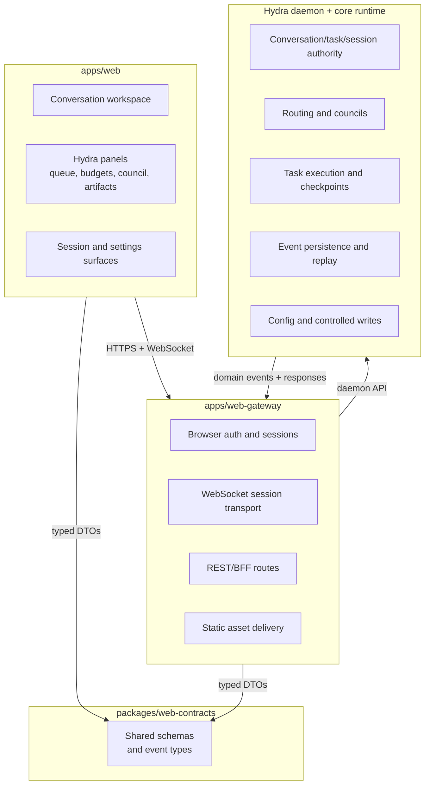

# Target Architecture

## High-Level Shape

## Responsibility Split

| Component                | Responsibility                                                                                               |
| ------------------------ | ------------------------------------------------------------------------------------------------------------ |
| `apps/web`               | Browser UX, conversation workspace, artifacts, approvals, reconnect UX, Hydra-specific operator panels       |
| `apps/web-gateway`       | Auth, browser sessions, WebSocket termination, REST routes, static serving, protocol translation             |
| `packages/web-contracts` | Shared schemas and DTOs for requests, events, approvals, artifacts, and snapshots                            |
| Hydra daemon             | Source of truth for orchestration state, task lifecycle, sessions, durable events, config/workflow mutations |

## Architectural Rules

1. **The daemon stays authoritative.**
   The gateway may adapt browser interactions into daemon calls, but it must not become the hidden
   home for Hydra behavior.

2. **The gateway is not a second control plane.**
   If a feature requires durable orchestration semantics, persistence, or controlled writes, the
   daemon should own it.

3. **Shared contracts come before shared behavior.**
   Browser, gateway, and daemon integration should align through versioned schemas rather than
   duplicated assumptions.

4. **The browser should feel native, not terminal-emulated.**
   Build browser-safe flows for approvals, artifacts, retries, and reconnect behavior instead of
   trying to mirror raw TTY interactions.
