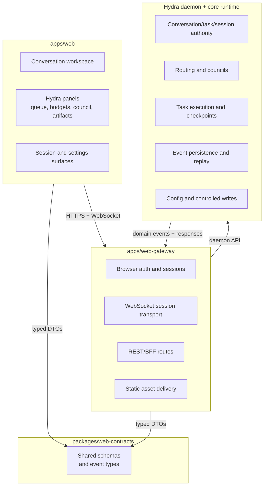
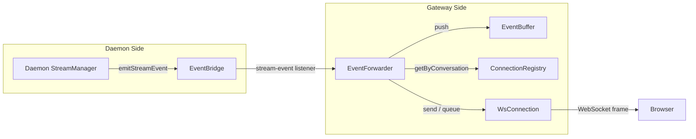

# Target Architecture

## High-Level Shape

## Responsibility Split

| Component                | Responsibility                                                                                               |
| ------------------------ | ------------------------------------------------------------------------------------------------------------ |
| `apps/web`               | Browser UX, conversation workspace, artifacts, approvals, reconnect UX, Hydra-specific operator panels       |
| `apps/web-gateway`       | Auth, browser sessions, WebSocket termination, REST routes, static serving, protocol translation             |
| `packages/web-contracts` | Shared schemas and DTOs for requests, events, approvals, artifacts, and snapshots                            |
| Hydra daemon             | Source of truth for orchestration state, task lifecycle, sessions, durable events, config/workflow mutations |

## Architectural Rules

1. **The daemon stays authoritative.**
   The gateway may adapt browser interactions into daemon calls, but it must not become the hidden
   home for Hydra behavior.

2. **The gateway is not a second control plane.**
   If a feature requires durable orchestration semantics, persistence, or controlled writes, the
   daemon should own it.

3. **Shared contracts come before shared behavior.**
   Browser, gateway, and daemon integration should align through versioned schemas rather than
   duplicated assumptions.

4. **The browser should feel native, not terminal-emulated.**
   Build browser-safe flows for approvals, artifacts, retries, and reconnect behavior instead of
   trying to mirror raw TTY interactions.

## Gateway Transport Layer

The gateway transport layer delivers real-time daemon events to browser clients over WebSocket
connections. The daemon remains authoritative for conversation state; the gateway adds session
binding, origin/rate-limit checks, reconnect replay, and browser-oriented protocol shaping.

### Transport Path Overview

Events move through five stages:

1. The daemon's `StreamManager` emits typed stream events during turn execution.
2. The daemon-side `EventBridge` re-emits those events to registered listeners.
3. `EventForwarder` records replay-relevant events in `EventBuffer`.
4. `EventForwarder` fans events out to subscribed `WsConnection` instances, or queues them while a
   connection is replaying.
5. `WsConnection` serializes the final server message and writes it to the underlying socket.

### Daemon Event Bridge

The transport layer depends only on `StreamEventBridgeLike`, not a concrete daemon implementation.
In the current single-process deployment, the bridge is an in-process `EventEmitter` boundary:

- no extra serialization hop between daemon and gateway
- typed `stream-event` payloads
- replaceable boundary if the system later moves to IPC or network mediation

### Connection Registry

`ConnectionRegistry` keeps three live indices:

| Index                               | Purpose                                          |
| ----------------------------------- | ------------------------------------------------ |
| `connectionId -> connection`        | Direct connection lookup                         |
| `sessionId -> Set<connection>`      | Broadcast session-lifecycle messages across tabs |
| `conversationId -> Set<connection>` | Fan out stream events to subscribers             |

It also tracks **pending interest** for subscriptions that are still being validated. That lets the
transport keep replay state coherent even when events arrive during subscription setup.

### Event Buffer

`EventBuffer` is a bounded per-conversation ring buffer for reconnect replay.

- Default capacity: **1000 events per conversation**
- Oldest events are evicted when capacity is exceeded
- Inactive conversations are purged after **5 minutes**
- Replay safety is tracked explicitly so the gateway does not pretend a sparse tail is safe to
  replay

If the buffer cannot safely satisfy a reconnect gap, the gateway falls back to daemon replay.

### Event Forwarder Pipeline

`EventForwarder` subscribes to daemon `stream-event` payloads and processes each event in order:

1. **Interest check** — if no subscribed or pending connection cares about the conversation, the
   event is not buffered for replay.
2. **Buffer write** — if interest exists, the event is stored in `EventBuffer`.
3. **Per-connection delivery**:
   - replaying connections queue the live event in `pendingEvents`
   - live connections receive the event immediately through backpressure protection

Replay queues are capped at **1000 pending events per connection/conversation**. If that backlog is
exceeded, the gateway sends `WS_REPLAY_OVERFLOW` and closes the connection.

### Replay and Reconnect

When the browser sends `subscribe`, `WsMessageHandler` chooses one of three paths:

| Scenario          | Trigger                                                                     | Strategy                                                                                                  |
| ----------------- | --------------------------------------------------------------------------- | --------------------------------------------------------------------------------------------------------- |
| Initial subscribe | No `lastAcknowledgedSeq`                                                    | Start live delivery immediately                                                                           |
| Buffer hit        | `lastAcknowledgedSeq` is present and the buffer can safely cover the gap    | Replay from `EventBuffer`, flush queued live events, then switch to live mode                             |
| Buffer miss       | `lastAcknowledgedSeq` is present but the buffer cannot safely cover the gap | Load turn history from the daemon, fetch per-turn replay, merge/dedupe by `seq`, then switch to live mode |

Daemon replay uses up to **8 concurrent** per-turn replay fetches. A subscribe generation counter
prevents stale async work from overwriting a newer subscription attempt.

### Backpressure

The transport stack uses `sendWithBackpressureProtection()` to close slow consumers before the
underlying WebSocket buffer grows without bound.

- Default high-water mark: **1 MiB**
- Applied to:
  - live `stream-event` delivery in `EventForwarder`
  - `subscribed`, `unsubscribed`, and handler-generated `error` messages in `WsMessageHandler`
- On overflow:
  - send `WS_BUFFER_OVERFLOW`
  - close with WebSocket code `1008`

Session lifecycle frames are narrower: `SessionWsBridge` currently sends
`session-expiring-soon`, `session-terminated`, `daemon-unavailable`, and `daemon-restored`
directly through `connection.send(...)` rather than through the shared backpressure helper.

### Session Lifecycle Bridge

`SessionWsBridge` translates session-state changes into browser-facing WebSocket messages.

| Session transition                         | WebSocket message       | Effect                                                     |
| ------------------------------------------ | ----------------------- | ---------------------------------------------------------- |
| Warning window reached                     | `session-expiring-soon` | Browser can extend the session                             |
| Session expired / invalidated / logged out | `session-terminated`    | Session-bound sockets are closed after the message is sent |
| Daemon becomes unreachable                 | `daemon-unavailable`    | Browser can enter degraded mode                            |
| Daemon recovers                            | `daemon-restored`       | Browser can resume normal operation                        |

### WebSocket Server and Upgrade Handshake

`GatewayWsServer` owns the `/ws` upgrade path. Before a connection is accepted, it checks:

1. request path is exactly `/ws`
2. `Origin` matches the configured `allowedOrigin`
3. a `__session` cookie is present
4. the source key passes the mutating rate limiter
5. the session validates and is not already idle

Once upgraded, the server:

- creates a `WsConnection`
- binds session lifecycle events through `SessionWsBridge`
- installs idle-timeout tracking
- queues inbound frames per connection so message handling stays serialized

### Configuration Knobs

The transport layer mixes explicit runtime inputs and internal defaults. The following settings are
architecturally important:

| Setting                                     | Default                            | Component                            | Exposure / notes                                                                                |
| ------------------------------------------- | ---------------------------------- | ------------------------------------ | ----------------------------------------------------------------------------------------------- |
| Event buffer capacity                       | `1000`                             | `EventBuffer`                        | Override by injecting a prebuilt `eventBuffer`                                                  |
| Inactive conversation timeout               | `5 min`                            | `EventBuffer`                        | Override by injecting a prebuilt `eventBuffer`                                                  |
| Daemon client timeout                       | `5000 ms`                          | `DaemonClient`                       | Exposed as `daemonClientOptions.timeoutMs`                                                      |
| Backpressure high-water mark                | `1 MiB`                            | `backpressure.ts`                    | Used by `EventForwarder` and `WsMessageHandler`; not currently exposed via `createGatewayApp()` |
| Max pending replay events                   | `1000`                             | `EventForwarder`                     | Internal replay overflow guard                                                                  |
| Daemon replay concurrency                   | `8`                                | `WsMessageHandler`                   | Internal replay fan-out limit                                                                   |
| Max inbound WS message size                 | `8 KiB`                            | `WsMessageHandler`                   | Internal validation limit                                                                       |
| Max pending inbound messages per connection | `64`                               | `GatewayWsServer`                    | Internal queue-depth guard                                                                      |
| WebSocket hard max payload                  | `1 MiB`                            | `GatewayWsServer`                    | Internal `ws` hard ceiling                                                                      |
| Idle timeout                                | `30 min`                           | `SessionService` / `GatewayWsServer` | Exposed as `sessionConfig.idleTimeoutMs`                                                        |
| Session warning threshold                   | `15 min`                           | `SessionService` / `SessionWsBridge` | Exposed as `sessionConfig.warningThresholdMs`                                                   |
| Mutating rate limit                         | `30 attempts / 60s`, `60s` lockout | `createMutatingRateLimiter()`        | Applies to mutating HTTP routes and `/ws` upgrades, not individual WebSocket messages           |
