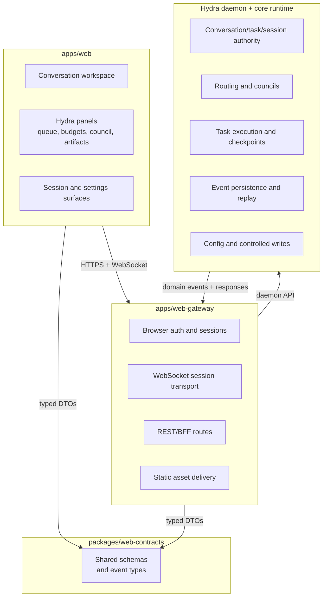
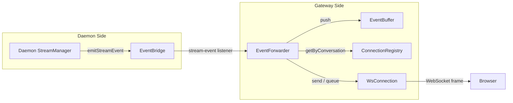

# Target Architecture

## High-Level Shape

## Responsibility Split

| Component                | Responsibility                                                                                               |
| ------------------------ | ------------------------------------------------------------------------------------------------------------ |
| `apps/web`               | Browser UX, conversation workspace, artifacts, approvals, reconnect UX, Hydra-specific operator panels       |
| `apps/web-gateway`       | Auth, browser sessions, WebSocket termination, REST routes, static serving, protocol translation             |
| `packages/web-contracts` | Shared schemas and DTOs for requests, events, approvals, artifacts, and snapshots                            |
| Hydra daemon             | Source of truth for orchestration state, task lifecycle, sessions, durable events, config/workflow mutations |

## Architectural Rules

1. **The daemon stays authoritative.**
   The gateway may adapt browser interactions into daemon calls, but it must not become the hidden
   home for Hydra behavior.

2. **The gateway is not a second control plane.**
   If a feature requires durable orchestration semantics, persistence, or controlled writes, the
   daemon should own it.

3. **Shared contracts come before shared behavior.**
   Browser, gateway, and daemon integration should align through versioned schemas rather than
   duplicated assumptions.

4. **The browser should feel native, not terminal-emulated.**
   Build browser-safe flows for approvals, artifacts, retries, and reconnect behavior instead of
   trying to mirror raw TTY interactions.

## Gateway Transport Layer

The gateway transport layer delivers real-time daemon events to browser clients over WebSocket
connections. The daemon remains the authority for all conversation state; the transport layer is a
mediation boundary that adds session binding, backpressure, and reconnect/replay semantics.

### Transport Path Overview

Events flow left to right through five stages:

1. The daemon's `StreamManager` produces stream events (token chunks, status transitions, errors)
   during task execution.
2. The **EventBridge** (`lib/daemon/event-bridge.ts`) re-emits those events to all registered
   listeners. Because the daemon and gateway share a single Node.js process, this is an in-process
   `EventEmitter` — zero serialization, zero network overhead.
3. The **EventForwarder** subscribes to the bridge and, for every event, pushes it into the
   **EventBuffer** and fans it out to every connection that has subscribed to the conversation.
4. Per-connection delivery respects the **replay barrier**: connections currently replaying missed
   events queue incoming live events until replay finishes, then flush in sequence order.
5. The **WsConnection** serializes the message as JSON and writes it to the underlying WebSocket.

### Daemon Event Bridge

`EventBridge` is a thin typed wrapper around `node:events.EventEmitter` that lives on the daemon
side. It exposes a single event channel — `stream-event` — carrying
`{ conversationId, event: StreamEvent }` payloads.

Key properties:

- **Error isolation.** Each listener runs inside a try/catch so a failing gateway handler cannot
  crash the daemon's event production.
- **No internal buffering.** Events are pushed synchronously to all listeners; buffering is the
  gateway's responsibility.
- **Minimal coupling.** The gateway depends on the `StreamEventBridgeLike` interface (an `on` /
  `removeListener` contract), not on the concrete `EventBridge` class. This keeps the boundary
  replaceable — an IPC or HTTP transport could stand in for multi-process deployments.

### Connection Registry

`ConnectionRegistry` maintains three indices over the set of active WebSocket connections:

| Index                    | Lookup                                              |
| ------------------------ | --------------------------------------------------- |
| `connectionId → conn`    | Fast single-connection access                       |
| `sessionId → Set<conn>`  | All connections for a browser session (multi-tab)   |
| `conversationId → Set<conn>` | All connections subscribed to a given conversation |

A connection may subscribe to multiple conversations, and a conversation may have subscribers from
different sessions. The registry also tracks **pending interest** — connections that have requested
a subscription but are still awaiting daemon validation — so the `EventForwarder` can buffer events
for conversations that are about to become active.

When a connection closes, the registry removes it from every index and notifies the `EventBuffer`
to mark any now-unsubscribed conversations as inactive, triggering eventual cleanup.

### Event Buffer

`EventBuffer` is a per-conversation bounded ring buffer that retains recent events for fast
reconnect replay. Each conversation gets an independent circular array; when the array fills, the
oldest events are silently evicted.

Replay safety is enforced before serving a buffer-hit replay: the buffer tracks which sequence
numbers have been evicted and rejects replay attempts whose starting point has been lost. This
prevents silent gaps — if the buffer cannot serve a contiguous range, the subscribe handler falls
back to a full daemon replay.

Conversations with no remaining subscribers enter an **inactive** state. After a configurable
timeout the buffer purges all state for that conversation, preventing unbounded memory growth from
abandoned subscriptions.

### Event Forwarder Pipeline

`EventForwarder` is the bridge-to-connections glue. It subscribes to the `EventBridge`'s
`stream-event` channel and, for each incoming event:

1. **Interest check.** If no connection has a subscription or pending interest in the conversation,
   the event is marked as dropped and the conversation is flagged inactive. No buffer space is
   consumed.
2. **Buffer.** The event is pushed into `EventBuffer` for later replay.
3. **Fan-out.** For every connection subscribed to the conversation:
   - If the connection is in the `replaying` state for that conversation, the event is queued in
     the connection's per-conversation pending-events list. If the queue exceeds 1 000 events, the
     connection is closed with an overflow error to protect server memory.
   - Otherwise (the `live` state), the event is sent immediately through the backpressure guard.

### Replay and Reconnect

When a client subscribes to a conversation — or re-subscribes after a disconnect — the message
handler chooses one of three paths:

| Scenario             | Trigger                                  | Strategy                                                                                         |
| -------------------- | ---------------------------------------- | ------------------------------------------------------------------------------------------------ |
| **Initial subscribe** | No `lastAcknowledgedSeq` provided       | Skip replay; transition straight to live.                                                       |
| **Buffer hit**       | `lastAcknowledgedSeq` present and buffer can serve a contiguous range | Replay from the buffer synchronously, flush any events that arrived during replay, go live.       |
| **Buffer miss**      | `lastAcknowledgedSeq` present but buffer cannot cover the gap | Load full turn history from the daemon, fetch per-turn stream replays with parallelism up to 8, merge and deduplicate by sequence number, then go live. |

The **replay barrier** ensures zero-gap, zero-duplicate ordering. While a conversation is in the
`replaying` state on a connection, the `EventForwarder` queues live arrivals instead of delivering
them. After the replayed events are sent, the handler flushes the queue (deduplicating by sequence
number) and atomically transitions to `live`. A generation counter on each subscribe attempt
prevents stale async operations from clobbering a newer subscription.

### Backpressure

Every outbound send passes through `sendWithBackpressureProtection`. If the WebSocket's internal
send buffer exceeds the high-water mark (default 1 MiB), the connection is immediately closed with
a `WS_BUFFER_OVERFLOW` error. This acts as a kill switch that prevents a single slow client from
consuming unbounded server memory.

The same guard applies to control messages (subscribe confirmations, errors) so no message path can
bypass the protection.

### Session Lifecycle Bridge

`SessionWsBridge` wires the existing `SessionStateBroadcaster` and `DaemonHeartbeat` primitives
into WebSocket protocol messages. It does not modify those primitives — it translates their
callbacks into frames the browser can act on:

| Session transition     | WebSocket message           | Effect                              |
| ---------------------- | --------------------------- | ----------------------------------- |
| Expiry approaching     | `session-expiring-soon`     | Browser can prompt re-auth          |
| Expired / invalidated  | `session-terminated`        | All session connections closed      |
| Daemon unreachable     | `daemon-unavailable`        | Browser shows degraded-mode banner  |
| Daemon recovered       | `daemon-restored`           | Browser can resume normal operation |

### WebSocket Server and Upgrade Handshake

`GatewayWsServer` handles the HTTP → WebSocket upgrade on the `/ws` path. The handshake runs the
full security stack — origin validation, session cookie extraction, rate-limit check, and session
validity — before promoting the connection. On success it creates a `WsConnection`, binds session
lifecycle via `SessionWsBridge`, and registers the connection in the `ConnectionRegistry`.

Inbound client messages are limited to three types — `subscribe`, `unsubscribe`, and `ack` — and
are processed through a per-connection serial queue that caps depth to prevent message-handler
reentrancy and memory growth.

### Configuration Knobs

Transport behavior is tunable through constants and gateway configuration. The following table
lists the knobs that are architecturally significant:

| Knob                             | Default        | Component        | Purpose                                                      |
| -------------------------------- | -------------- | ---------------- | ------------------------------------------------------------ |
| Event buffer capacity            | 1 000 events   | `EventBuffer`    | Ring size per conversation before oldest events are evicted  |
| Inactive conversation timeout    | 5 min          | `EventBuffer`    | Delay before purging state for conversations with no subscribers |
| Backpressure high-water mark     | 1 MiB          | `backpressure`   | WebSocket send-buffer threshold; exceeding closes the connection |
| Max pending replay events        | 1 000          | `EventForwarder` | Live events queued during replay; exceeding closes the connection |
| Daemon replay concurrency        | 8              | `WsMessageHandler` | Parallel workers for per-turn stream-replay fetches           |
| Max inbound message size         | 8 KB           | `WsMessageHandler` | Client messages larger than this are rejected before parse    |
| Max pending messages per connection | 64          | `GatewayWsServer` | Queued client messages before the connection is closed         |
| WebSocket hard max payload       | 1 MiB          | `GatewayWsServer` | Library-level DOS protection on inbound frames                |
| Idle connection timeout          | 30 min         | `GatewayConfig`  | Closes WebSocket connections with no activity                 |
| Session warning threshold        | 15 min         | `GatewayConfig`  | Sends `session-expiring-soon` this long before session expiry |
| Mutating rate-limit threshold    | 30 / 60 s      | `GatewayConfig`  | Subscribe/unsubscribe rate limit per window                   |
