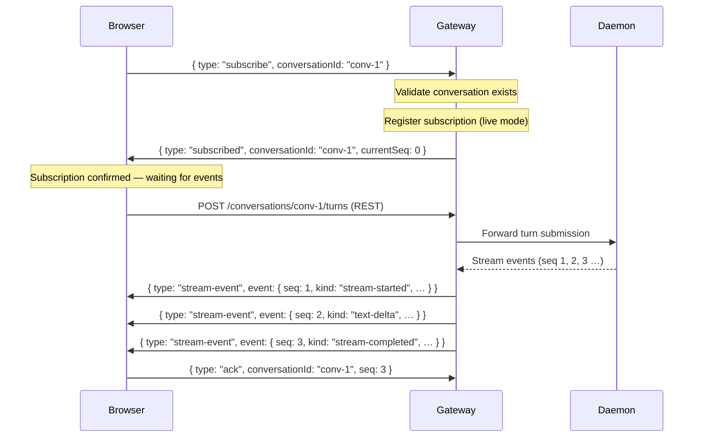
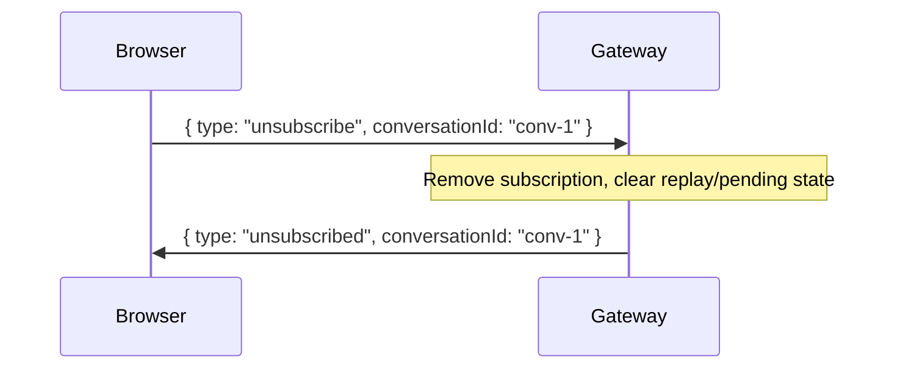
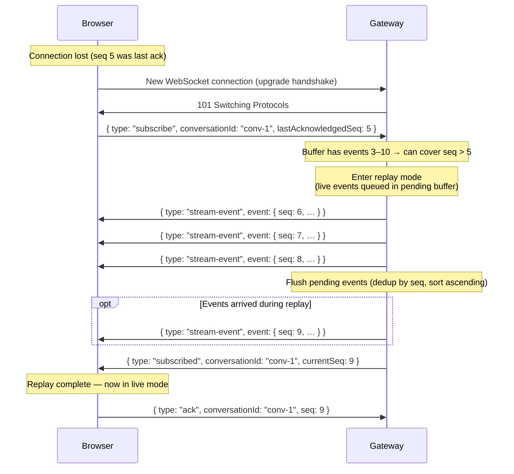
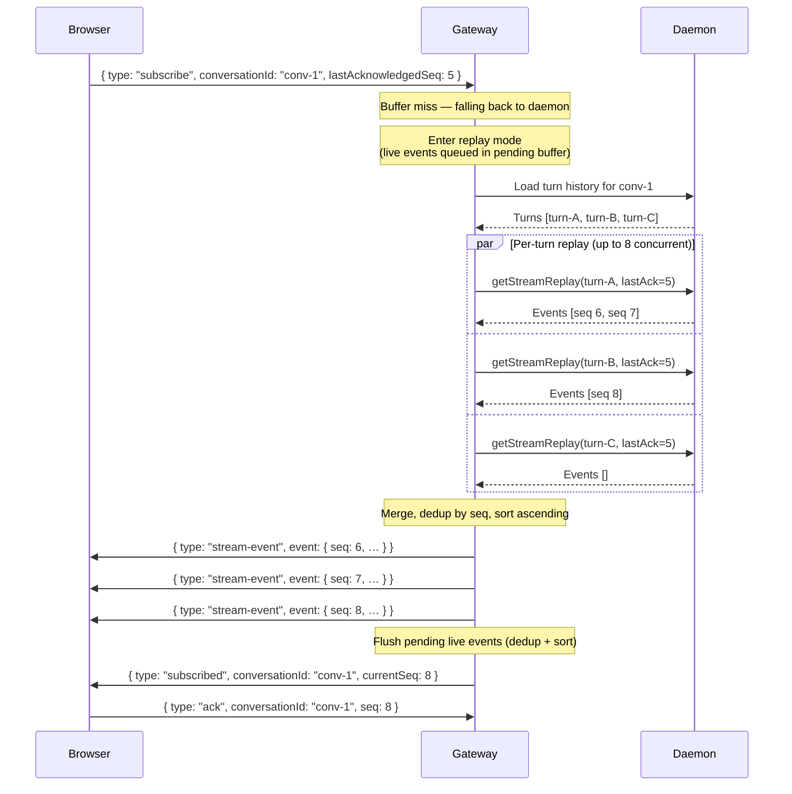

# WebSocket Transport Protocol

This document describes the implemented WebSocket transport protocol between the browser and the
Hydra web gateway. The gateway mediates all conversation streaming — the browser never communicates
directly with the daemon.

## Transport Overview

| Transport     | Purpose                                                             |
| ------------- | ------------------------------------------------------------------- |
| **WebSocket** | Bidirectional channel for streaming events and subscription control |
| **REST/JSON** | Conversation lifecycle, turn submission, approvals, work control    |

The WebSocket carries server→client stream events and accepts client→server subscription
management. Conversation commands (instruction submission, approval responses, cancel, retry) flow
via REST endpoints; the WebSocket delivers the resulting events.

---

## Connection Endpoint

| Property | Value                                                   |
| -------- | ------------------------------------------------------- |
| Path     | `/ws`                                                   |
| Protocol | `wss://` (TLS in production)                            |
| Auth     | `__session` cookie + Origin header validated at upgrade |

The gateway exposes a single WebSocket endpoint at `/ws`. All other paths are rejected and the
socket is destroyed.

---

## Connection Lifecycle

### Handshake

The upgrade handshake performs five validation steps in order. If any step fails, the gateway
rejects the upgrade with an HTTP error and a JSON body before the WebSocket is established.

```mermaid
sequenceDiagram
    participant Browser
    participant Gateway

    Browser->>Gateway: HTTP Upgrade /ws (Cookie: __session=…; Origin: …)
    Note over Gateway: 1. Validate Origin header against allowedOrigin
    alt Origin mismatch
        Gateway-->>Browser: 403 { code: "ORIGIN_REJECTED", category: "auth" }
    end
    Note over Gateway: 2. Parse __session cookie from headers
    alt Cookie missing or empty
        Gateway-->>Browser: 401 { code: "SESSION_NOT_FOUND", category: "auth" }
    end
    Note over Gateway: 3. Check rate limit (per source IP)
    alt Rate limit exceeded
        Gateway-->>Browser: 429 { code: "RATE_LIMITED", category: "rate-limit" }
    end
    Note over Gateway: 4. Validate session (not expired, not invalidated)
    alt Session invalid
        Gateway-->>Browser: 401 { code: "SESSION_NOT_FOUND", category: "auth" }
    end
    Note over Gateway: 5. Register connection
    Gateway->>Browser: 101 Switching Protocols
    Note over Gateway: Assign connectionId (UUID)<br/>Index by sessionId + connectionId
```

After a successful upgrade, the connection is idle and ready to receive subscription messages.
No conversation stream events flow until the client subscribes to a conversation.
Session-level messages (e.g. errors, session lifecycle notices) may arrive at any time.

### Session Binding

Every WebSocket connection is bound to exactly one authenticated session at handshake time. The
binding is immutable for the lifetime of the connection and cannot be transferred.

### Connection Registration

Each connection is assigned a `connectionId` (UUID via `crypto.randomUUID()`) and indexed by both
`sessionId` and `conversationId` in a dual-index connection registry.

### Idle Timeout

The gateway tracks the last activity timestamp for each connection. Activity is recorded on any
WebSocket message, ping, or pong. If the connection exceeds the configured idle timeout, the
gateway closes it with code `1000` and reason `Session idle timeout`.

---

## Message Format

All messages are JSON. The `ws` library enforces a hard **`maxPayload`** ceiling of **1 MiB**
(1,048,576 bytes). Messages that exceed this ceiling are rejected by `ws` itself — the connection
is terminated before the gateway ever sees the data. Below that ceiling, the gateway applies an
additional app-level inbound message size limit of **8,192 bytes** (8 KiB). Messages that pass the
`ws` ceiling but exceed the 8 KiB limit are rejected with `WS_INVALID_MESSAGE` before JSON parsing.

### Client → Server Messages

The client sends three message types: `subscribe`, `unsubscribe`, and `ack`. Any other type or
malformed message produces an error response without closing the connection.

#### `subscribe`

Request events for a conversation. Optionally provide a `lastAcknowledgedSeq` to resume from a
previous position.

```json
{
  "type": "subscribe",
  "conversationId": "conv-abc123",
  "lastAcknowledgedSeq": 42
}
```

| Field                 | Type    | Required | Description                             |
| --------------------- | ------- | -------- | --------------------------------------- |
| `type`                | string  | yes      | Literal `"subscribe"`                   |
| `conversationId`      | string  | yes      | Non-empty conversation identifier       |
| `lastAcknowledgedSeq` | integer | no       | Last seq the client has processed (≥ 0) |

- **Omitted `lastAcknowledgedSeq`** — initial subscribe; the client goes directly to live mode
  with no replay.
- **`lastAcknowledgedSeq: 0`** — replay all available events (seq > 0).
- **`lastAcknowledgedSeq: N`** — replay events with seq > N, then transition to live.

#### `unsubscribe`

Stop receiving events for a conversation.

```json
{
  "type": "unsubscribe",
  "conversationId": "conv-abc123"
}
```

| Field            | Type   | Required | Description                       |
| ---------------- | ------ | -------- | --------------------------------- |
| `type`           | string | yes      | Literal `"unsubscribe"`           |
| `conversationId` | string | yes      | Non-empty conversation identifier |

#### `ack`

Acknowledge receipt of events up to a given sequence number on the current WebSocket connection.
Fire-and-forget; no server response.
The gateway records the latest acknowledged sequence on that live connection, but reconnect replay is
driven by the `lastAcknowledgedSeq` value supplied in a later `subscribe` message.

```json
{
  "type": "ack",
  "conversationId": "conv-abc123",
  "seq": 42
}
```

| Field            | Type    | Required | Description                              |
| ---------------- | ------- | -------- | ---------------------------------------- |
| `type`           | string  | yes      | Literal `"ack"`                          |
| `conversationId` | string  | yes      | Non-empty conversation identifier        |
| `seq`            | integer | yes      | Sequence number being acknowledged (≥ 0) |

### Server → Client Messages

The gateway sends nine message types to the client.

#### `stream-event`

A conversation stream event forwarded from the daemon.

```json
{
  "type": "stream-event",
  "conversationId": "conv-abc123",
  "event": {
    "seq": 7,
    "turnId": "turn-xyz",
    "kind": "text-delta",
    "payload": { "text": "Hello " },
    "timestamp": "2025-01-15T10:30:00.000Z"
  }
}
```

| Field             | Type    | Description                                               |
| ----------------- | ------- | --------------------------------------------------------- |
| `event.seq`       | integer | Per-conversation monotonic sequence number, starting at 1 |
| `event.turnId`    | string  | Turn that produced this event                             |
| `event.kind`      | string  | One of 13 event kinds (see below)                         |
| `event.payload`   | object  | Kind-specific data                                        |
| `event.timestamp` | string  | ISO 8601 production timestamp                             |

**Stream event kinds** (13 values):

| Kind                | Description                             |
| ------------------- | --------------------------------------- |
| `stream-started`    | A new stream has begun for a turn       |
| `text-delta`        | Incremental text output                 |
| `status-change`     | Agent or turn status transition         |
| `activity-marker`   | Agent activity indicator                |
| `approval-prompt`   | Daemon requests operator approval       |
| `approval-response` | Operator approval response acknowledged |
| `artifact-notice`   | An artifact was produced                |
| `checkpoint`        | Execution checkpoint                    |
| `warning`           | Non-fatal warning                       |
| `error`             | Execution error                         |
| `cancellation`      | Turn was cancelled                      |
| `stream-completed`  | Stream finished successfully            |
| `stream-failed`     | Stream finished with a failure          |

#### `subscribed`

Sent after subscribe processing completes (after any replay). Confirms the subscription is live.

```json
{
  "type": "subscribed",
  "conversationId": "conv-abc123",
  "currentSeq": 42
}
```

| Field            | Type    | Description                                      |
| ---------------- | ------- | ------------------------------------------------ |
| `conversationId` | string  | Conversation the client is now subscribed to     |
| `currentSeq`     | integer | Highest sequence number delivered to this client |

#### `unsubscribed`

Confirms the client is no longer receiving events for a conversation.

```json
{
  "type": "unsubscribed",
  "conversationId": "conv-abc123"
}
```

#### `session-expiring-soon`

Warning sent when the bound session enters its expiry window. The browser should extend the
session (e.g., `POST /session/extend`) to avoid disconnection.

```json
{
  "type": "session-expiring-soon",
  "expiresAt": "2025-01-15T11:00:00.000Z"
}
```

#### `session-active`

Authoritative session-health signal. Sent in two scenarios:

1. **Recovery** — the bound session returns to `active` after a warning-window extension or other
   session-state recovery.
2. **Fresh bind / reconnect bootstrap** — the session is already active when the client connects (or
   reconnects). The gateway sends `session-active` so the client can treat the included `expiresAt`
   as the canonical session deadline and clear any stale expiry warnings left over from a previous
   connection.

In both cases the browser should replace its cached `expiresAt`, clear any `expiring-soon` warning
banner, and treat the session as healthy.

```json
{
  "type": "session-active",
  "expiresAt": "2025-01-15T11:15:00.000Z"
}
```

#### `session-terminated`

The session has ended. The connection will close shortly after this message.

```json
{
  "type": "session-terminated",
  "state": "expired",
  "reason": "Session TTL exceeded"
}
```

| Field    | Type   | Description                                    |
| -------- | ------ | ---------------------------------------------- |
| `state`  | string | One of: `expired`, `invalidated`, `logged-out` |
| `reason` | string | Optional human-readable reason                 |

#### `daemon-unavailable`

The daemon has become unreachable. The connection stays open during a grace period to allow
recovery.

```json
{
  "type": "daemon-unavailable"
}
```

#### `daemon-restored`

The daemon is reachable again after a period of unavailability. The gateway also
sends this message as a bootstrap signal on fresh WebSocket bind (or reconnect)
when the session is already in a healthy `active` or `expiring-soon` state — this
lets reconnecting clients clear any stale degraded-daemon UI state left over from
a prior connection.

```json
{
  "type": "daemon-restored"
}
```

#### `error`

A structured error in response to a client message or an operational failure.

```json
{
  "type": "error",
  "ok": false,
  "code": "WS_INVALID_MESSAGE",
  "category": "validation",
  "message": "Validation error: conversationId is required",
  "conversationId": "conv-abc123",
  "retryAfterMs": 5000
}
```

| Field            | Type    | Required | Description                                                     |
| ---------------- | ------- | -------- | --------------------------------------------------------------- |
| `type`           | string  | yes      | Literal `"error"`                                               |
| `ok`             | boolean | yes      | Always `false`                                                  |
| `code`           | string  | yes      | Machine-readable error code                                     |
| `category`       | string  | yes      | One of: `auth`, `session`, `validation`, `daemon`, `rate-limit` |
| `message`        | string  | yes      | Human-readable description                                      |
| `conversationId` | string  | no       | If the error relates to a specific conversation                 |
| `turnId`         | string  | no       | If the error relates to a specific turn                         |
| `retryAfterMs`   | integer | no       | Suggested retry delay in milliseconds                           |

---

## Error Codes

### Handshake Errors (HTTP, before WebSocket establishment)

| Code                  | Category     | HTTP | Cause                                             |
| --------------------- | ------------ | ---- | ------------------------------------------------- |
| `ORIGIN_REJECTED`     | `auth`       | 403  | Origin header does not match                      |
| `SESSION_NOT_FOUND`   | `auth`       | 401  | Missing or empty session cookie                   |
| `SESSION_EXPIRED`     | `session`    | 401  | Session expired before the WebSocket upgrade      |
| `SESSION_INVALIDATED` | `session`    | 401  | Session was invalidated before the upgrade        |
| `IDLE_TIMEOUT`        | `session`    | 401  | Session exceeded idle timeout                     |
| `RATE_LIMITED`        | `rate-limit` | 429  | Too many connection attempts from the same source |

### Message-Level Errors (sent over WebSocket)

| Code                        | Category     | Closes connection? | Cause                                                       |
| --------------------------- | ------------ | ------------------ | ----------------------------------------------------------- |
| `WS_INVALID_MESSAGE`        | `validation` | no                 | Malformed JSON or schema violation                          |
| `CONVERSATION_NOT_FOUND`    | `validation` | no                 | Unknown conversation ID in subscribe                        |
| `WS_MESSAGE_QUEUE_OVERFLOW` | `rate-limit` | yes (1008)         | ≥ 64 pending messages on this connection                    |
| `WS_BUFFER_OVERFLOW`        | `daemon`     | yes (1008)         | Send buffer exceeds 1 MiB high-water mark                   |
| `WS_REPLAY_OVERFLOW`        | `daemon`     | yes (1008)         | ≥ 1,000 events queued during replay                         |
| `REPLAY_INCOMPLETE`         | `daemon`     | no                 | Daemon replay failed; resume aborted before replay delivery |
| `DAEMON_UNREACHABLE`        | `daemon`     | no                 | Daemon not reachable for mediation                          |

### WebSocket Close Codes

| Code   | Meaning                                         |
| ------ | ----------------------------------------------- |
| `1000` | Normal close (idle timeout, clean shutdown)     |
| `1008` | Policy violation (overflow, backpressure)       |
| `1011` | Unexpected server error during message handling |

---

## Subscription Flow

### Initial Subscribe (No Replay)

When the client subscribes without `lastAcknowledgedSeq`, it enters live mode immediately.



### Unsubscribe



---

## Reconnect and Resume Protocol

When the browser loses its WebSocket connection (network interruption, page refresh, device sleep),
it reconnects and resumes from where it left off using `lastAcknowledgedSeq`.

The gateway supports two replay strategies, tried in order:

1. **In-memory buffer replay** — fast path; replays from the gateway's per-conversation ring buffer.
2. **Daemon fallback replay** — slow path; fetches events from the daemon when the buffer cannot
   cover the gap.

### Buffer Replay (Fast Path)

The gateway maintains a bounded in-memory ring buffer (default capacity: **1,000 events** per
conversation, inactive timeout: **5 minutes**). If the buffer contains a contiguous run of events
from the client's last ack position, replay proceeds from the buffer without daemon involvement.



**Buffer safety checks** — the gateway will not replay from the buffer if:

- No events with seq > `lastAcknowledgedSeq` are buffered.
- An eviction gap exists between the client's position and the oldest buffered event (events were
  evicted from the ring buffer while the client was disconnected).

If the buffer cannot cover the gap, the gateway falls through to daemon replay.

### Daemon Fallback Replay (Slow Path)

When the buffer is insufficient, the gateway fetches events from the daemon by loading the
conversation's turn history and requesting stream replay per turn. Requests are issued with a
concurrency limit of **8 parallel per-turn fetches**.



If any daemon replay request fails, the gateway sends a `REPLAY_INCOMPLETE` error and does **not**
close the connection, but it also does **not** deliver partial replay data or promote the
subscription into live mode. The client should treat the resume attempt as aborted and may fall back
to loading full conversation state via REST before retrying.

### Replay Barrier

While replay is in progress (replay state = `replaying`), new live events arriving from the daemon
for the same conversation are queued in a per-connection pending buffer. When replay finishes:

1. Pending events are deduplicated by `seq` (last-write-wins).
2. Events with `seq` ≤ the last replayed seq are discarded.
3. Remaining events are sorted ascending by `seq` and flushed.
4. The connection transitions to `live` mode.

The pending buffer is capped at **1,000 events**. If this limit is exceeded during replay, the
gateway sends a `WS_REPLAY_OVERFLOW` error and closes the connection with code `1008`.

---

## Session Lifecycle Events

### Session Expiry Warning

The gateway sends a `session-expiring-soon` message when the bound session enters its configured
warning window. The warning is deduplicated — at most one per unique `expiresAt` value.

```mermaid
sequenceDiagram
    participant Browser
    participant Gateway

    Note over Gateway: Session expiry warning window reached
    Gateway->>Browser: { type: "session-expiring-soon", expiresAt: "2025-01-15T11:00:00Z" }
    Note over Browser: Extend session via POST /session/extend

    alt Session extended
        Gateway->>Browser: { type: "session-active", expiresAt: "2025-01-15T11:15:00Z" }
        Note over Gateway: New expiry; fresh warning scheduled if needed
    else Session not extended
        Gateway->>Browser: { type: "session-terminated", state: "expired" }
        Note over Gateway: Close all connections for session
    end
```

### Session Termination

When a session ends (expiry, invalidation, or logout), the gateway:

1. Sends `session-terminated` to **all** WebSocket connections bound to that session.
2. Closes each connection asynchronously (after the message is delivered).

The `state` field indicates the cause:

| State         | Trigger                             |
| ------------- | ----------------------------------- |
| `expired`     | Session TTL exceeded                |
| `invalidated` | Session invalidated by admin action |
| `logged-out`  | Operator explicitly logged out      |

### Daemon Health Notifications

If the daemon becomes unreachable, the gateway sends `daemon-unavailable` to all active
connections. Connections remain open during the grace period. When the daemon recovers, the gateway
sends `daemon-restored`. The gateway also sends `daemon-restored` as a bootstrap signal on fresh
bind or reconnect when the session is already healthy, so clients can clear stale degraded state.

---

## Multi-Tab Behavior

When an operator opens multiple browser tabs, each tab establishes its own WebSocket connection.
All connections for the same session are tracked independently in the connection registry.

- Each connection maintains independent subscription state and live ack positions.
- Replay after reconnect is still driven by the `lastAcknowledgedSeq` provided in each new
  `subscribe` message.
- Events for a subscribed conversation are delivered to **every** connection subscribed to that
  conversation, not just one.
- Session-level messages (`session-expiring-soon`, `session-active`, `session-terminated`) are
  broadcast to all connections for the session.

---

## Backpressure Protection

The gateway monitors the WebSocket send buffer (`bufferedAmount`) for each connection. If the
buffer exceeds the high-water mark (default: **1,048,576 bytes** / 1 MiB), the gateway sends a
`WS_BUFFER_OVERFLOW` error and closes the connection with code `1008`.

A per-connection inbound message queue is also bounded at **64 pending messages**. If a client
sends messages faster than the gateway can process them, the gateway sends
`WS_MESSAGE_QUEUE_OVERFLOW` and closes with `1008`.

---

## Complementary REST Endpoints

The WebSocket carries streaming events; conversation commands flow via REST. All REST endpoints
require an authenticated session and validate request payloads against shared contract schemas.

### Conversation Lifecycle

| Method | Path                         | Description          |
| ------ | ---------------------------- | -------------------- |
| POST   | `/conversations`             | Create conversation  |
| GET    | `/conversations`             | List conversations   |
| GET    | `/conversations/:id`         | Open conversation    |
| POST   | `/conversations/:id/resume`  | Resume conversation  |
| POST   | `/conversations/:id/archive` | Archive conversation |

### Turns

| Method | Path                           | Description        |
| ------ | ------------------------------ | ------------------ |
| POST   | `/conversations/:convId/turns` | Submit instruction |
| GET    | `/conversations/:convId/turns` | List turn history  |

### Approvals

| Method | Path                               | Description           |
| ------ | ---------------------------------- | --------------------- |
| GET    | `/conversations/:convId/approvals` | Get pending approvals |
| POST   | `/approvals/:approvalId/respond`   | Respond to approval   |

### Work Control

| Method | Path                                          | Description                                                                 |
| ------ | --------------------------------------------- | --------------------------------------------------------------------------- |
| POST   | `/conversations/:convId/turns/:turnId/cancel` | Cancel turn                                                                 |
| POST   | `/conversations/:convId/turns/:turnId/retry`  | Retry turn                                                                  |
| POST   | `/conversations`                              | Fork conversation by providing `parentConversationId` and `forkPointTurnId` |

### Artifacts and Activities

| Method | Path                               | Description                     |
| ------ | ---------------------------------- | ------------------------------- |
| GET    | `/turns/:turnId/artifacts`         | List artifacts for turn         |
| GET    | `/conversations/:convId/artifacts` | List artifacts for conversation |
| GET    | `/artifacts/:artifactId`           | Get artifact content            |
| GET    | `/turns/:turnId/activities`        | Get activity entries            |

---

## Constants and Defaults

| Constant                      | Value           | Description                                    |
| ----------------------------- | --------------- | ---------------------------------------------- |
| Max inbound message size      | 8,192 bytes     | Messages exceeding this are rejected pre-parse |
| WebSocket hard max payload    | 1,048,576 bytes | `ws` library ceiling                           |
| Send buffer high-water mark   | 1,048,576 bytes | Backpressure threshold (configurable)          |
| Event buffer capacity         | 1,000 events    | Per-conversation ring buffer (configurable)    |
| Event buffer inactive timeout | 300,000 ms      | Buffer eviction after 5 min inactivity         |
| Max pending replay events     | 1,000           | Pending queue cap during replay                |
| Max pending inbound messages  | 64              | Per-connection inbound queue depth             |
| Daemon replay concurrency     | 8               | Parallel per-turn replay fetches               |

---

## Sequence Numbers

- Sequence numbers are **per-conversation**, starting at **1** and increasing monotonically.
- They align with daemon `EventRecord.seq` values.
- The client uses sequence numbers for three purposes:
  1. **Acknowledgment** — `ack` messages tell the gateway how far the client has processed.
  2. **Resume** — `lastAcknowledgedSeq` in `subscribe` tells the gateway where to replay from.
  3. **Deduplication** — the client can discard events with seq ≤ its last processed seq.

---

## Protocol Design Rules

- Every request and event shape is defined through `packages/web-contracts` Zod schemas.
- Browser optimism must never become the source of truth for conversation or task state — the
  daemon is authoritative.
- Reconnect and replay semantics are designed into the protocol, not left to ad hoc client behavior.
- Command-like browser actions map to typed REST endpoints rather than stringly-typed WebSocket
  messages.
- The WebSocket is a **delivery channel**, not a command channel — commands flow via REST,
  events flow via WebSocket.
